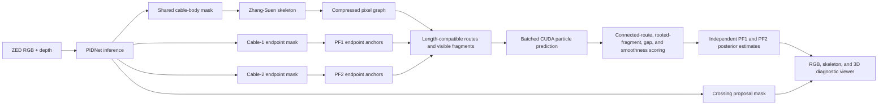

# Cable Reconstruction Pipeline

## Purpose of this document

This document describes the complete system as it is implemented now. It is
intended to be understandable without reading the source code and without
requiring a mathematical particle-filter or graph-theory background.

The project reconstructs the 3D shape of two visually identical flexible
cables from one ZED stereo camera. The difficult part is not detecting cable
pixels. The difficult part is deciding which connected path through those
pixels belongs to each physical cable when the cables touch, overlap, cross in
the image, become partly hidden, or move quickly.

The central design is:

1. The neural network reports visual evidence.
2. A skeleton graph converts that evidence into connected route hypotheses.
3. Two particle-filter populations track the two physical cable identities.
4. Known cable length, endpoint identity, path order, depth, and motion history
   decide which route and 3D shape are most plausible.

The neural network does **not** label the cable body as cable 1 and cable 2.
Cable identity comes from the two endpoint groups and is maintained by the
particle filters.

---

## One-page overview



At runtime, PIDNet is evaluated once per tracked frame and produces all four
output channels in the same inference. The body mask is skeletonized and
turned into a graph. The graph provides multiple possible ordered paths
between endpoint pairs. The particle filter does not average all cable points
together. It compares a proposed cable against an **ordered connected route**,
from one endpoint to the other.

This distinction is important. A particle can be physically close to many
cable pixels while still switching onto the wrong branch. Ordered route
comparison penalizes that mistake because the particle and observation must
progress through the cable in the same order.

---

## 1. Inputs, outputs, and physical assumptions

### Inputs

Each camera frame provides:

- a rectified RGB image;
- a registered depth image from the ZED camera;
- camera intrinsics needed to convert image pixels and depth into 3D points;
- a timestamp used for velocity prediction.

The current camera configuration is:

- ZED HD720;
- requested capture rate of 60 FPS;
- ZED `NEURAL` depth mode;
- depth fill enabled;
- no application-side point stride or point-count reduction in tracking.

The viewer has its own independent point-cloud stride. That stride changes
only rendering cost and does not remove tracking observations.

### Known information

The tracker assumes:

- there are up to two physical cables;
- the two ends in endpoint channel 1 belong to cable 1;
- the two ends in endpoint channel 2 belong to cable 2;
- both cables currently have a measured tip-to-tip length of 0.515 m;
- a cable is represented by 12 ordered 3D nodes;
- consecutive nodes are connected by straight line segments of equal target
  length.

The straight segments are a discretization of a continuous cable, not an
assumption that the complete cable is straight. Twelve short segments can form
a curved cable. More dense samples are generated between the nodes when the
hypothesis is scored.

### Outputs

For each cable, the tracker returns:

- 12 ordered 3D cable nodes;
- a denser polyline for display and scoring diagnostics;
- the most likely observed graph route, when a complete route exists;
- supported, missing, and unknown portions of the estimate;
- endpoint, link-length, trace, support, and curvature diagnostics;
- posterior uncertainty;
- the highest-weight particles for visual inspection.

---

## 2. Neural-network observation

### Model

The project uses a compact PIDNet-inspired segmentation network implemented in
PyTorch. It keeps separate detail, context, and boundary processing branches,
but is sized for this cable task. Runtime inference uses CUDA, automatic mixed
precision, and channels-last tensor layout.

### Four output channels

One inference produces four independent probability maps:

| Channel | Meaning |
|---|---|
| Cable body | Every visible cable-body pixel, shared by both cables |
| Endpoint group 1 | Both physical tips belonging to cable 1 |
| Endpoint group 2 | Both physical tips belonging to cable 2 |
| Crossing | An RGB location that visually resembles a crossing |

These are independent sigmoid channels, so semantic regions may overlap. For
example, an endpoint or crossing is still part of the cable observation.

There is deliberately no “cable 1 body” channel and no “cable 2 body”
channel. The cables are visually identical, so asking the NN to maintain body
identity through an overlap would assign a temporal/topological problem to a
single-frame image segmenter. Instead:

- PIDNet says where cable material is visible;
- endpoint channels say which tips belong together;
- the graph says which connected paths are possible;
- each PF decides the shape associated with its endpoint pair.

### Thresholding

The current runtime thresholds are:

| Output | Threshold |
|---|---:|
| Cable body | 0.85 |
| Endpoint group 1 | 0.90 |
| Endpoint group 2 | 0.75 |
| Crossing | 0.95 |

The binary masks are needed on the CPU for connected-component and graph
operations. The cable probability map itself remains on the GPU so the PF can
sample continuous image evidence without downloading and uploading the
full-resolution probability image.

### Endpoint extraction and identity stability

Each endpoint mask may contain several connected components. Components below
the configured area threshold are treated as small NN speckles. The remaining
components are lifted to 3D with the registered depth map.

Identity is handled independently inside each endpoint group:

- endpoint group 1 can only create the two tips for PF1;
- endpoint group 2 can only create the two tips for PF2;
- temporal 3D association matches current components to the previous
  endpoints so “start” and “end” do not change merely because their image
  ordering changes;
- the association has a distance gate to prevent an unrelated detection from
  silently replacing a tracked endpoint;
- image-coordinate ordering is used only to establish an initial ordering when
  there is no previous state.

“Start” and “end” are internal ordering labels. They do not imply a physical
polarity of the cable.

### Endpoint tangent measurement

Near every visible endpoint, the observation builder collects nearby 3D cable
points. Principal-component analysis is applied to this local neighborhood.
The dominant eigenvector gives the local direction of the elongated cable
region. Its sign is selected so that it points inward from the endpoint toward
the cable body.

This tangent is not trusted as an exact hard direction. It is used in two
softer ways:

- to center some route-based particle proposals near the observed departure
  direction;
- to reward particles whose first or last section agrees with the measured
  direction.

This makes endpoint information useful without forcing the entire cable into a
straight line.

---

## 3. Moving information from RGB and depth into 3D

The RGB masks are two-dimensional, while the particle filter operates in 3D.
For every relevant pixel, the depth value and camera intrinsics are used to
unproject the pixel into a camera-coordinate 3D point.

The optimized data path is:

1. PIDNet produces probabilities on the GPU.
2. Depth is uploaded once into a reusable CUDA tensor.
3. Relevant pixels are unprojected in parallel on the GPU.
4. Only the compact results needed by CPU topology code are read back.

This avoids constructing a full XYZRGBA point cloud for every tracking frame
and avoids a full-resolution point-cloud readback.

Invalid or non-finite depth cannot become a valid 3D cable observation. The
runtime still keeps the original 2D mask for image diagnostics.

---

## 4. Skeletonization

### Why skeletonize?

The cable-body segmentation is a thick region. A thick region is useful for
detection but inconvenient for reasoning about connectivity. Hundreds of
neighboring pixels across the cable width create many equivalent paths.

Skeletonization reduces each connected cable region to an approximately
one-pixel-wide centerline while preserving its connectivity. It changes a
thick painted cable into a structure that can be represented as a graph.

### Method used

The implementation uses exact iterative **Zhang-Suen thinning**. Zhang-Suen
uses two alternating deletion passes. During each pass it removes boundary
pixels only when doing so preserves the local foreground connection. The
passes repeat until no more pixels can be removed.

The implementation evaluates the deletion rules through lookup tables and
only processes active foreground pixels. It does not use an approximate
distance-transform centerline and does not subsample the tracking mask.

The result is:

- ordinary cable sections that are one-pixel chains;
- endpoints whose skeleton degree is usually one;
- ordinary interior pixels whose degree is two;
- junctions whose degree is greater than two;
- loops, which may contain only degree-two pixels.

The live skeleton window is therefore not another NN prediction. It is the
topological centerline extracted from the NN cable-body mask.

---

## 5. Graph construction

### Pixel graph

The first graph is an 8-connected pixel graph:

- every skeleton pixel is a graph vertex;
- an edge connects spatially neighboring skeleton pixels;
- horizontal, vertical, and diagonal neighbors are considered.

A diagonal connection is omitted when an intervening horizontal or vertical
skeleton pixel already connects the corner. This prevents a small corner from
being represented by redundant parallel routes.

The degree of a skeleton pixel is the number of graph neighbors:

- degree 1: a terminal point;
- degree 2: an ordinary point along a cable section;
- degree greater than 2: a junction or branch.

### Why compress the graph?

A full pixel graph can contain roughly a thousand vertices for a single
frame, although almost all of them simply have degree two. Route search does
not need every centerline pixel to be treated as a separate decision.

The graph is compressed into:

- **nodes** at endpoints, junctions, and endpoint anchor locations;
- **edges** representing the full ordered chain of degree-two pixels between
  nodes.

This is a graph contraction or quotient-style representation: the long
nonbranching chains are contracted into graph edges while their ordered
geometry and length are retained.

### Node-region construction

All pixels whose degree is not two are initially node seeds. Pixels selected
as endpoint graph anchors are also seeds. The seeds are dilated locally inside
the skeleton and clustered into connected node regions. One representative
pixel near each region centroid becomes the graph-node coordinate.

The dilation merges the several adjacent high-degree pixels normally produced
by a thick image junction into one meaningful graph node instead of many
nearly identical junction nodes.

### Edge construction

After node regions are removed, every remaining nonbranching chain becomes a
graph edge. An edge stores:

- its two incident graph nodes;
- the ordered skeleton pixels from one incident node to the other;
- an ordered 3D polyline obtained by lifting those pixels with local depth;
- its measured 3D arc length.

If a component is a closed loop in which every pixel has degree two, the code
introduces one explicit node and represents the loop with a self-loop edge.
This avoids losing an otherwise valid component merely because it has no
natural terminal or branch.

### What graph theory contributes

The graph is not merely a visualization. It supplies the following concrete
operations:

- connected-component membership checks;
- endpoint-to-node association;
- node degree and junction detection;
- contraction of degree-two chains;
- edge-length accumulation;
- traversal with an edge-usage constraint;
- enumeration of multiple endpoint-to-endpoint trails;
- preservation of ordered pixels along every route.

The graph is used to generate and score the path hypotheses used by the PF.
It is not currently used for a global two-cable disjoint-path or
multi-commodity-flow optimization.

---

## 6. From the graph to possible cable routes

### Endpoint anchoring

Each cable’s two detected endpoint locations are mapped to graph nodes. A
complete route can be built only when:

- both endpoints for that cable are visible;
- both can be associated with the skeleton;
- both belong to the same connected skeleton component.

This prevents a false path from being invented between disconnected image
regions.

### Route search is not shortest-path search

The code does **not** compute one shortest skeleton path. The physical cable
has a known fixed length, and at a branch the shortest image route can easily
be the wrong cable.

Instead, the code performs bounded best-first enumeration of
**length-compatible edge-simple trails**:

- search starts at the graph node associated with one endpoint;
- a state records the current node, accumulated 3D length, used graph edges,
  and the ordered trail;
- an edge may not be used twice in the same trail;
- a graph node may be revisited through different edges;
- states whose length exceeds the physical cable length plus a margin are
  pruned;
- states closer to the target cable length receive higher queue priority;
- reaching the other endpoint creates a complete candidate route;
- search is bounded by candidate-count, state-count, and edge-count limits.

“Edge-simple” is useful here because it prevents a candidate from repeatedly
walking backward and forward along the same observed cable section to
artificially reach the required length. Allowing a node to be revisited still
permits loop-like topology when different edges are used.

The current limits are:

- up to 16 complete route candidates per cable;
- up to 4096 search states;
- up to 24 graph edges in a route;
- route length may exceed the target by no more than 0.18 m during search.

Completed routes are ordered first by absolute cable-length error and then by
edge count. Search also reports whether unexplored states remained when a
bound was reached, so truncation can be diagnosed rather than hidden.

### Building a continuous observed route

For every completed trail:

1. graph-edge polylines are reversed when necessary to follow traversal
   direction;
2. adjacent edge polylines are concatenated;
3. duplicate points at shared nodes are removed;
4. the two ends are set to the measured 3D endpoint positions;
5. the route is resampled uniformly along arc length;
6. route length, endpoint alignment, and turn statistics are recorded.

The observation representation uses 128 route samples. Before PF scoring, it
is also resampled to match the PF node and dense-sample layouts.

### Visible fragments

When one endpoint is hidden or the segmentation is broken, no full route may
exist. The graph can still contain a visible trace rooted at either labeled
endpoint.

For each visible endpoint, the observation builder:

1. finds the graph node associated with that endpoint;
2. orients every incident edge from the endpoint into the graph;
3. compares each candidate with the independently measured inward endpoint
   tangent;
4. retains at most one inward trace for that endpoint.

The one-trace rule rejects the common short outward tail created when an
endpoint blob splits an otherwise degree-two centerline. Each retained trace
has a known cable identity, endpoint identity, direction, 3D polyline, and
length. Generic graph edges remain available for visualization and topology
diagnostics, but do not update a cable PF because they do not have a defensible
cable or arc-length identity.

---

## 7. Particle representation

### Two identities, one batched implementation

There are two logically independent particle populations:

- PF1 is associated only with endpoint group 1;
- PF2 is associated only with endpoint group 2.

They do not exchange weights and there is no joint cable-contact constraint.
For efficiency, their tensors have a leading cable dimension and both
populations are processed in the same CUDA operations. Therefore, they are
parallel on the GPU without pretending that they are one joint probabilistic
state.

This also means the design can operate when only one cable has usable
evidence. One PF can update while the other remains uninitialized or continues
prediction.

### A particle

One particle is one complete proposed 3D cable shape:

- 12 ordered 3D nodes;
- a 3D velocity for every node;
- one probability weight;
- an associated graph-route index when a complete route is available.

Each of the 11 links has the same target length. Together the links equal the
configured 0.515 m cable length.

The current tracker uses 800 particles per cable. Scoring samples four
intermediate positions per link, producing 45 ordered dense samples from each
particle.

---

## 8. Particle initialization and proposal generation

### Initializing from graph routes

When a cable is first observed, candidate graph routes are resampled to 12
nodes. Particles are distributed round-robin across these route centers rather
than all starting from one selected route.

Smooth spatial noise is added along each route. The perturbation is generated
as a smooth field over node index so neighboring nodes move coherently. This
avoids initializing the cable as independent random points or introducing
high-frequency zigzags.

### Endpoint-direction proposal

When an endpoint tangent is valid, the second node is centered one link length
inward along the starting tangent. The second-to-last node is treated
similarly from the other endpoint.

This is a proposal center, not a permanent hard direction. Subsequent
constraint projection and scoring decide whether that local direction is
consistent with the route, cable length, and other evidence.

### Temporal proposals

After initialization, most particles are proposed from their previous shapes
and per-node velocities:

- previous velocity is damped over time;
- the node moves according to this velocity;
- smooth acceleration noise provides shape and motion uncertainty;
- visible endpoints are placed at their current measured 3D positions;
- visible endpoint velocities are estimated from temporally associated
  endpoint measurements.

If the endpoint motion is faster, the acceleration-noise scale increases up to
a configured maximum. Fast motion therefore produces a wider proposal
distribution instead of using the same uncertainty as a stationary cable.

### Measurement correction of node velocity

After a complete graph-route observation is accepted, the constrained
parent-to-proposal displacement supplies a direct measurement of how every
interior node actually moved during the frame interval. This displacement
velocity is clamped to reject route/detection jumps and blended with the
process-model prediction.

The measured endpoint velocities remain assigned to the two endpoint nodes.
The corrected full velocity field is then projected once onto the fixed-link
constraint tangent space. This prevents a measurement from correcting cable
position while leaving an inconsistent stale or zero velocity for the next
frame.

Ordinary particles and the 10% retracking population have separate feature
switches. Correction is applied only with a complete route. Partial or hidden
sections retain their predicted velocity instead of treating an incomplete
observation as full shape motion.

### Ten-percent exploration population

Ten percent of the particles are reserved as a wider exploration population
when global-particle generation is enabled.

When graph routes are available, these particles are still centered on
possible observed routes. Smooth low-dimensional deformation modes and a
larger noise scale give them broader coverage. They are not arbitrary
unstructured clouds of 12 independent points.

Their purpose is to preserve a chance of retracking after rapid movement or a
bad previous state. They are not a separate “recovery mode.”

### Fixed-length projection

After proposal generation, iterative link-constraint sweeps move nodes so all
links return to their target length. Visible endpoints are held as anchors.
The corresponding velocities are projected so they do not immediately violate
the reconstructed link geometry.

This makes fixed length a property of every accepted particle rather than only
a weak score that can be traded away against image fit.

---

## 9. How particles are scored

All enabled costs are added into one energy. Lower energy means that a
particle better explains the observation and satisfies the cable model. The
previous probability is combined with the new energy, and the results are
normalized into updated particle weights.

### 9.1 Connected-route trace: the dominant observation score

When complete graph routes exist, each dense particle sample is compared with
the route sample at the same normalized arc-length position:

- the beginning of the particle is compared with the beginning of the route;
- the middle is compared with the middle;
- the end is compared with the end.

The particle is evaluated against every candidate route, and its best route is
retained.

This is different from asking every particle point for its nearest cable
pixel. A nearest-point score ignores order. Near a branch, it can reward a
particle that follows one cable for a while and then jumps to another nearby
branch. Connected trace scoring requires the complete ordered shape to follow
one connected graph trail.

Distance errors use a Huber penalty. Small errors are treated strongly and
smoothly, while an unusually large error grows linearly instead of dominating
the entire score. This provides robustness without making large unexplained
errors free.

### 9.2 Graph route-length filtering and ordering

Graph search is bounded by the known physical cable length plus a configured
margin, and complete routes are ordered by their length error before they reach
the particle filter.

Length is particularly valuable at a crossing or branch. Two projected paths
may look locally plausible, but only one may produce a complete
endpoint-to-endpoint route compatible with the measured cable length.

Length is not added again as a PF energy term. Fixed-length particles already
encode the same physical quantity, so another soft route-length penalty was
redundant.

### 9.3 Smoothness score

Angles between consecutive particle links are measured. Repeated sharp turns
raise the energy. This discourages high-frequency wavy particles that fit
individual points but do not resemble a cable.

Smoothness does not assume the whole cable is straight and does not erase
large legitimate bends.

### 9.4 Fixed-length and endpoint validity

When fixed-length constraints are enabled, a particle is valid only if:

- every link remains within the configured tolerance of its target length;
- every visible endpoint node remains within tolerance of its measured
  endpoint.

These are validity checks in addition to proposal projection.

### 9.5 Endpoint-rooted partial trace score

If no complete route exists, a retained endpoint-0 trace is compared only with
the particle prefix and a retained endpoint-1 trace is compared only with the
reversed particle suffix. The number of compared dense samples comes from the
observed trace length divided by the known physical cable length. Point order
is preserved and corresponding arc-length samples are compared with the same
Huber distance used by the complete-route score.

The local endpoint PCA tangent is used only to choose the inward rooted graph
edge when an endpoint touches more than one candidate. It is not a particle
proposal offset or an added PF energy term.

The partial trace is never slid through the particle and is never reversed to
find a lower cost. Those operations would discard the endpoint identity and
could reward a geometrically close but topologically wrong branch.

The two rooted trace costs are averaged by their observed physical lengths.
Only the observed prefix and suffix receive supported or missing labels. The
unseen middle remains unknown and is carried by temporal prediction and the
fixed-length constraint.

### 9.6 Unsupported-gap check

The code measures the longest consecutive arc of a particle that is not
supported by route or partial evidence. A long unsupported section always
receives a continuous penalty. It can make a particle invalid only when a
complete endpoint-to-endpoint route exists.

A rooted partial trace never uses this hard rejection. During fast motion the
whole predicted prefix can temporarily be far from its new observation; a
hard gate would reject every particle and prevent recovery. The Huber trace
cost and continuous gap penalty instead keep ranking the population.

This is more informative than only counting the percentage of supported
samples. Ten scattered small errors and one continuous 80 mm unexplained jump
should not be considered equivalent.

### Current numerical scales

Important current values include:

| Quantity | Value |
|---|---:|
| Connected-trace distance scale | 8 mm |
| Supported-route distance | 15 mm |
| Maximum unsupported continuous length | 80 mm |
| Endpoint/link tolerance | 3 mm |

These values are configuration, not hidden constants.

---

## 10. Weight update, resampling, and final estimate

### Weight update

For a valid measurement:

1. the old particle weight supplies the temporal prior;
2. the total new energy lowers the likelihood of poorly fitting particles;
3. invalid particles receive no probability;
4. a softmax normalizes the population.

If no valid particle exists, the bad measurement is not blindly committed.

### Current resampling behavior

The current implementation computes effective sample size

\[
N_{\mathrm{eff}}=\frac{1}{\sum_k w_k^2}.
\]

An initialized population is resampled only when usable complete or partial
evidence exists and \(N_{\mathrm{eff}}\) falls below the configured fraction of
the particle count. The current fraction is 0.50. Systematic resampling uses
one uniformly random offset and equally spaced cumulative-weight positions.
It has lower sampling variance than multinomial resampling and runs as one
batched operation on the active device.

After resampling, the 10% exploration population is rejuvenated with smooth
shape noise. With a complete route it remains route-centred. With only rooted
partial traces it remains centred on the boundary-transported prior because
the hidden route is not observed. The viewer reports `RS=Y` only on frames
where resampling actually occurred.

The `ess_resampling` switch provides a research ablation. When it is off, the
documented baseline behavior is restored: multinomial resampling on every
complete-route frame and no partial-frame resampling.

### Choosing a route mode

After the weights are updated, particles assigned to each candidate route are
grouped. Their weights are summed per route. The route carrying the largest
total posterior probability is selected.

This is more stable than selecting a route based only on the single
highest-weight particle.

### Producing the reported cable

Within the selected route group:

1. particle weights are renormalized;
2. the node positions are averaged with those conditional weights;
3. the fixed-length constraint is applied again to the averaged shape;
4. dense output samples and diagnostics are generated.

When there is no complete route, the posterior mean uses the relevant full
particle population.

The displayed final green cable is therefore a constrained posterior mean, not
necessarily one raw particle. The top 40 raw particles are separately retained
for diagnostics. A raw particle nearest the reported mean is also identified
for representative diagnostic values.

### Posterior uncertainty

For every node, the weighted spread of particles around the selected estimate
is converted into a 3D covariance. The largest node uncertainty is displayed.
This reports whether the population agrees on the shape; it does not create
additional observations.

---

## 11. Motion and partial-observation behavior

### Normal motion

Particles are moved by damped per-node velocity and smooth acceleration noise.
Before measurement scoring, each predicted particle receives the minimum
arc-length-linear correction needed to satisfy its measured endpoint boundary:

\[
\mathbf x_i^- \leftarrow \mathbf x_i^-
 (1-s_i)(\mathbf e_0-\mathbf x_0^-)
 s_i(\mathbf e_1-\mathbf x_{N-1}^-).
\]

If only one endpoint is usable, its correction fades to zero at the opposite
end. Fixed-length projection follows this transport, then the particle is
scored against complete routes or rooted partial traces. This uses measured
boundary motion directly without assuming a hidden cable route.

### Fast motion

The constant acceleration-noise model remains predictable across motion
regimes. A 10% wider route-centered exploration population supplies additional
alternatives when the shape moves outside the narrow high-probability
population.

### Partial occlusion

When a complete route disappears:

- endpoint boundary residuals transport the entire predicted population before
  scoring;
- ESS-triggered systematic resampling prevents repeated partial likelihoods
  from collapsing the population to one particle;
- ordinary particles continue mostly by damped velocity;
- acceleration noise is suppressed for ordinary particles so stationary
  visible nodes do not swim;
- the 10% exploration particles retain process and wider smooth shape noise
  around the transported prior;
- each visible endpoint remains anchored;
- an endpoint-rooted graph trace updates only the corresponding particle
  prefix or suffix;
- the hidden middle is not scored as missing and remains under the motion and
  fixed-length models.

The frame is reported as `PARTIAL` only when rooted evidence actually
contributes a measurement. Its trace error is computed over the observed
prefixes and suffixes, and the viewer reports supported, missing, and unknown
fractions separately. Turning off either `partial_observation` or
`fragment_score` removes this update path, which makes the behavior directly
ablatable.

### No usable measurement

If prediction-without-measurement is enabled, the state can advance using the
motion model and fixed-length constraints. Uncertainty should grow because the
camera is no longer correcting the hidden shape.

The tracker does not invent a certain cable shape during a long complete
occlusion. It preserves a distribution of physically valid possibilities.

---

## 12. What crossing information currently does

This section is important because three different ideas are often called a
“crossing.”

### Explicit NN crossing channel

PIDNet produces a crossing probability mask. It is thresholded and displayed
in bright yellow. This tells the operator where the RGB network believes a
cross-like image pattern exists.

There is no explicit crossing term in the particle filter. The crossing mask
contributes **no particle reward, penalty, ownership, contact test, or physical
constraint**.

### Crossing represented implicitly by the cable graph

The shared cable-body segmentation is skeletonized independently of the
crossing channel. If the body mask forms a junction, the skeleton graph
contains a branch node and multiple incident edges.

The route enumerator can then create several possible trails through that
junction. Endpoint identity, ordered trace fit, cable length, temporal prior,
and smoothness decide which trail is preferred.

This is implicit topological handling of crossing ambiguity. The graph knows
that several connected continuations are possible, but it does not know which
physical strands pass over or under each other.

### What is not implemented

The current phase does not:

- decide whether a crossing is cable 1 against cable 2 or a self-crossing;
- infer over/under ordering;
- verify physical contact in 3D;
- force either cable through the explicit yellow crossing region;
- create separate “PF1 crossing” and “PF2 crossing” measurements;
- jointly optimize both PF populations;
- impose graph-edge exclusivity between cables.

This separation is deliberate. An RGB crossing is a visual proposal, not proof
of 3D contact. Explicit crossing feedback should be added only after its
semantics and validation rule are defined.

---

## 13. Runtime parallelism and latency control

### Latest-frame tracking

Camera capture should not wait for a slow tracking frame. The application uses
a bounded latest-frame design:

- one tracking job can be active;
- one pending frame can be replaced by a newer camera frame;
- stale pending frames are discarded rather than building an unbounded queue;
- reusable host buffers avoid repeated large allocations;
- timestamps remain monotonic for motion prediction.

This keeps latency bounded. Tracking FPS may be lower than capture FPS, but the
tracker works on recent frames rather than processing an old backlog.

### GPU parallelism

The following work is vectorized across cables, particles, nodes, samples, and
route candidates:

- motion prediction;
- route-centered proposal creation;
- dense segment sampling;
- connected trace residuals;
- rooted-fragment residuals;
- smoothness scores;
- validity masks;
- weight normalization;
- posterior statistics.

Both cable populations are stored in one batched CUDA tensor. They remain
probabilistically independent even though their arithmetic runs together.

### Fused constraints

Native CUDA kernels fuse anchored fixed-link sweeps and velocity projection.
For compatible unanchored cases, PyTorch CUDA Graph replay avoids repeatedly
launching the same sequence from Python.

These optimizations change execution, not the mathematical cable model.

### Independent visualization

Visualization has its own best-effort path:

- tracking results are published through a latest-result mailbox;
- the viewer can skip obsolete views;
- the full XYZRGBA display cloud refreshes at 4 FPS;
- RGB, skeleton, PF curves, text, and window events can refresh when newer
  tracking results arrive;
- the render loop can poll up to 60 FPS and the monitor continues displaying
  the most recent framebuffer;
- viewer-only point stride 2 renders about one quarter of the full cloud;
- tracking still uses full-resolution observations.

Therefore the 3D viewer is a diagnostic consumer, not part of the algorithmic
tracking cost.

---

## 14. User interface and visual meaning

The split viewer contains:

- an RGB segmentation overlay;
- a live skeleton/graph panel;
- a 3D point-cloud and particle-filter view;
- live timing and diagnostic text;
- feature toggles for isolation experiments.

### Semantic colors

The background 3D cloud keeps its original camera RGB. Semantic pixels
override that color:

| Color | Meaning |
|---|---|
| Orange | Shared cable-body segmentation |
| Blue | Endpoint group 1 segmentation |
| Green | Endpoint group 2 segmentation |
| Bright yellow | NN crossing proposal |

The skeleton panel separately shows the thinned centerline, graph nodes,
junctions, endpoint associations, and crossing proposal so graph construction
can be checked without interpreting the 3D view.

The PF view includes the reported cable estimates, endpoint anchors, top
particles, and text diagnostics. Top particles are intentionally lighter and
thinner than the final estimate.

### Why the viewer can show different FPS values

- **Capture FPS** is how often the ZED supplies frames.
- **Tracking FPS** is how often NN, observation, graph, and PF processing
  complete.
- **Viewer FPS** is diagnostic-frame or render activity, depending on the
  label.
- **Skipped views** count results intentionally replaced before rendering.

A low full-cloud update rate does not imply low tracking rate.

### Diagnostic window recording

The 3D viewer includes a **START RECORDING** button in its upper-right corner.
Click it, or press `C`, to record the complete application window: RGB
segmentation, skeleton graph, 3D point cloud, PF estimates, diagnostics, and
feature controls. Click **STOP RECORDING**, or press `C` again, to finalize the
video.

Recordings are saved under `diagnostics/recordings` as timestamped MP4 files.
H.264 is preferred for phone compatibility, with MPEG-4 as an automatic
fallback. Encoding runs on a background thread behind a bounded queue. If the
encoder or viewer cannot keep up, missed captures are counted and the previous
frame is repeated so playback duration remains aligned with real time. This
never blocks the tracking worker. The saved path, encoded-frame count, and
missed-frame count are printed to the console.

---

## 15. Feature isolation

The major retained PF behaviors can be enabled or disabled in
`ZED_segmentation_viewer/source/config.toml` and through the feature UI.

| Feature | Purpose |
|---|---|
| `connected_trace` | Scores particles against ordered graph routes |
| `smoothness` | Penalizes repeated sharp link turns |
| `fixed_length` | Projects and validates equal-length cable links |
| `temporal_prediction` | Uses per-node velocity from the previous state |
| `endpoint_motion_transport` | Applies measured endpoint boundary residuals across particle arc length |
| `ess_resampling` | Uses ESS-triggered systematic resampling for complete and partial evidence |
| `global_particles` | Keeps a 10% wider route-centered exploration population |
| `measurement_velocity_update` | Corrects ordinary-particle velocity from accepted node displacement |
| `global_particle_velocity_update` | Gives route-centered retracking particles consistent measured velocity |
| `partial_observation` | Allows endpoint-rooted visible traces to update a disconnected cable |
| `fragment_score` | Matches each endpoint-rooted trace only to its corresponding particle prefix or suffix |
| `single_endpoint_updates` | Allows a cable update with one visible endpoint |
| `prediction_without_measurement` | Advances the state using motion alone |
| `posterior_uncertainty` | Computes node covariance diagnostics |
| `fused_constraint_kernels` | Uses native CUDA fixed-length/velocity kernels |
| `cuda_graph_replay` | Replays compatible repeated CUDA constraint work |

Feature isolation is intended for research ablation. The meaningful comparison
is not only FPS. Each run should also compare route correctness, trace error,
endpoint error, unsupported gaps, stability, recovery, and uncertainty.

---

## 16. Console profiling

The application prints three useful profiling families.

### `OBS_PROFILE`

This decomposes observation construction into:

- GPU maps and unprojection;
- CPU mask work;
- connected components;
- endpoint extraction;
- skeletonization;
- graph construction;
- route search and route building;
- fragment and tangent work;
- topology counts.

The topology counts explain why a slow frame was difficult. For example, an
increase in skeleton nodes, edges, branches, or components can increase graph
work even when the image resolution is unchanged.

### `PF_PROFILE`

This decomposes particle-filter GPU work into:

- input preparation;
- prediction;
- prediction constraints;
- proposal generation;
- measurement constraints;
- route scoring;
- partial/fragment scoring;
- weight update;
- posterior estimate;
- estimate constraint;
- diagnostics;
- CPU readback.

CUDA events are reused so profiling does not add a new synchronization after
every stage.

### `TRACK_PROFILE`

This reports end-to-end tracking stages such as neural inference, observation
construction, PF processing, and result preparation. It is the appropriate
view for control-loop latency.

---

## 17. Data collection, annotation, and training

The training application is launched with:

```powershell
.\.venv\Scripts\python.exe .\NN_collection_training\run_NN_collection.py
```

### Dataset organization

Images, layered masks, manifests, models, and training outputs are stored under
the project `data` directory. Annotation uses the same four semantic layers as
runtime inference:

- one shared cable-body layer;
- one layer containing both endpoints of cable 1;
- one layer containing both endpoints of cable 2;
- one crossing layer.

The layered representation allows regions to overlap. A pixel does not have to
stop being cable body when it is also labeled endpoint or crossing.

### Collection and review workflow

The GUI supports:

- live ZED capture;
- single-frame and burst capture;
- manual painting and correction of semantic layers;
- running a small trained model on the current capture;
- converting that prediction into an editable annotation draft;
- human verification from the annotation page;
- assignment to train, validation, or test splits;
- threshold calibration and visual TP/FP/FN inspection.

Training uses human-verified examples. A model-generated draft does not become
trusted ground truth merely because it came from the model.

Capture sessions are tracked in the dataset manifest. The training code checks
for sessions that span multiple splits because adjacent burst frames in both
training and validation would make validation results overly optimistic.

### Training targets

The network predicts:

- cable body;
- endpoint group 1;
- endpoint group 2;
- crossing;
- an auxiliary cable-boundary output.

The four semantic heads use focal binary cross-entropy plus soft Dice loss.
Focal loss emphasizes difficult/rare pixels; Dice loss emphasizes region
overlap. The auxiliary boundary head uses focal binary cross-entropy and helps
the network retain cable edges.

Endpoint, crossing, and boundary terms have explicit configurable weights.

### Optimization

The current training implementation supports:

- AdamW optimization;
- cosine learning-rate decay;
- CUDA automatic mixed precision;
- channels-last memory layout;
- an exponential moving average of model parameters;
- optional `torch.compile`;
- checkpoint resume with schema and dataset checks;
- best, last, history, dataset-snapshot, and run metadata outputs.

### Validation

Validation measures pixel overlap for all channels and component-level
precision, recall, F1, and localization error for endpoint and crossing
components. Thresholds can be selected per channel rather than requiring one
threshold for all outputs.

Early stopping is based on validation-score improvement. A patience of zero
disables it. When stopping is enabled, the console reports the best epoch,
current score, required minimum improvement, patience interval, and current
per-head validation quality.

---

## 18. How to run the tracker

From the project root:

```powershell
.\.venv\Scripts\python.exe .\ZED_segmentation_viewer\run_ZED_segmentation.py
```

Useful runtime forms are:

```powershell
# Run without the viewer for an algorithm-only timing check.
.\.venv\Scripts\python.exe .\ZED_segmentation_viewer\run_ZED_segmentation.py --viewer-mode off

# Stop automatically after a bounded test.
.\.venv\Scripts\python.exe .\ZED_segmentation_viewer\run_ZED_segmentation.py --run-seconds 60

# Use a different configuration or model.
.\.venv\Scripts\python.exe .\ZED_segmentation_viewer\run_ZED_segmentation.py --config PATH_TO_CONFIG --checkpoint PATH_TO_MODEL
```

The default checkpoint is:

`data/models/pidnet_two_cable_best.pt`

---

## 19. Source-file responsibilities

| File | Responsibility |
|---|---|
| `ZED_segmentation_viewer/run_ZED_segmentation.py` | Minimal runtime launcher |
| `ZED_segmentation_viewer/source/app.py` | Camera loop, asynchronous scheduling, runtime integration, configuration |
| `ZED_segmentation_viewer/source/observation.py` | Endpoints, 3D lifting, Zhang-Suen skeleton, graph, routes, fragments |
| `ZED_segmentation_viewer/source/particle_filter.py` | Particle state, prediction, constraints, scoring, weights, posterior output |
| `ZED_segmentation_viewer/source/cuda_constraints.py` | Fused CUDA link and velocity constraints |
| `ZED_segmentation_viewer/source/split_viewer.py` | RGB, skeleton, 3D point-cloud, PF, controls, and diagnostics |
| `ZED_segmentation_viewer/source/config.toml` | Camera, viewer, NN, observation, PF, and feature settings |
| `NN_collection_training/run_NN_collection.py` | Minimal collection/training GUI launcher |
| `NN_collection_training/source/pidnet_training_gui.py` | Collection, annotation, review, prediction drafts, training controls |
| `NN_collection_training/source/train_pidnet_cable.py` | Dataset loading, augmentation, losses, training, validation, checkpoints |
| `NN_collection_training/source/cable_pidnet.py` | PIDNet model and optimized inference wrapper |
| `NN_collection_training/source/pidnet_schema.py` | Canonical four-channel semantics and checkpoint validation |

---

## 20. Current strengths

The current pipeline has several defensible design choices:

- cable-body detection and cable identity are separated;
- endpoint groups preserve physical cable identity;
- full-resolution segmentation is used for tracking;
- graph topology replaces unordered nearest-cloud averaging;
- multiple length-compatible routes are retained at branches;
- scoring preserves order along the cable;
- fixed physical length is enforced on every particle;
- both PFs are independent but efficiently batched on CUDA;
- temporal velocity, endpoint transport, and a wider exploration population
  handle movement;
- partial evidence does not collapse the hidden particle distribution;
- hidden sections remain explicitly unknown instead of being treated as
  visibly unsupported;
- every retained major algorithm can be ablated;
- the diagnostic UI exposes intermediate representations rather than only the
  final green curves.

---

## 21. Current limitations

The following remain genuine limitations rather than hidden fallback behavior:

- skeleton topology depends on the binary body threshold;
- a merged RGB junction does not reveal which strands pass straight through;
- route enumeration is bounded and can be truncated on a very complex graph;
- depth at a thin or lifted cable edge may contain table/cable boundary
  artifacts;
- endpoint PCA can be noisy if the local mask or depth is poor;
- a long complete occlusion remains underdetermined;
- particle resampling can still lose diversity despite ESS gating;
- the two PFs do not jointly explain the shared observation;
- there is no explicit physical crossing/contact model;
- the NN crossing proposal is visualization-only in the current phase;
- there is no over/under or self-crossing classification.

These limits define the next research questions. They should not be obscured by
heuristic “recovery” modes that are difficult to explain or reproduce.

---

## 22. Short description for a research presentation

> We use a four-head PIDNet-style network to extract one shared cable-body
> observation, two cable-specific endpoint groups, and an RGB crossing
> proposal. The shared body mask is thinned with Zhang-Suen skeletonization and
> converted from an 8-connected pixel graph into a compressed graph of
> junction nodes and ordered centerline edges. For each endpoint pair, bounded
> best-first search enumerates multiple edge-simple trails whose 3D lengths are
> compatible with the measured cable length. Two logically independent but
> CUDA-batched particle filters then track the two cables. Particles are
> initialized and proposed around the graph routes, constrained to fixed
> length, and scored mainly by ordered arc-length correspondence to complete
> graph trails, with additional smoothness, unsupported-gap, and
> endpoint-rooted fragment evidence. The reported shape is a constrained
> posterior mean within the most probable route mode. The explicit crossing
> channel is currently displayed for diagnosis but is not yet used as a
> physical contact constraint.

---

## 23. The most important conceptual distinction

The full system should be understood as three layers:

1. **Observation:** “These pixels and 3D samples look like cable, these are the
   endpoint groups, and this region looks like an image crossing.”
2. **Topology:** “Given the observed centerline, these connected ordered routes
   between endpoints are possible.”
3. **Tracking:** “Given cable identity, known length, previous motion, depth,
   and all route alternatives, this distribution of 3D cable shapes is most
   plausible.”

The NN observes. The graph organizes. The particle filter tracks and chooses.
Keeping these responsibilities separate is the foundation of the current
pipeline.
