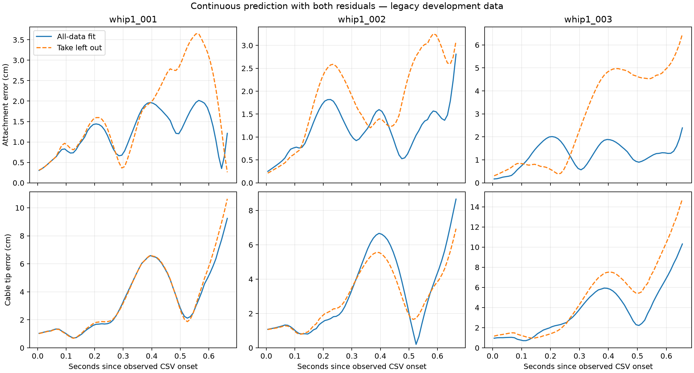

# Corrected preliminary drone/cable bundle — 8 September 2026

**Subsequent user decision (8 September): keep both the drone and cable residuals for the new model.** The component choice is settled; the recorded comparisons and limitations below remain unchanged. Both are to be carried into the planned 30 Hz integration. This records a model choice, not an already activated GUI/PPO configuration or a training restart. See the run's `component_decision_20260908.json` for checkpoint provenance.

All four components are now fitted and saved as a separate development candidate: nominal drone response, bounded drone NN, cable physics and dissipative cable NN. The nominal drone parameters are the previously corrected attitude fit, frozen during this new residual fit.

Job: `data/bootstrap_model_runs/20260908-064040-669809`. Portable component bundle: `bundle/manifest.json`. This is an offline execution predictor; the GUI/PPO still uses the preserved selected model. No PPO/SAC training or flight was started.

**Review conclusion:** fitting is complete, but enabling both NNs does not consistently improve complete-whip tip prediction. The drone NN improves tracking; the cable NN improves most pooled fitting windows yet slightly worsens measured-boundary whole-whip tip RMS on all three takes. Preserve the fitted components and ablations rather than automatically promoting the full combination. Review component choice and finish the separate 30 Hz/feasibility integration before new PPO training. See [scope and reuse](BOOTSTRAP_BUNDLE_USAGE.md) for what is temporary historical-data processing versus lasting model code.

## Whole observed maneuver assessment

Predictions begin from past observations approximately 0.105 s before CSV onset and continue without measurement resets. Actual native delayed command events drive predicted drone pose; the rotated rigid offset drives the cable boundary. Only recorded CSV-phase targets are scored. Future measured cable/pose is never a predictor input in the combined cases.

| Assessment | Take | Drone origin RMS (cm) | Attachment RMS (cm) | All cable markers RMS (cm) | Tip RMS (cm) | Tip max (cm) |
|---|---|---:|---:|---:|---:|---:|
| All-data fit | whip1_001 | 1.24 | 1.32 | 2.40 | 4.10 | 9.24 |
| All-data fit | whip1_002 | 1.20 | 1.27 | 2.17 | 3.87 | 8.66 |
| All-data fit | whip1_003 | 1.31 | 1.34 | 2.50 | 4.34 | 10.31 |
| Take left out | whip1_001 | 1.82 | 1.96 | 2.64 | 4.35 | 10.64 |
| Take left out | whip1_002 | 1.92 | 2.01 | 2.19 | 3.39 | 6.94 |
| Take left out | whip1_003 | 3.43 | 3.52 | 4.25 | 6.17 | 14.78 |

The all-data rows are training-data performance. Each left-out row uses a drone fit excluding that whip and a cable fit excluding that whip plus its grouped preliminary takes. These similar legacy takes have already informed model design; the folds are development checks, not independent flight or paper evidence.

## What the residuals change

| Take | Nominal drone origin RMS (cm) | With drone NN (cm) | Combined tip without either NN (cm) | Combined tip with both (cm) | Both, straight-down initialization (cm) |
|---|---:|---:|---:|---:|---:|
| whip1_001 | 1.88 | 1.24 | 3.55 | 4.10 | 5.21 |
| whip1_002 | 2.22 | 1.20 | 3.52 | 3.87 | 4.74 |
| whip1_003 | 2.73 | 1.31 | 4.70 | 4.34 | 6.09 |

The straight-down case uses the same measured drone pose/velocity but no measured cable shape or cable velocity. It is a sensitivity check at the recorded launch state, not proof that every ten-second hover produces the assumed state.

### Separating cable error from drone-boundary error

| Take | Measured attachment, cable physics tip RMS (cm) | Measured attachment, cable NN tip RMS (cm) | Predicted attachment, both NN tip RMS (cm) |
|---|---:|---:|---:|
| whip1_001 | 3.68 | 3.88 | 4.10 |
| whip1_002 | 3.80 | 3.96 | 3.87 |
| whip1_003 | 3.59 | 3.77 | 4.34 |

Measured-attachment replay is an intentional cable-only diagnostic using the observed boundary, separately labelled from the complete prediction. Per-marker errors, all four NN ablations, masks, initial states and trajectories are saved in `combined/`.

### Cable fitting-window results (all-data candidate)

| Take | Physics-only marker RMS (cm) | With NN marker RMS (cm) | Physics-only tip RMS (cm) | With NN tip RMS (cm) |
|---|---:|---:|---:|---:|
| fig8_001 | 2.02 | 1.68 | 2.90 | 2.32 |
| fig8_002 | 2.30 | 1.48 | 3.48 | 2.10 |
| fig8_003 | 1.97 | 1.71 | 2.66 | 2.10 |
| fig8vertical_001 | 1.65 | 1.50 | 2.46 | 2.10 |
| fig8vertical_002 | 1.92 | 2.00 | 2.75 | 2.88 |
| osc_001 | 4.09 | 3.73 | 6.57 | 5.87 |
| osc_002 | 1.89 | 1.55 | 2.69 | 2.18 |
| osc_003 | 5.69 | 5.52 | 9.94 | 8.91 |
| whip1_001 | 2.05 | 2.00 | 2.93 | 2.86 |
| whip1_002 | 2.05 | 1.99 | 2.94 | 2.86 |
| whip1_003 | 2.24 | 2.13 | 3.41 | 3.27 |

These are selected 0.65 s fitting windows, not the uninterrupted-maneuver scores above. All eleven takes contribute; this does not mean every raw frame enters the optimizer. The NN is selected on the pooled equal-take objective and can worsen an individual take or a particular whip-tip metric.

## Fitted model and data contract

- Drone nominal: delayed PD plus acceleration feedforward and frozen causal pre-hover compensation at the OptiTrack origin. Independent positive acceleration-direction scales drive the second-order attitude response. Effective loaded-drone parameters are not firmware gains or motor constants.
- Drone NN: 15 inputs (position error, velocity error, desired acceleration, predicted velocity, frozen hover compensation), two 16-unit tanh layers, three acceleration corrections bounded to ±0.5 m/s² per axis. No time/take identity or future measurement inputs. It changes realized translation; it does not directly add an attitude command. Fit only the three whip CSV maneuvers, with corresponding nominal fold parameters frozen.
- Cable: fixed 0.9525 m measured geometry, 12 nodes, measured .157 kg drone plus .018 kg cable assembly. Tracking-origin-to-attachment offset remains the rotated [.006655, -.012874, -.055] m; attachment-to-C1 is a distinct flexible .063 m span. Mass distribution remains the documented proportional estimate.
- New cable physics: EI = 1e-07 N·m² and Cb = 0.0001 N·m²·s. Selected by an explicit bounded grid/refinement with geometry/mass fixed. These are preliminary effective parameters, not an identifiability claim.
- Cable EI varies from 2.84e-8 to 1e-5 across the development folds; Cb varies between 3.75e-5 and 1e-4. The data do not establish unique material parameters. The largest remaining fitting-window tip error is 8.91 cm on osc_003; it was retained because high prediction error alone is not evidence of invalid data.
- Cable NN: two 32-unit tanh layers, relative node positions/velocities and root velocity as input; state-dependent nonnegative per-axis damping on free nodes, bounded below 2 s⁻¹. Correction is −gamma(q,v)·v; it cannot inject kinetic energy directly or correct arbitrary conservative/elastic forces. Fixed external drag is exactly zero; no 0.3 s⁻¹ initialization and no separately learned scalar drag.
- Cable fitting admits all eight preliminary and three whip takes. Whip scope is 1.3 s pre-hover plus the observed CSV, excluding post-hold/landing targets. Missing pose/markers, impossible jumps/chords, possible contact and original invalid intervals are recorded masks; raw data are preserved. No take was dropped because its fitted error was high.
- Cable physics/NN selection uses equal-take measured-boundary 0.65 s windows spanning motion intensities. NN BPTT uses 0.05 s windows, 24 updates, and training-only 0.65 s selection including the zero residual; a saved dimensionless output-bias grid is also selected only on training windows. This is a bounded bootstrap optimization budget, not a claim of optimizer convergence or long-horizon accuracy.
- Drone NN uses 100 Adam updates and the full observed maneuver; selection includes the zero-NN baseline and uses regularized training error, not held-out results.
- Coupling: desired FullState → effective loaded drone → predicted pose/rigid attachment → cable. No extra cable reaction is applied to this fitted loaded-drone response. The virtual force generator is a distinct model stage and still needs the planned 30 Hz integration.

## Remaining limitations

The old controller executed only the 20 observed maneuver rows (~0.66–0.67 s), not the later reference tail or planned ~0.78 s hit. These scores therefore do not establish hitting accuracy. Takeoff and post-hold were outside the CSV and are retained as separate phases, not silently appended to the maneuver loss.

| Take | Nominal first-0.5-s post-hold origin RMS (cm) | With drone NN (cm) |
|---|---:|---:|
| whip1_001 | 15.16 | 16.23 |
| whip1_002 | 18.49 | 19.79 |
| whip1_003 | 14.76 | 15.71 |

Post-hold was not fitted. Its logged hold target was selected using the real end position, so this is also not validation of future preplanned recovery. Longer maneuvers, recovery, different cable loads/shapes and thrust feasibility remain unestablished. The effective drone model can absorb cable-loading effects specific to these whips; it is not a generally identified two-way aircraft/cable plant.

The next integration step is to connect this reviewed candidate to a newly trained 30 Hz force policy and matching 30 Hz FullState path, with feasibility checks and consistent rehearsal/export. Do not relabel or retime the old 20 Hz checkpoint. New compatible recordings should assess the frozen candidate before adaptation; then use new recordings for subsequent fits while retaining legacy provenance as an archive.

## Numerical sensitivity

A separate seven-case cable comparison did not pass strict batch-versus-single equality: maximum accumulated marker coordinate difference was 1.20 mm. Therefore the primary complete assessments run each trajectory separately. The original batched physical/residual fitting remains recorded as such; it is not claimed bit-identical to single-case deployment. See `numerical_batch_review.json` and both probe archives.

On take 1 with both residuals, increasing cable substeps from 12 to 24 per 10 ms step changed maximum marker coordinates by 3.70 mm, but tip RMS changed from 4.098 cm to 4.090 cm. This limited probe supports the scale of the reported error, not exact numerical equivalence or a general convergence guarantee. The fit and primary assessment keep the original 12 substeps; no simulator change was hidden inside fitting.

## Verification and evidence

Actual platform: Windows-11-10.0.26200-SP0, NVIDIA GeForce RTX 4080. All 133 protected original measurement/model/config/policy files verified unchanged; all input/mask/nominal/source snapshots checked. Both packaged residuals load with SHA-256 verification. No automatic activation, source deletion, data retirement or flight.

95 distinct targeted tests passed. See `test_verification.json` for exact test commands/results; `verification.json`, `protocol.json`, per-fold parameter grids/gradient checks/history, and `combined/results.json` for the numerical record.

