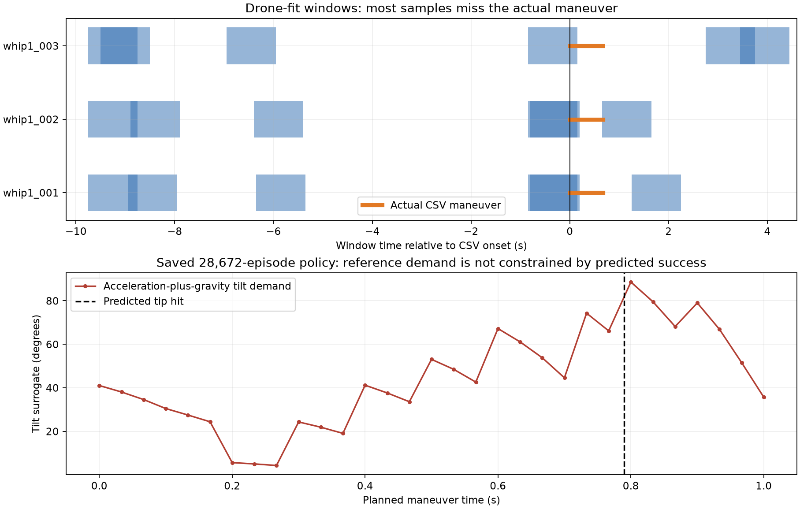

# Complete-model theory and implementation audit — 8 September 2026 UTC

The two-residual approach is a defensible development model, but this audit found several concrete issues that should be corrected before treating the current PPO as a deployment candidate. The most important are inadequate maneuver coverage in the drone fit, missing feasibility checks, and a discrepancy between the training prediction and the Full State preview. Training was left running. No reward, physics, residual weights, controller, logger, or active configuration was changed during this audit.

Evidence is in [the audit folder](../runs/audits/20260908-025749-theory-code-audit/), particularly `probe_evidence.json`, the copied policy/configuration snapshot, and `snapshot_prediction.npz`. The reproducible main probe is [tools/audit_complete_model.py](../tools/audit_complete_model.py). The policy snapshot contains 28,672 training episodes; subsequent checkpoints may differ. All numerical probes used Windows and an RTX 4080. This was a focused review of the complete training/identification/export route and its supporting tests, not certification of every repository file or the remote flight system.

**1. High priority — the drone fit mostly misses the maneuver. Confirmed from saved fitting windows.**

`historical_fit.py:46` selects windows by cable-tip displacement, splits them into three intensity groups, and chooses evenly spaced start indexes within each group. `drone_windows` at line 293 reuses that selector. The final drone fit uses six one-second windows per take. This does not ensure coverage of command onset, acceleration, reversal, or the complete whip.

| Take | Maneuver intervals represented, counting repeated windows | Total fitted intervals | Unique maneuver intervals covered |
|---|---:|---:|---:|
| whip1_001 | 35 | 600 | 20 / 67 |
| whip1_002 | 37 | 600 | 22 / 67 |
| whip1_003 | 15 | 600 | 15 / 66 |

Only 87/1,800 interval occurrences, **4.83%**, are in the actual CSV maneuver. For 001 the 0.20–0.66 s segment is absent; for 002 the 0.20–0.64 s segment is absent; for 003 the 0.15–0.65 s segment is absent. Many windows start around nine seconds before the maneuver. A window that starts at −0.85 s sees only the first 0.15 s of the command transient, then stops.

This affects both the nominal gains and the drone NN: they share these windows. It is a data-selection defect, not evidence that two residuals are intrinsically unsuitable. It explains why a favorable short-window average cannot establish full-whip accuracy. The whole-recording provenance is correct, but the phrase “fitted on yesterday's whips” overstated how much of the whips actually informed the response model. I should have checked this coverage before launching the new PPO.

**Fix:** construct explicit command-phase windows, always including a continuous rollout from pre-command hover through the complete observed CSV segment. Retain hover and post-whip windows as separately weighted auxiliary data. Report maneuver-only and full-transient errors separately. First compare the current small response model with its NN disabled/enabled on those windows; refit the drone component before increasing network size. Preserve old fit artifacts and use the same whole-take exclusions for development checks.

**2. High priority — simulated success does not constrain the complete command sequence's feasibility. Confirmed on a saved policy.**

The virtual point model bounds the commanded force norm and vertical component, but has no attitude, angular-rate, motor, or thrust slew state. The effective drone response is a translational second-order model plus NN; it also has no actuator feasibility constraints. `execute_fullstate_batch` checks numerical position/speed bounds, not whether a vehicle can track the PVA.

The audited policy snapshot produces a predicted tip hit at **0.79 s** and no numerical failure. Its generated PVA requires an acceleration-plus-gravity tilt surrogate of **74.30° before the predicted hit** and **88.62° at 0.80 s**, with vertical specific-force component only **0.253 m/s²** at that sample. The planned sequence continues to 1.00 s. These are reference demands, not measured attitudes, and the surrogate excludes cable reaction and feedback corrections. We have not established the vehicle's true limit. The evidence nevertheless shows that the current success metric is not a feasibility check.

Further, the ordinary task scorer deactivates after the first valid hit (`point_force_env.py`, success handling). Full-state execution continues to the frozen cutoff, but most position/displacement penalties stop accumulating after that hit. A difficult post-hit tail can therefore receive little additional penalty even though it is still part of the exported whip. This is separate from the later gentle recovery.

**Fix:** evaluate the full command sequence through its fixed cutoff for thrust-direction, acceleration, slew, and workspace demands, including samples after the first hit. Keep the user's hit objective and slow recovery distinction. Use measured platform limits when available; do not invent a tilt threshold. A future decision to constrain or shorten the planned tail must be made consistently in training and export and saved as a new experiment. Current high success should remain a simulated development metric.

The reference approach relies on tracking dynamics: Bitcraze's documentation describes the Mellinger controller as a geometric position/attitude controller, dependent on configured mass. Sending PVA does not remove attitude dynamics. Its documented rates describe upstream firmware, not the unverified firmware on the colleague's vehicle. [Bitcraze controller documentation](https://www.bitcraze.io/documentation/repository/crazyflie-firmware/master/functional-areas/sensor-to-control/controllers/).

**3. High priority — post-hit numerical failure is not penalized in the new full-state path. Confirmed by an isolated synthetic probe.**

At `learning/fullstate_rollout.py:106`, execution failure is merged into `score.failed`, but a numerical failure after the scorer has deactivated does not receive the failure cost. The legacy force-execution branch explicitly accounts for failures that occur outside the active scorer (`deployment_rollout.py:277`); the new branch does not.

I injected a synthetic cable transition that first makes a valid hit, then returns NaN later in the same frozen sequence. Compared with an otherwise identical finite tail, both cases retain `success=True` and exactly the same reward, approximately 319.99. The bad case correctly sets `failed=True`, but its numerical penalty remains zero. Evaluation counts `score.episode_success` directly, so success and failure can be reported simultaneously. This is a fault-injection test, not an observed NaN in the training run.

**Fix:** account for newly detected execution failures across the entire frozen sequence exactly once; distinguish first-contact success from usable complete execution in metrics/checkpoint selection. Add a regression test covering a failure after a hit and after invalid contact. This changes the training objective/selection behavior, so preserve the current run and apply the fix in a new run rather than silently modifying its live source.

**4. High priority for use — this run cannot currently start the Full State rehearsal or export a package. Confirmed by calling the exporter.**

The new run stores both verified residual checkpoints under `runs/ppo/.../launch_config/`. `deployment/package.py:28–40` rejects any enabled residual path not under `data/baselines`. The Full State tab calls that exporter at the start of rehearsal (`testing_page.py:337`). The probe raises **“Export requires an applied full-state execution baseline.”** before creating an output package.

The snapshot is a sensible way to preserve training provenance; the exporter contract was not updated to accept it. Merely applying some later baseline will not change the paths in this run's saved model.

**Fix:** let package creation copy and verify the exact run-snapshot residuals into a self-contained package, rewrite only the packaged model paths, and verify the copied bytes. Keep original run/model hashes unchanged. Test the package from a separate directory with no access to the original repository. This can be fixed without retraining, provided model bytes and execution semantics are preserved.

**5. High priority for interpretation — the Full State preview and PPO score represent different trajectories. Confirmed code path and numerical example.**

Training uses:

`initial estimate → frozen forces → virtual cable/drone point simulation → sampled 30 Hz PVA → fitted drone response + NN → attachment-driven cable physics + NN → reward`.

The Full State worker instead replays forces through the virtual point/cable physics, shows that source simulation, and exports its trajectory with an analytic recovery. It does not execute the reference through `FullStateAttachmentModel` for the 3D display or displayed hit outcome. Its explanatory label does say “source simulation,” but users can still mistake the displayed hit for the predicted execution result.

For the audited checkpoint and identical nominal initialization, batch planning and deployment planning produce **exactly identical forces**, both with a 1.00 s cutoff. The virtual plan misses, while the complete predicted execution hits at 0.79 s. That difference can be legitimate: PPO is optimizing the modeled execution, not forcing the virtual tip to hit. A virtual miss must not automatically invalidate an execution-model hit, and neither is a real hit.

**Fix:** retain the virtual source trajectory for CSV generation, and add a clearly distinct complete-execution prediction in the preview using the same evaluator as training. Do not export the predicted actual response as the new desired reference: doing so would apply the response model again on the real vehicle. Check equality of generated PVA and predictions between a saved training scenario and the export/rehearsal path, not only equality of force arrays. The live rehearsal currently also starts its virtual replay from the settled simulated cable rather than the planner's assumed hanging state; quantify that difference in this equality test.

**6. Medium priority — numerical trajectory interpolation changes acceleration demands. Confirmed analytic reproduction; real effect not isolated.**

`deployment/fullstate.py:26` constructs cubic Hermite position/velocity interpolation and differentiates it analytically for acceleration. The formula itself passes a constant-acceleration analytic trajectory test to about 1e−12. The subtle issue is that the DDER integrator updates positions using the new velocity at each substep (`dder.py:2257`), so its sampled P/V are not the exact analytic P/V of that same continuous acceleration.

For constant physical acceleration `a`, symplectic Euler with 12 substeps in an interval of width `h` yields a displacement term `0.5*a*h²*(1+1/12)`. Hermite's endpoint accelerations are then `1.25*a` and `0.75*a`, despite constant physical acceleration. The audit reproduces this ±25% ripple. Sampling the particular 30 Hz grid in the one-second toy example produces a mean of 1.067*a, demonstrating sensitivity to interval phase and knot rounding.

In the actual historical source, the first exported acceleration is `[13.003, 0.021, 4.741] m/s²`, versus interval `Δv/Δt = [10.385, 0.017, 3.786] m/s²`. Across the first 20 packets the vector discrepancy is 1.318 m/s² RMS. Endpoint acceleration and interval average are not identical physical quantities, so this alone does not prove that the historical acceleration was wrong by that amount. It does show that “exporting the trajectory unchanged” is not equivalent to preserving the simulator's acceleration/force at every instant.

**Fix:** compare alternative derivative-consistent trajectory representations and their held PVA execution, with analytic constant-acceleration tests and timestep/substep convergence. Do not smooth A independently of P and V. Freeze any chosen conversion as part of the model being fitted; changing the exporter changes the command distribution and must be revalidated. Raising command rate alone does not establish a solution.

**7. High priority for the next experiment — the supplied controller contains the truncated sequence. Confirmed source-to-log match.**

The supplied [full_state_pva.py](C:/Users/wts28/Downloads/full_state_pva.py:40) contains exactly **20 hard-coded PVA samples**, ending at 0.633333 s. Those P/V/A values match the first 20 historical CSV rows with zero numeric difference. The normal execution loop holds the last sample for another 1/30 s, then returns to a measured-position hold, giving 0.666667 s. This precisely explains the observed prefix and timing if that file was the executed version; it is not evidence of a random packet-loss truncation. The colleague's currently installed version has not been verified.

The supplied logger subscribes to the command topic and timestamps receipt on the host. It logs `cf.get_position()` and derives velocity from consecutive returned positions. Those are not confirmations that each packet was applied onboard at that timestamp. Approximate alignment of measured XYZ and repeated ~10 Hz logged positions cannot identify actual vehicle transport delay independently of logging delay. The fitted 60 ms delay must remain an effective delay.

**Fix:** ensure the current executor consumes the complete new CSV, preserving its timestamps and phase boundaries, instead of retaining this 20-row list. Reconcile emitted row count/duration with the artifact and the logger. Keep raw logs. Do not interpolate a missing historical tail or mark post-CSV hold as a commanded whip. No logger change is required merely to discover the existing truncation; more precise delay identification needs better timestamp evidence.

**8. Medium priority — training supplies cable information that the proposed real initializer will not have. Confirmed.**

`sample_batch` gives the planning estimate randomized cable tilt, bend and angular velocity (`deployment_rollout.py:57–85`). The real experiment adapter constructs a straight hanging cable with translational drone velocity (`tracking_rehearsal.py:launch_state`). Thus randomized training episodes partially reveal their initial cable perturbation to the planner, while deployment assumes it away. In a deterministic audit draw, the estimate differs from the hanging initializer by 1.47 cm at the tip and 0.0237 m/s in tip velocity. This is likely smaller than the current response-model error, but it is a real information mismatch.

**Fix:** randomize the execution truth, but derive the planning estimate only from the drone information available after hover, with the same assumed hanging cable as deployment. Retain the existing 5 cm start/target variation. This requires a new training configuration/implementation version; do not quietly reinterpret the current run as having trained under that observation contract.

**9. Modeling limitation — the drone response is a local loaded-system surrogate, not a complete drone physics model.**

The implemented equation is `a = Kp*(p_ref-p) + Kd*(v_ref-v) + G*a_ref + NN(features)`, integrated recursively. The NN receives 21 features and is bounded componentwise to ±2 m/s². There is no attitude/integral/motor state, explicit cable-load input, uncertainty estimate, or saturation model. Final gains include vertical `Kd≈20` and Y/Z feedforward gains `≈2`, all at their allowed upper bounds. The sparsely covered, nearly planar, repeated command is insufficient to interpret these as firmware gains or broadly identified 3D dynamics.

Its already implicit fixed-setup cable load explains why the execution code correctly avoids adding a second explicit cable reaction to the drone surrogate. However, the effective response may change when PPO produces substantially different cable tension histories. This is a limitation of the one-way approximation, not a reason to add the cable force again without re-identification.

**Fix:** first repair maneuver-window coverage; assess prediction over the whole transient with and without NN. Then inspect command/response coverage of candidate PPO plans. If generalization remains poor, add only identified missing states/features, such as attitude/response lag or cable-load dependence, and use uncertainty or local command bounds. Repeated trials reduce repeatability uncertainty but do not replace varied excitation. Residual-model literature explicitly identifies model-error exploitation as a limitation of model-based policy learning. [Lutter et al., Differentiable Physics Models](https://arxiv.org/abs/2011.01734). Short accurate rollouts are not sufficient evidence for unrestricted long rollouts; MBPO analyzes this model-usage tradeoff. [Janner et al., When to Trust Your Model](https://arxiv.org/abs/1906.08253).

**10. Modeling limitation — the current cable NN is restricted damping, and its optimization uses very short rollouts.**

The active candidate NN is `a_res[j] = −gamma_j(q,v) * v[j]`, with each world-axis rate between 0 and 2 s⁻¹ and zero correction at the attachment. It can dissipate energy through velocity opposition, but cannot represent every residual force: for example, an independent force at zero velocity or arbitrary transverse lift. Global componentwise rates are not guaranteed rotation-equivariant. The `acceleration_limit=0.5` field is not the active bound in dissipative mode; correction magnitude instead scales with velocity. Therefore “all unmodeled cable physics is learned” would be an overstatement.

The candidate includes both fitted internal bending damping and NN damping. These can be hard to distinguish from trajectories. EI reaches 1e−9 in the final fit, while folds differ greatly with small objective changes; it is an effective fitted value, not a reliable material measurement. The code actually trains the cable NN through **0.05 s / five-step** windows (`historical_fit.py:230`), then selects it using two-second training rollouts and calibrates an output bias on those longer windows. The protocol's 0.5 s cable horizon concerns physical fitting, not NN backpropagation. This distinction matters when describing the procedure.

**Fix:** report the exact residual class and both training/selection horizons. Test continuous maneuver predictions, parameter sensitivity and timestep convergence; extend NN optimization horizon if that improves held-out transient prediction. Retain the dissipative restriction unless data justify a more general force model. The rod model's fixed-length, point/pivot attachment and lumped-marker assumptions should be checked against physical construction. DER is a discretization framework, not automatic validation of these particular assumptions. [Bergou et al., Discrete Elastic Rods](https://www.cs.columbia.edu/cg/rods/index.html).

**11. Interface and reporting limitations — frames, body rates, units and labels need precise treatment.**

The fit computes attachment truth as `p_cf7 + R(t)*r_body`. Command positions add only the initial world offset. The export worker passes the saved body offset directly as a world offset, which assumes the corresponding initial orientation. The ideal simulator has no measured orientation. In physical use, rotate the measured offset by the initial orientation; verify the OptiTrack rigid-body frame. Dynamic attachment velocity also depends on `omega × r`, and acceleration on angular acceleration and centripetal terms. The empirical attachment model absorbs those effects only within its fitted behavior.

Zero yaw and zero body-rate feedforward do not mean zero roll/pitch during an accelerating maneuver. The supplied sender always sets X/Y body-rate feedforward to zero; an aggressive trajectory may need improved rate feedforward/regularity, depending on the installed controller. The upstream API defines acceleration in m/s² and omega in body-frame rad/s. This is an interface reference, not validation of the colleague's installed version. [Crazyswarm2 source](https://github.com/IMRCLab/crazyswarm2/blob/main/crazyflie_py/crazyflie_py/crazyflie.py).

Several metadata strings still say `initial_state_only_open_loop_once_with_pid_recovery`, while full-state execution deliberately excludes recovery. The evaluator reports recovery rate as zero rather than prominently showing “not evaluated.” A “fresh” PPO here has new trainable weights/optimizer but retains a scripted action prior; it is not an unseeded policy. Validation reuses a fixed simulated scenario seed, and 25% nominal fraction repeats the same scenario. Neither checkpoint selection on that set nor historical data reused for fitting is independent real validation.

**Fix:** preserve file provenance while clarifying these labels; package the exact model, residuals, exporter version and initializer. Keep the true `fullstate_30hz.csv` kinematic acceleration distinct from legacy `controller_acceleration.csv`, which is gravity-compensated force divided by controller mass. Do not add/subtract weight again from kinematic full-state acceleration.

**What checked out**

- The frozen-force implementation queries the policy only inside the private virtual rollout. Execution truth is not fed back into planning. The policy is queried repeatedly in simulation to compile a sequence; it is not one neural-network call that directly returns every future force.
- Both residual checkpoints are enabled and hash-verified in this run. The mass decomposition is 0.157 kg drone plus 0.018 kg cable assembly. Separate cable drag is zero in the candidate; no hidden 0.3 s⁻¹ initialization was found in this candidate path.
- The execution cable receives a predicted attachment boundary and its own residual, without adding a second drone mass or applying the virtual force to it again.
- Training and deployment force planners matched exactly for the saved snapshot tested. Historical stored forces also previously reproduced the archived trajectory exactly.
- PPO computes tanh-Gaussian log probabilities, clipped probability ratios and masked GAE. With terminal sequence reward and gamma=lambda=1, the return propagates to all active planning actions. No basic optimizer/credit-assignment defect was identified in this review. The value function need not observe execution truth to be an action-independent baseline, though partial history/uncertainty can increase variance. The structure is consistent with optimizing a learned simulator using PPO; it should not be presented as implementing MBPO. [Schulman et al., PPO](https://arxiv.org/abs/1707.06347).
- Sixteen targeted existing tests passed: command history/masking, drone split scope, full-state CPU/GPU execution, PVA export and dissipative residual behavior. Passing these local tests does not cover the newly discovered integration and data-selection defects.

**Recommended order of work**

1. Correct the post-hit failure accounting and add its regression test. Repair snapshot export independently of the running PPO.
2. Fix drone window selection, refit on the complete observed maneuver, and repeat continuous combined validation. Keep old measurements; do not discard the failed parts simply because the current model predicts them poorly.
3. Compare virtual reference, modeled execution and measured trajectory as three separate quantities. Verify the exact new CSV can be consumed in full by the current remote executor.
4. Resolve the PVA derivative/feasibility contract and the hanging-initializer mismatch before a replacement training run. Reuse this running experiment as a versioned exploratory comparison; do not silently patch its live model or call its success a flight guarantee.
5. Use new executions for prospective assessment. Report command tracking, attachment trajectory, cable-relative trajectory, tip error at the planned hit time and minimum target distance separately, with timing/marker-quality masks and failures retained.

No flight/controller behavior was exercised by this audit. The colleague's current code, firmware, receiver timing and vehicle limits remain unverified. The theory is worth pursuing; the immediate work is to make the implementation and evidence match the claimed experiment.
