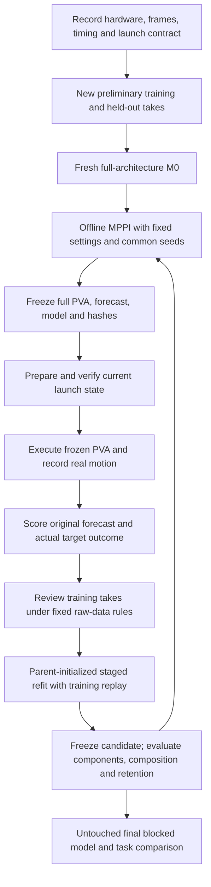

# Aerial whipping: whole-system paper audit

11 September 2026. This is the authoritative current paper assessment. Read the
[experiment protocol](PAPER_EXPERIMENT_PROTOCOL.md) for the selected design and
remaining release conditions. Historical methods and results remain preserved;
this audit does not refit a model or change a flown command.

## 1. Verdict and research question

**The project has a defensible system architecture and a repeatable implemented
identification method. It is not yet ready to claim reliable real-world target
interception or start the clean paper collection.** The immediate work is to
standardize fresh M0 construction, verify the execution and measurement contract,
and establish repeatable launch conditions. Another increasingly elaborate reward
or a new adaptation algorithm is not the priority.

The research question should be: **Can a reusable model of the loaded UAV and
flexible cable, refined from a small number of recorded flights, improve subsequent
open-loop targeted whipping through offline sampling-based replanning?**

The intended contribution is the complete system: measured command-to-cable
dynamics, planning beyond static cable reach, and a repeatable real-to-sim-to-real
update loop. Standard system identification is an appropriate supporting method.
The paper need not establish a new adaptation algorithm, a new rod model, or a
new MPPI theorem. Those claims would create obligations the current work does
not address.

The selected baseline is the implemented **staged, regularized nonlinear system
identification by simulation-error minimization**, with both residual model
classes fixed across the clean study. Combined command-to-tip error is the main
model evaluation. A new joint optimization stage is not required for this paper
baseline. The earlier combined-fitting proposal remains a possible versioned
development extension, not a method already executed.

All existing preliminary, M0, M1 and M2 data are development evidence, as the user
specified. A documented release candidate is not an assertion that missing
hardware checks have passed. The [protocol](PAPER_EXPERIMENT_PROTOCOL.md) therefore
has `ready_for_clean_collection: false` until its concrete release conditions close.

## 2. What was audited

The review followed the actual selected model and flight packages through:

- PVA generation, packet timing, effective aircraft response, attachment geometry,
  cable simulation, residual networks, and the production prediction path;
- raw flight pairing, clock estimation, missing observations, causal initialization,
  fitting windows, replay weights, staged optimization and validation ancestry;
- whole-maneuver MPPI proposals, ranking, objective, export and recovery;
- original forecasts, matched-model diagnostics, real task metrics, and the study UI;
- active paper documentation and relevant primary literature, including recent
  aerial cable-control and payload-throwing work.

This is a scoped implementation and research audit, not an exhaustive proof of
every branch in the repository. The selected experiment is MPPI; PPO remains a
separate implementation and is not required for this paper's main evidence.
The actual external flight sender/firmware chain cannot be certified from the
available internal source and host logs alone.

The audit artifacts are in
[`runs/audits/paper-pipeline-audit-20260911`](../runs/audits/paper-pipeline-audit-20260911/README.md).
There were 88 passing focused tests and one skipped historical-fixture test.
The audit also performed three fixed-command numerical diagnostic rollouts and
read-only launch/task-window measurements. No fitting, new MPPI search, physical
flight, model promotion, or flight-selection change was performed.

## 3. Where this sits in the literature

These papers constrain the claims and motivate specific checks. They do not
validate this aircraft, these numerical parameters, or this reward. Publication
status below is the status established by the accessed source; the two 2026
manuscripts are treated as preprints.

| Primary work | Relevant evidence and distinction | Consequence for our paper |
|---|---|---|
| [Chi et al., Iterative Residual Policy, RSS 2022](https://arxiv.org/html/2203.00663v2) | Dynamic rope manipulation improves by predicting action changes from the preceding observed trajectory. Their rope-target experiment uses a fixed arm and planar task; it is not our loaded UAV forward-model update. | Closest task/iteration comparator. Explain reusable model refinement versus task-specific action correction. Do not compare their planar distance directly with our 3D trajectory RMS. |
| [Chebotar et al., SimOpt, 2019](https://arxiv.org/html/1810.05687v4) | Alternates real data, simulation-parameter distribution adaptation, and policy improvement using trajectory discrepancy. | Grounds iterative simulation calibration. Our point estimate with parent regularization is not an implementation of their distribution update. |
| [Mamedov et al., Learning DLO Dynamics from a Single Trajectory, 2024](https://arxiv.org/html/2407.03476v1) | Uses a structured hybrid dynamics model, finite rollout training, and explicit latent-state initialization. Training-state estimation and test initialization are distinguished. | Supports evaluating recursive predictions and treating initialization as part of the estimator. Our weighted history fit is not their moving-horizon estimator; one second is an engineering choice. |
| [Chen et al., DEFORM, 2024](https://arxiv.org/html/2406.05931v2) | Combines differentiable rod mechanics, learned corrections, and constraint handling; evaluates physical and learned components and prediction horizon. | Ground the hybrid-model approach and component ablations. Our bounded acceleration MLP does not inherit DEFORM's specific correction architecture or conservation properties. |
| [Bergou et al., Discrete Elastic Rods, 2008](https://www.cs.columbia.edu/cg/pdfs/143-rods.pdf) | Provides discrete rod geometry and mechanics. | Cite the mechanics foundation. Describe our free attachment, discretization, damping and curvature regularization explicitly, rather than implying the original paper validates all implementation choices. |
| [Williams et al., MPPI, 2015 manuscript](https://arxiv.org/pdf/1509.01149) | Derives sampling-based control with distribution/importance-weight assumptions and feedback execution. | Call our actual variant MPPI-inspired offline trajectory optimization. Adaptive proposal families, deterministic incumbents and hit-first ranking are implementation choices, not a direct theorem from MPPI. |
| [Krotov et al., Motor control beyond reach, 2022](https://doi.org/10.1098/rsos.220581) | Human-whip experiments distinguish observed contact from geometric error. Marker speed peaks often progress from proximal to distal segments; unfolding also occurs in poor attempts. | Use task success independently of a wave-style score. Show marker-speed progression as a diagnostic, not a necessary or sufficient hit criterion. Full article checked through its [article PDF](https://upload.wikimedia.org/wikipedia/commons/f/fe/Motor_control_beyond_reach%E2%80%94how_humans_hit_a_target_with_a_whip.pdf). |
| [Edraki et al., Human-Inspired Robot Whip Manipulation, ICRA workshop 2025](https://deformable-workshop.github.io/icra2025/spotlight/01_01_05_Edraki_Human.pdf) | Studies preparatory and striking actions, target distance, and effort with a fixed robot arm. This is a workshop paper. | Preparation can simplify the task. Their geometric threshold is task-specific; it does not establish a universal whip-speed or bend threshold. |
| [Jakobsson et al., Wiggle and Go!, April 2026 preprint](https://arxiv.org/html/2604.22102v1) | Diagnostic rope excitation informs model descriptors and sampling-based trajectory search for dynamic manipulation. | Identification followed by dynamic rope planning is already an active direction. State the aerial free-tip task and repeated measured refinement precisely; avoid broad first-system claims. |
| [Shen, Franchi and Gabellieri, Aerial Robots Carrying Flexible Cables, 2024](https://arxiv.org/html/2403.17565v2) | Uses a flexible-cable model and reduced dynamics for quadrotor cable-shape control, with real aerial experiments. | Direct aerial-cable precedent. Our task is a fast free-tip strike with frozen commands, rather than online shape tracking. The effective cascade needs its own validation. |
| [Zhai et al., Learning to Throw, June 2026 preprint](https://arxiv.org/html/2606.27603v1) | Quadrotor cable-suspended payload throwing uses learned control and evaluates important dynamics/controller modeling choices. Payload release differs from a tethered free-tip strike. | Cite the close aerial dynamic-manipulation setting. Explain differences in task, feedback, model refinement and validation; do not claim the first agile cable manipulation with a quadrotor. |
| [Ribeiro et al., On the smoothness of nonlinear system identification, Automatica 2020](https://arxiv.org/abs/1905.00820) | Analyzes difficult optimization landscapes for long simulation horizons and motivates multiple-shooting approaches. | Longer windows are not automatically better. Our independent initialized windows have no continuity constraints and should not be called constrained multiple shooting. |
| [Huang et al., COMPASS, CoRL 2023](https://proceedings.mlr.press/v229/huang23c.html) | Factors simulator discrepancies through structured parameter relationships. | Supports making discrepancy diagnosis explicit. Our measured-boundary interventions are component diagnostics, not a learned causal-discovery algorithm. |

The strongest defensible novelty statement is narrow: integration and experimental
demonstration of a loaded-UAV/free-tip whipping loop with a reusable identified
model and offline replanning. Whether this is sufficiently novel for a particular
venue depends on the completed evidence and a final submission-date literature
check. This search does not establish an exhaustive priority claim.

## 4. The actual system and mathematical contract

### Hardware and reference points

| Quantity | Current development value | Qualification |
|---|---|---|
| Aircraft / cable assembly mass | 145 g / 17 g | User reported; total 162 g |
| Battery / controller | 2S; Mellinger | User reports fivefold integral-gain repair; preserve and record an actual controller/firmware export before the clean study |
| Cable length | 0.9525 m | Existing marker-interval geometry |
| Cable representation | 10 measured markers; 12 simulated nodes and 11 edges | First marker interval has an extra subdivision |
| Tracking-origin initial position | `[0, 0, 1.255]` m | Original planning assumption, not each take's measured start |
| Target | `[1.25, 0, 1.0]` m; radius 0.05 m | Virtual sphere in the tracking frame |
| Body-frame origin-to-attachment offset | `[0.0066549972854827175, -0.01287427254333901, -0.055]` m | Apply the measured rotation |
| Command rate / model output grid | 30 Hz / 150 Hz | Cable has eight internal substeps per outer step |
| Cable internal step | 0.8333 ms | Numerical setting, not a measured physical time constant |

Individual marker and bare-cable masses were scaled in existing proportions to
17 g; they were not all independently reweighed. The total load is about 11.7%
of aircraft mass. The load cannot simply be declared negligible.

For tracked origin position and orientation `(p_o, R)`, the cable root is
`p_a = p_o + R r_oa`. The same convention must hold in measured preprocessing,
simulation, exported commands and plots. The tracked origin is not automatically
the center of mass or the firmware's position reference.

### Commands and aircraft response

For held jerk `j_k` over `h = 1/30 s`, reference knots obey

```text
a[k+1] = a[k] + h j[k]
v[k+1] = v[k] + h a[k] + h² j[k]/2
p[k+1] = p[k] + h v[k] + h² a[k]/2 + h³ j[k]/6
```

The CSV sends desired tracked-origin PVA, yaw and yaw rate. Acceleration is
kinematic; gravity is not added again to that column. Reference integration is
exact for held jerk. The aircraft model receives sampled, held PVA packets with
its effective fitted delay; this differs from perfect continuous spline tracking.

The translation model has the schematic form

```text
dot(p) = v
dot(v) = Kp (p_des_delayed - p) + Kd (v_des_delayed - v)
         + Gff a_des_delayed + b + r_drone(features)
```

The diagonal response gains separate horizontal and vertical behavior. An
orientation response model includes acceleration scales, a lag and frame alignment.
The initial bias is inferred from hover history; it is not a measurement of the
onboard integrator state. A fitted delay can absorb transport, estimation and
response effects and is not an independently measured radio latency.

The forward path is a **cascade**:


There is no explicit cable-reaction feedback from `C` to `D`. The aircraft fit
already describes a loaded system; adding a force term without changing that
identification could double-count some response. Conversely, the present cascade
cannot guarantee accurate extrapolation to different loads or cable shapes.
Judge it by complete command-to-tip prediction within the experiment's domain.

### Cable and neural corrections

The cable implementation combines rod bending, implicit bending damping,
external velocity damping and length constraints. Its root is position-driven
with the current free-pivot convention. The curvature-frame regularization
`2e-5` is part of the selected numerical model. Material-like fitted coefficients
must be called effective parameters unless independently measured and identifiable.

The aircraft residual is a bounded acceleration MLP, 15 → 16 → 16 → 3, using
scaled relative tracking features, velocity and bias. The cable residual is a
global MLP, 75 → 32 → 32 → 33 for 12 nodes, using root-relative positions and
velocities plus root velocity. The root output is zero. Both use tanh nonlinearities
and a per-component correction scale of 0.5 m/s². These are discrepancy models,
not identified motor-thrust limits. Translation-relative features do not imply
rotation equivariance, energy conservation or passivity. Cable corrections can
inject energy; no conservation claim follows from using a physics backbone.

The clean baseline should retain both residual architectures from M0 onward,
with zero-output initialization before preliminary fitting. The development M0
had its cable residual disabled whereas M1/M2 enabled it. That architecture change
must not be silently reproduced inside a purported fixed-method comparison.

## 5. Identification: what is sound and what needs standardization

### Data preparation

The existing preparation has several valuable protections: immutable raw files,
paired recordings, exact command checks, explicit geometry, native observation
masks, past-only initialization, separate data roles, source hashes and selection
frozen before validation. Keep these.

The logger XYZ and native pose both originate from OptiTrack. They are not two
independent sensors. Native pose is about 100 Hz; logger pose can be cached at
about 10 Hz. Commands matched 309/311/310 rows per M0/M1/M2 take respectively,
but host-log agreement does not alone establish firmware receipt and execution
semantics. Current alignment estimates a clock offset from command events and
reviewed stream relationships. It does not independently identify every delay
or certify absence of clock drift.

Fit raw global coordinates. Do not improve the main result by recentering height,
aligning trajectories to minimize model error, borrowing future initialization
samples, or interpolating across missing-marker gaps. Any fixed transform or
clock correction must be measured or estimated under a predeclared,
model-independent rule and recorded with uncertainty.

The current histories are 0.4 s for the aircraft and 1 s for the cable. The cable
endpoint velocity uses a weighted quadratic fit with 0.02 s exponential time
scale: a one-second available history is **not a uniform one-second average**.
Recent samples dominate the velocity. Node positions and velocities are mapped
and projected consistently with the rod constraints. No future measured states
reset a recursive scored rollout. Retrospective clock estimation must not be
described as a demonstrated online state-estimator implementation.

Whip fitting uses the complete planned whip interval, about 1.13–1.2 s in the
current flights. Preliminary windows are 2 s for the aircraft and 1 s for the
cable. Recovery and contact are separate. A longer fit window trades more dynamic
information against accumulated model error, initialization sensitivity and
gradient difficulty; it is not automatically superior.

Current geometric/jump/coverage masks are fixed from source observations, not
candidate fit error. The jump checks are about 0.10 m per adjacent drone sample
and 0.15 m per cable marker sample, with a 0.015 m length tolerance and 80%
coverage fitting gate. Publish excluded intervals and phase-wise coverage:
fast motion can be disproportionately removed by such rules. Fitting eligibility
is not the same as whether a real target encounter is observable.

### Objective and optimizer

Let `e` be a three-dimensional position error divided by the fixed 0.02 m scale.
The robust vector penalty is `rho(||e||²) = 2(sqrt(1 + ||e||²) - 1)`.
Orientation uses the same robust construction with a 0.05 rad scale.
These scales are engineering normalizers, not estimated sensor standard deviations.

For each component, the objective is a weighted mean of valid recursive
simulation errors plus parent and residual regularization. The cable data term
is half all-marker loss and half tip loss. Positive nominal parameters use log
coordinates; their parent penalty coefficient is 0.03. The delay profile has
an additional `0.03*((delay-parent_delay)/0.04)²` penalty. Each neural correction
has magnitude and parent-output-change penalties of 0.01 normalized by the
correction scale squared. Compare parent and candidate outputs at the same
simulated state, rather than conflating state changes with network changes.

Unnormalized data-family masses are new whip 1, all prior whip 0.5 and preliminary
0.5, normalized over the families present. Within a family, takes have equal
weight divided across their eligible windows. All prior whip takes form one
family; equal weighting of each old generation is not implemented. Data replay
means prior training observations remain in the fit, not just a weight warm start.

The implemented stage sequence is:

1. Fit six aircraft translation response gains and profile the fixed delay grid,
   retaining the inherited residual; fit orientation response.
2. Fit the aircraft residual through the entire recursive trajectory and refine
   orientation after the response change.
3. Fit positive cable `EI`, bending damping `Cb`, and external damping using the
   measured attachment motion, retaining the inherited cable residual.
4. Fit the cable residual through its complete fitting window.
5. Freeze the best numerically verified training selection, then evaluate
   aircraft, measured-boundary cable, and complete command-driven cable predictions.

Physical/response stages use bounded SciPy trust-region reflective nonlinear
least squares. Finite-difference perturbations and expensive trajectories are
batched on CUDA; the outer solver runs on CPU. Neural stages use Adam at 0.001,
weight decay `1e-4`, gradient-norm clipping at 1 and full temporal gradients.
GPU batching/CUDA graphs are implemented. “Maximum GPU use” is not itself a
scientific result: report wall time, samples, actual stopping and hardware.

The [frozen method](FROZEN_SYSTEM_IDENTIFICATION.md) specifies all bounds,
finite-difference steps and plateau rules. The nominal solver retains an
80-evaluation guard; residual training has no routine update ceiling. These
regularization and numerical controls should not be confused with identified
aircraft capability. Boundary activity and stopping reasons must be reported.

**Combined validation is evaluation, not joint fitting.** The present component
losses do not optimize command-to-tip error directly. Better component fits can
remove old error cancellation and worsen the complete prediction on a take.
That is a limitation of the staged estimator, not evidence that an adaptation
step is intrinsically meaningless. The right response is to measure composition
and retention explicitly, without promising monotonic improvement.

### Fresh M0 is the principal software release gap

The existing preliminary driver is a legacy bootstrap with different parameter
searches, residual conventions and loss details. The selected development M0
also incorporates subsequent cable-only investigation. Calling that driver on
fresh data does not yet produce a fresh M0 under the same documented full model
class and fitting contract as M1/M2.

Before clean collection, provide one explicit preliminary-only entry point with
the selected geometry/model class, reset residual weights, the same component
losses and numerical checks, and declared initial priors. Missing old-whip
families should simply have zero weight. It should produce a manifest compatible
with the full update path. Generic raw-workflow setup still defaults to a legacy
scalar cable fit; paper runs must require the full contract rather than silently
accept that default. This audit documents the gap; it does not implement or run
a new M0 fit.

## 6. Planning and the meaning of a whip

The selected production path is offline optimization of the complete maneuver,
not real-time feedback MPPI. It uses 512 random candidates, four proposal
families, ten interpolated control points and a 1.5 s/45-command search horizon.
Means, an incumbent and fixed baselines add evaluations beyond those 512 samples.
Adaptive-temperature exponential weights update proposals; hit-first ranking
retains feasible hits ahead of misses and scores within the hit set. Search
uses practical plateau stopping with no imposed wall-time deadline.

The actual score is the versioned preferred-fold objective, not every legacy
field called `reward` in the settings file. Main weights are contact 450, fold
600, cast 200, miss 300, approach 15, lateral 30, jerk 0.02, exit speed 0.5,
exit climb 5 and exit acceleration 1. The selected M2 adds a successful-contact
bonus `1600*v_forward²/(16 + v_forward²)`. Here 4 m/s is a soft scale, not a
hard minimum. There is no active earlier-hit-time reward.

Fold/cast preferences include a fixed archived simulated shape/tangent reference.
This is a deliberately designed motion prior. It does not prove the emergence
of a measured physical wave, and its distance from a preferred shape is not
a universal whip detector. Disclose the reference and seed commands, their
provenance and their hashes. All seeds must be rerolled under the candidate
model; substituting an old forecast would invalidate the comparison.

Keep **target outcome**, **execution feasibility**, and **motion diagnostics**
separate. For the clean target task, define virtual success as tip entry into
the fixed 3D sphere during `[0, 1.5] s` from command onset. Do not add a minimum
speed, reversal, bend-dwell or height-style gate to make a visually preferred
motion count as a hit. Keep measured closest distance even on misses.

For wave presentation, plot material position versus time colored by marker
speed, alongside cable snapshots and proximal-to-distal peak times. A localized
bend can be shown as a secondary geometric diagnostic if its discretization and
tracking gaps are disclosed. Multiple peaks and reflections make one fitted
ridge ambiguous. Do not convert the preferred-fold score into measured energy
transport. Neither tip speed alone nor a kinematic wave plot measures impact
force, impulse or power.

The existing execution envelope includes jerk, speed, tilt, specific-force and
workspace checks. Those are provisional command/operation constraints, not
learned vehicle limits. The protocol keeps them distinct from task scoring and
requires hardware review before the clean study. Raising/removing a bound after
seeing a failed paper take would change the method.

## 7. Development evidence: what the numbers actually establish

The flown lineage is **M0 → M1-full → M2-frozen-refit-v1**. The gain-only M1 is
a separate rejected sibling. The old M2 and its frozen refit have the same model
signature; the refit is a reproducibility check, not another adaptation generation.

### Original forecasts on each model's own flights

| Flown model | Takes | Drone RMS, cm | Tip RMS, cm | Observed 5 cm entries |
|---|---:|---:|---:|---:|
| M0 | 5 | 12.28 | 17.17 | 0/5 |
| M1-full | 5 | 8.46 | 8.77 | 0/5 |
| M2-frozen-refit-v1 | 3 | 7.04 | 9.38 | 0/3 |

These are equal-take means from the frozen original forecasts under the historic
scoring intervals. They assess the real executed pipeline, including its nominal
initial-state assumption. Plans, objective/ranking details and impact weights
changed between generations. This table cannot isolate adaptation or support
monotonic real target improvement. Near-target measured speeds are not physical
impact speeds when no contact is observed.

### All frozen models on the same fresh M2 recordings

| Model evaluated | Drone RMS, cm | Measured-boundary cable tip RMS, cm | Complete command-to-tip RMS, cm |
|---|---:|---:|---:|
| M0 | 9.41 | 10.86 | 14.86 |
| M1-full | 7.06 | 7.34 | 7.99 |
| M2-frozen-refit-v1 | 5.76 | 6.35 | 7.03 |

None of these models fitted the three M2 recordings. All receive the same
commands, causal histories, observation masks and score definitions in this
diagnostic. Average complete tip error is about 52.7% lower for M2 than M0 here.
M2 nevertheless worsens take002 from 6.38 to 8.97 cm relative to M1. With only
three correlated development takes and repeated method inspection, this is
promising diagnostic evidence, not a final generalization estimate.

The question differs from the original-forecast comparison: measured causal
initialization removes part of the initial-condition mismatch, and measured-root
cable prediction removes aircraft-boundary error. These are labeled interventions,
not replacements for the original prospective forecast. Conditional cable error
alone must never be presented as the full system's prediction accuracy.

Other retention evidence is mixed. On the two M1 takes excluded from all fits,
M1→M2 mean complete tip RMS changes 6.82→6.42 cm, while one take worsens. Across
all five M1 takes including training data, complete tip RMS worsens 5.85→6.23 cm
despite component gains. Preliminary holdout errors also slightly worsen. Keep
per-take points and train/holdout ancestry visible.

Source: the hash-bound [system comparison](M0_M1_M2_SYSTEM_COMPARISON.md) and
[`report.json`](../runs/evaluation/M0-M1-M2-system-review-20260910-v2/report.json).

### New launch-state diagnostic

The audit measured the last available native state before onset and estimated
past-only endpoint velocities for 12 usable initializations. M0 take003 lacks
the complete required cable history and is excluded from this diagnostic only.

| Quantity across the 12 takes | Range |
|---|---:|
| Drone-origin displacement from nominal start | 0.73–8.83 cm |
| Tip displacement from a vertical hanging cable relative to the actual root | 1.54–3.95 cm |
| Estimated initial absolute tip speed | 0.010–0.136 m/s |

Positions are compared before rod-state projection; velocities are estimates,
not direct measurements. These differences are substantial at a 5 cm target
scale. They do not prove that initial conditions explain all downstream error.
In particular, focusing only on residual cable motion misses the larger initial
drone-position differences in some takes.

The audit also evaluated every real take on one common `[0, 1.5] s` task window.
No virtual entry was observed in any of the 13 takes. This newly labeled metric
does not rewrite the original reports. Data and source hashes are recorded in
[`launch_and_task_window.json`](../runs/audits/paper-pipeline-audit-20260911/launch_and_task_window.json).

**Operational implication:** precompute the plan, then prepare the vehicle/cable
and launch only when a current, observed state is within a calibrated tolerance
of the plan's assumed state. The plan can wait while the state settles. Reading
the initial state before a 30–70 second optimization and using it unchanged at
launch is not equivalent. Fast PPO inference is not necessary to implement
this preparation-first solution. A live launch-condition check is not yet
verified in the current hardware workflow.

### New numerical sensitivity diagnostic

Private diagnostic copies used the exact selected M2 commands, state, parameters
and residuals on the same outer grid, changing only cable substeps. The production
eight-substep run reproduced the saved forecast with tip RMS difference
`3.10e-13 m` over 1.5 s; drone origin differences were zero.

| Internal substeps | First predicted entry, s | Forward speed at entry, m/s | Closest center distance, cm |
|---|---:|---:|---:|
| 8, production | 1.152791 | 4.9051 | 3.334 |
| 16 | 1.152499 | 4.9343 | 3.258 |
| 32 | 1.152371 | 4.9476 | 3.223 |

Tip RMS differences are 0.552 cm for 8→16 and 0.342 cm for 16→32. Production
versus 32 has 0.894 cm RMS and 2.72 cm maximum instantaneous tip difference.
The predicted hit is stable for this motion, and successive differences decrease.
The maximum difference is not negligible compared with a 5 cm target; this is
one-motion sensitivity evidence, not a global convergence proof or validation
of physical accuracy. Before release, repeat the check on a representative
preliminary motion and at least one other fast development motion, with an
outcome/error tolerance declared in advance.

Source: [`numerical_refinement.json`](../runs/audits/paper-pipeline-audit-20260911/numerical_refinement.json).

## 8. Validity risks and reviewer-facing answers

| Likely question | Current answer | Required paper evidence |
|---|---|---|
| Did adaptation improve the model or just change the command? | Matched commands show useful model gains; original flights also changed planning settings. | Frozen models on identical unseen commands and histories, plus separate real task comparison under one fixed planner. |
| Does the real whip hit? | No observed virtual entries in the current 13 development takes. | Prospective endpoint distances and hit/miss/unknown counts; independent contact evidence if claiming physical hits. |
| Are the initial conditions realistic? | Measurable discrepancies exist; original forecast assumes rest. | Logged preparation/launch state, tolerances set before clean testing, and unchanged original forecasts. |
| Is the simulator physically sound? | Geometry, command chain, recursive fitting and local numerical checks are implemented. The aircraft/cable model is an effective cascade. | Held-out complete prediction, numerical sensitivity, explicit modeling limits and component diagnostics. |
| Is the method fixed? | M1/M2 staged refit is reproducible, but fresh M0 uses a different legacy path. | One full-scope M0/update contract, constant model class, priors and fixed fitting/planning/evaluation settings. |
| Was validation used to tune the method? | Yes, current development outcomes were repeatedly inspected. | A new registered dataset and untouched final test, with no reuse in fitting or selection. |
| Are learned parameters physical truth? | Not established; residuals and nominal terms can trade off. | Predictive claims first; parameter sensitivity/identifiability only if making material-property claims. |
| Does the residual help? | Cable residual helps several whip predictions; aircraft residual has mixed removal effects. | Full model is an engineering choice. Retrained nominal-only ablation is needed for a strong residual-benefit claim. Removal alone is diagnostic, not a fair retraining comparison. |
| Is this real-time MPPI? | No; the selected search is offline and took about a minute in recent runs. | Separate optimization, export, launch and execution times. No online feedback/real-time guarantee. |
| Does it learn motor capability or impact power? | No explicit identified saturation law or measured contact force. | Restrict claims to loaded PVA response and directed tip speed; additional measurements would be needed for stronger claims. |
| Do 13 flights prove generality? | No; repeated trajectories on one development setup. | Predeclared target/task domain, independent sessions and appropriate repeat counts; extra hardware only if claiming hardware transfer. |

The task's high speed makes timing and spatial metrology especially important.
At 5 m/s, a 10 ms timing difference corresponds to 5 cm of travel. This arithmetic
does not quantify actual clock error, but explains why clock assumptions and
gap-aware target reconstruction must accompany centimeter-scale claims.

## 9. Selected paper pipeline and release work

The [experiment protocol](PAPER_EXPERIMENT_PROTOCOL.md) defines the concrete
sequence, data roles, planner baseline, adoption rule, endpoints and final test.
Its main loop is:



Complete these bounded tasks before collecting paper data:

1. **Standardize M0 and full-scope execution.** Make preliminary-only construction
   and subsequent updates use the same selected architecture, losses and checks;
   reject scalar-only defaults in a paper run. Verify with development fixtures.
2. **Close measurement and execution provenance.** Record the actual sender,
   controller/firmware parameters, rate/packet semantics, origin convention,
   target survey and timing uncertainty. Test launch timestamp correspondence.
3. **Make preparation repeatable.** Verify a live readiness condition after the
   plan is computed; calibrate its tolerances and timeout on development data.
   Record rejected launches as well as accepted ones. Do not infer fresh state
   from an old optimization start.
4. **Finish numerical/task measurement checks.** Add the two representative
   fixed-command step-size checks; verify target crossing, gaps, initial-state
   sensitivity and tracking uncertainty on development data. A near-threshold
   numerical hit is not enough by itself to authorize a physical accuracy claim.
5. **Freeze and dry-run the experiment manifest.** Include target coordinates,
   operational validation margins, preparation limits, fixed planner/source
   artifacts, blocked collection order, all data roles and reporting rules.
   Then make the fresh collection; do not silently tune during it.

There is no requirement here to replace MPPI with PPO, add a hard 4 m/s success
gate, train on M2 now, or implement joint fitting before seeing whether the
standardized staged baseline and launch procedure are adequate. If bounded
development testing shows the cascade or staged fitting is insufficient, name
and test that change before freezing a new protocol version.

## 10. How to present the paper

Working title: **Targeted Aerial Whipping through Iterative Model Refinement and
Offline Sampling-Based Planning**. Use “target interception” if final measurements
remain virtual; reserve “physical striking” for observed contact.

Lead the introduction with reaching a target using the dynamic motion of an
underactuated flexible appendage. Explain why a loaded aircraft response and
free cable are difficult to predict accurately enough for a short open-loop
maneuver. Then state the system loop and the two testable claims: improved
unseen prediction and improved prospective task outcome. Do not bury those
claims under the chronology of failed rewards and debugging runs.

| Paper element | Recommended contents |
|---|---|
| Figure 1 | Aircraft, cable markers, tracked origin/attachment, target and the complete loop. Clearly label offline planning and onboard feedback. |
| Figure 2 | One prespecified representative real whip with original ghost at common timestamps; 3D or XZ plus lateral view; tip distance and per-axis residual below. Choose the median primary task error, and identify any separately shown best demonstration. |
| Figure 3 | Paired complete tip prediction error across frozen M0/M1/M2 on the same fresh takes. Include individual points; show drone and conditional cable diagnostics alongside. |
| Figure 4 | Real closest-distance distributions and hit/miss/unknown counts for each frozen model/planner condition, with target radius shown. Report every attempt and preparation/collection attrition. |
| Figure 5 | Marker-speed progression and cable snapshots, plus transfer-target results if tested. Label this as mechanism visualization, not a success detector. |
| Main tables | Hardware/geometry, exact model/planner contract, real-data and compute budget, primary task/model results. |
| Supplement | Per-take roles and hashes, all command/forecast links, all failures, clock/mask definitions, parameter bounds, optimizer histories, residual diagnostics and numerical checks. |

Use a consistent legend: measured solid, original prospective forecast dashed,
matched initialized prediction dotted. Label model ID, plan ID, take ID, role,
scoring interval and target geometry. Call a measured-minus-predicted curve a
**trajectory error**, distinguishing it from the learned neural residual.
Keep physical units on every axis and missing-marker intervals visibly absent.

The results should answer in order: (1) does the model predict unseen flights
better, (2) does replanning with it improve real target outcome under the same
procedure, (3) what accounts for remaining errors, and (4) where does it fail?
Report real data duration/take counts beside fitting and planning time. A single
adaptation chain supports that tested system; it does not estimate variability
over independently initialized systems or hardware.

For statistical presentation, the repeated flight/session is the sampling unit,
not the 100 Hz frame. Use paired differences for models evaluated on the same
take, blocked comparisons for interleaved real flights, and uncertainty intervals
that respect session dependence. Predeclare M2 versus M0 as the primary contrast;
M1 and mechanism diagnostics are secondary. Avoid precise population claims from
the three existing M2 takes or from a small number of target locations.

## 11. Verification and preserved evidence

The implementation trace used these concrete source entry points:

| Contract | Main source |
|---|---|
| Packet reference and production command-to-cable path | [pva_commands.py](../simulator/pva_commands.py), [research_execution.py](../simulator/research_execution.py) |
| Aircraft response and learned correction | [drone_pose_response.py](../simulator/drone_pose_response.py), [drone_pose_residual.py](../simulator/drone_pose_residual.py) |
| Rod dynamics and cable residual | [dder.py](../simulator/cable/dder.py), [residual.py](../simulator/cable/residual.py) |
| Full fitting data, optimizers and selection | [whip_full_data.py](../experimental_data/whip_full_data.py), [whip_full_optim.py](../experimental_data/whip_full_optim.py), [whip_full_fit.py](../experimental_data/whip_full_fit.py) |
| Fresh-M0 legacy path requiring alignment | [preliminary_fit.py](../experimental_data/preliminary_fit.py) |
| Raw workflow and causal state construction | [whip_adaptation.py](../experimental_data/whip_adaptation.py), [current_adaptation.py](../experimental_data/current_adaptation.py) |
| Original forecasts, target encounters and matched comparisons | [adaptation_check.py](../experimental_data/adaptation_check.py), [flight_performance.py](../experimental_data/flight_performance.py), [system_comparison.py](../experimental_data/system_comparison.py) |
| Actual whole-maneuver planner | [mppi_trajectory.py](../planning/mppi_trajectory.py) |

The repository name does not make this pipeline a particle-filter method.
The active estimator here is staged point-parameter/network refitting with a
causal history initializer, not online Bayesian particle filtering.

The focused suite checks weighting and masks, causal history and geometry,
full-model adaptation, observation/forecast evaluation, differentiable execution,
PVA contracts, target/impact scoring, preferred-fold search and export. Result:
**88 passed, 1 skipped, 66.18 s**. The skipped cold-seed replay test requires an
absent historical bootstrap fixture; it is not counted as passed. This audit's
independent selected-M2 replay provides additional concrete forecast parity.

The staged M2 reproducibility refit was an earlier authorized experiment:
parameters, neural tensors and reported losses/metrics reproduced exactly in
27.61 minutes on the recorded RTX 4080 environment. The present audit did not
repeat that training or establish cross-device bitwise reproducibility.

This audit protects 646 existing evidence, configuration, flight-package and
core-runtime files by hash. Previous active paper-guide bytes are preserved in
the audit's `before/` directory. Changes are limited to new diagnostic artifacts
and current documentation. Historical forecasts, fitting roles, raw recordings,
models, controller settings and selected flight are retained. The old selected
package's creation-time “awaiting measured take” status is not used to infer
that M2 has not flown; the current catalog and reviewed recordings establish it.

The authoritative division is now: this document for paper interpretation,
the release-candidate protocol for the next clean study, and the frozen staged
method for the actual historical fit. An implemented baseline, an unimplemented
proposal, and an achieved experimental result must remain visibly distinct.
