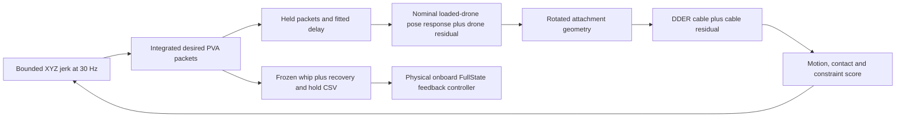

# Paper-writing handoff: aerial cable whipping and between-trial adaptation

**Snapshot date: 9 September 2026. Repository branch: `twin-rewrite`.**

This is a technical briefing for the researcher and the separate Codex session writing the paper. It consolidates the implemented method, experimental lineage, available evidence, potential contributions, and unfinished work. It is not a completed manuscript or a claim that all proposed experiments have succeeded. Repository-relative links are provided so this file remains usable on another computer.

The implementation snapshot immediately preceding this document is commit `74d7c1b`. The document itself is committed afterward. Read the newest [HANDOFF.md](../HANDOFF.md) and [AGENTS.md](../AGENTS.md) for later decisions. For a numerical result, its frozen run configuration, source, and artifacts take precedence over generic defaults and historical prose.

## 1. Start here: what this project actually studies

**Later MPPI update:** the travelling-bend experiment and accepted plan
`20260909-160208-467697` are recorded in [the current MPPI task record](MPPI_PULLBACK_20260909.md).
It adds ordered persistent bend progression before tip contact and broader MPPI
sampling. Its full proposal was accepted after independent replay/recovery checks;
the parent receding loop was stopped. Treat it as historical-model simulation,
not energy-transfer proof, new flight evidence, or a matched PPO comparison.
The numerical discussion below retains the earlier result's original semantics.

The project concerns **dynamic aerial manipulation of a flexible cable by a quadrotor**. The intended maneuver is a whip: the aircraft first moves forward, then moves backward while the cable continues forward and its distal tip reaches a target with sufficient directed speed. The user's physical intuition is to load the cable motion and then release it so motion propagates toward the tip. The implemented task presently verifies the ordered motion and tip-contact conditions; it does not yet quantify energy transfer or establish a physical wave-propagation mechanism experimentally.

The broader research question is:

> Can recorded aerial cable maneuvers improve an explicit drone–cable prediction model, and can that model improve the next executable maneuver with limited additional physical trials and computation?

The research object is the useful adapted model and the command sequence generated through it. PPO and MPPI are planning/optimization mechanisms. A claim that a generic optimizer is new, or that PPO simply outperforms another optimizer, is not the strongest framing supported by the project.

The active implementation uses **direct desired position, velocity, and acceleration (PVA) at 30 Hz**, generated through bounded jerk. It predicts the response of the loaded aircraft and then the cable. Planning happens offline; the aircraft executes a frozen FullState reference through its onboard feedback controller. The software is not currently an onboard MPPI controller receiving live cable-state feedback.

The directory name contains `particle_filter`, but that does not establish that a particle filter is part of the active PVA/MPPI contribution. Follow the active call graph before writing a state-estimation claim. Likewise, retained SAC, CEM, force-controller, and Isaac-related modules are not all components of the current algorithm.

## 2. Status and evidence boundaries

| Item | Status at this snapshot | What can be said |
|---|---|---|
| Direct 30 Hz jerk-to-PVA command generation | Implemented and tested | Consistent desired P/V/A packets are generated and replayed |
| Historical loaded-drone and cable hybrid model | Available with frozen weights | Used for the current simulation diagnostics |
| Current forward-pull/backward-release MPPI | One verified final simulation artifact | Satisfies the encoded motion/contact conditions in the historical model |
| Complete recovery/export/portable replay | Verified for the named final artifact | Saved command and model replay regenerate exactly on the tested environment |
| New preliminary PVA M0 bootstrap | Stopped and incomplete | Not a finished model and not a verified model of the current vehicle |
| New direct-PVA PPO | Infrastructure and a small smoke run | No trained, matched PVA PPO performance baseline |
| Historical force-PPO adaptation study | Two equal-budget simulated continuations completed | Preliminary simulator study; preserve its original task and semantics |
| Historical physical recordings | Available | Measured trajectories with explicit clock, mask, normalization and provenance limitations |
| Prospective improvement from the current MPPI | Not established | Requires new physical trials |
| Battery compensation | Discussed; not implemented or calibrated | Proposed next investigation; Bolt uses a 2S battery |
| Energy-transfer analysis | Not completed | Forward/backward and tip-speed measurements are available, not an energy balance |

Fitting, PPO training, their campaign, and monitoring heartbeats remain stopped/paused while the user investigates the physical drone. Paper writing is not authorization to restart those jobs. Reading artifacts, extracting tables, and making figures from saved evidence do not require regenerating optimization results.

## 3. A defensible paper direction and candidate contributions

A provisional title is **“Hybrid Dynamics Modeling and Offline Planning for Aerial Cable Whipping.”** If prospective adaptation experiments succeed, a stronger title could emphasize **between-trial adaptation**. These are working titles, not fixed claims or venue decisions.

The following are candidate contribution statements. Their evidence requirements must remain visible during drafting.

| Candidate contribution | Implemented basis | Evidence still needed for a strong paper claim |
|---|---|---|
| A model that separates loaded-aircraft tracking error from cable deformation error | Nominal drone pose response plus bounded drone NN; measured-attachment cable fitting; DDER plus cable NN; composed command-driven replay | Matched component ablations and prospective coupled prediction across maneuvers/vehicles |
| Executable offline aerial-whip planning through the actual PVA interface | Bounded jerk, held FullState packets, modeled delay, explicit geometry, committed-state MPPI and complete recovery checks | Repeated physical executions across targets and initial conditions |
| Between-trial adaptation of a reusable model | Historical M0/M1 fits and equal-budget force-PPO study; preserved data lineage | Real outcome improvement after adaptation, compared with fixed-model and extra-optimization controls |
| Efficient differentiable identification and batched planning | CUDA graph replay, batched curvature, direct tridiagonal solver and checked adjoint | Broader workloads/hardware and complete pipeline timing if making a general speed claim |
| Auditable task evaluation and replay | Exact CSV-linked forecasts, model/source hashes, first-contact timing, explicit reversal criteria, stored velocity diagnostics | Useful reproducibility infrastructure; not automatically a standalone algorithmic novelty |

Possible cautious wording for a draft introduction:

> We develop a hybrid prediction and offline planning framework for aerial cable whipping. The framework composes a fitted loaded-aircraft response with a differentiable cable model, generates consistent FullState references through bounded jerk, and evaluates ordered pullback and directed tip-contact conditions. We investigate the role of model adaptation and computational acceleration in producing repeatable maneuvers.

The last sentence describes the research program. A final abstract must replace it with the actual completed experimental design and measured outcomes. Do not promise few-shot transfer, reliable physical striking, generalization, or superiority before those results exist.

## 4. Apparatus, geometry, coordinates and units

Detailed sources: [geometry conventions](GEOMETRY_COORDINATE_CONVENTIONS.md), [geometry implementation](../simulator/geometry.py), and the exact model JSON used by an experiment.

The setup includes a Crazyflie Bolt-based aircraft, an attached flexible cable, OptiTrack rigid-body tracking, and ten cable markers. The user confirmed a **2S battery**. The actual flashed firmware revision, ESC model/configuration, voltage calibration, and motor/propeller specification remain to be established for the battery investigation.

Historical cf7 mass accounting is 0.157 kg aircraft plus 0.018 kg cable/marker assembly, totaling 0.175 kg. The internal split between bare cable and markers was proportionally allocated from prior measurements; it is not ten individually weighed marker masses. Later cf3 hardware is distinct; a 0.153 kg value is recorded in the PVA implementation notes. Do not substitute cf7 parameters for cf3 or infer whether a quoted mass includes all payloads without checking its source.

Use these coordinate symbols:

| Symbol | Meaning |
|---|---|
| W | World/OptiTrack coordinates |
| T | Tracked rigid-body frame |
| O | Tracked rigid-body origin |
| A | Cable attachment point |
| R | Active rotation from T into W |
| r | Constant O-to-A vector expressed in T |
| q_i, v_i | Cable node world position and velocity |
| d | Unit strike direction, currently +X |

The tracked origin is not established to be the center of mass or the firmware IMU origin. T is not automatically the firmware body frame. Quaternion arrays use XYZW, with explicit normalization and invalid-quaternion handling.

For the historical normalized M1 used by current MPPI:

```text
r = [0.0066549972854827175, -0.01287427254333901, -0.055] m
```

Rigid-offset geometry is analytic:

\[
p_A=p_O+Rr,
\qquad v_A=v_O+R(\omega_T\times r),
\]
\[
a_A=a_O+R\left(\alpha_T\times r+\omega_T\times(\omega_T\times r)\right).
\]

No neural network learns this coordinate transformation. A target is a world point and is not shifted by the attachment offset. A saved CSV is not translated merely because a new launch position is selected.

The cable representation has **12 simulation nodes**: attachment at node 0, an unmeasured midpoint at node 1, and markers C1 through C10 at nodes 2 through 11. Physical marker-interval lengths are `[0.063, 0.087, 0.1, 0.1, 0.1, 0.1, 0.1, 0.1025, 0.1, 0.1]` m, totaling 0.9525 m. The first 0.063 m interval is subdivided into two edges. The 0.055 m tracked-origin attachment offset is separate from that first flexible interval. Short observed chords are possible when a fixed-length span bends.

The current MPPI launch is tracked origin `[-2, 0, 1.255]` m and target `[-1, 0, 1.1]` m. Initial desired velocity and acceleration are zero, nominal orientation is level, and the planning cable starts hanging with zero velocity. This is a planning assumption, not a live measured cable-state estimator.

## 5. Current architecture: command generation to predicted cable motion



The loop through the score is **offline simulation optimization**. No physical feedback connection from F into this MPPI loop is implemented. The aircraft's existing onboard position/attitude controller still uses feedback while tracking the saved reference.

The current cascade is an **effective loaded-system predictor**. The aircraft response has been fitted in a cable-loaded setup; the cable receives the predicted attachment motion. Explicit cable reaction from DDER is not added again to the empirical aircraft acceleration. This avoids silently double-counting loading, but it is also a modeling limitation: the current PVA engine is not a fully identified, bidirectionally coupled motor–rigid-body–cable simulator.

Historical model JSONs retain names such as `point_force_dder_model_v1`, `force_accounting`, and `integrated_piecewise_linear_virtual_velocity_v1`. Those describe their provenance/legacy interfaces. The active PVA environment consumes the retained physical and execution components through a new command path. Do not infer current action semantics from a legacy model schema alone.

## 6. Direct PVA actions and timing

Primary code: [pva_commands.py](../simulator/pva_commands.py), [pva_env.py](../learning/pva_env.py), [research_pose.py](../simulator/research_pose.py), [research_physics.py](../simulator/research_physics.py).

At control step k, a normalized action a_k in [-1,1]^3 selects XYZ jerk:

\[
j_k=j_{\max}\odot a_k,\qquad h=1/30\;\mathrm{s}.
\]

With jerk constant during the reference-construction interval:

\[
p^d_{k+1}=p^d_k+h v^d_k+\tfrac12h^2 a^d_k+\tfrac16h^3 j_k,
\]
\[
v^d_{k+1}=v^d_k+h a^d_k+\tfrac12h^2j_k,
\qquad a^d_{k+1}=a^d_k+h j_k.
\]

The current per-axis jerk bound is 60 m/s³. Bounded jerk is an action parameterization, not proof that the resulting trajectory is within real hardware capability.

The initial packet contains hover P/V/A. A selected jerk updates the next reference packet. Execution uses 30 Hz zero-order-held FullState packets, not continuous evaluation of the reference polynomial by the physical aircraft. Prediction preserves that causal timing and the fitted command delay.

Acceleration in the CSV is **kinematic acceleration** in m/s². Do not add/subtract gravity, divide by aircraft mass, or apply battery correction to these PVA arrays. Those operations belong to an explicitly verified onboard controller/actuator mapping.

The selected model's outer cable physics step is 1/150 s, giving five outer ticks per command, with eight internal cable substeps per outer tick. Aircraft pose integration also resolves delayed command events and uses subdivisions constrained by its response parameters. Do not equate command rate, tracking rate, physics rate, inner solver substeps, or controller firmware rate.

Planning physics uses float64. Policy observations/networks use their explicit neural-network dtype; “all computation is float64” would be inaccurate.

## 7. Loaded-drone pose model and neural correction

Sources: [nominal pose model](NOMINAL_DRONE_POSE_RESPONSE.md), [drone_pose_response.py](../simulator/drone_pose_response.py), [drone_pose_residual.py](../simulator/drone_pose_residual.py).

The nominal translational model uses delayed held commands:

\[
a_{\mathrm{nom}}=K_p(p^d-p_O)+K_d(v^d-v_O)+G_a a^d+b,
\qquad \dot p_O=v_O.
\]

The realized modeled acceleration is `a_nom + r_drone`. Horizontal gains are shared between X and Y; vertical gains are separate. The constant b represents effective pre-hover compensation, not measured battery compensation or directly observed controller integral state.

For measured-flight fitting, b and initial velocity/angular velocity are estimated from an eligible past hover window. The compensation must be recomputed when nominal gains change. Its constancy during a short prediction does not establish that real controller integrators remain constant through long recovery.

For the `independent_scale_v3` attitude construction, the nominal acceleration is scaled by separate horizontal/vertical coefficients, gravity is added to construct a desired direction, and yaw completes a rotation frame. A fixed effective tracked-frame alignment relates this frame to the observed rigid body. Orientation evolves through a critically damped second-order response:

\[
e_R=\operatorname{Log}(R^T R_d),\qquad
\dot\omega_T=e_R/\tau_R^2-2\omega_T/\tau_R,
\qquad \dot R=R[\omega_T]_\times.
\]

In the current code, the drone residual modifies realized translation; it is not directly added to the nominal acceleration used to construct the attitude command. That distinction is explicit in `research_pose.tensor_derivatives`.

The drone residual is an MLP with input dimension 15, two hidden layers of width 16 with tanh activations, and three bounded acceleration outputs. Inputs contain scaled position/velocity tracking errors, desired acceleration, actual velocity, and hover compensation. Absolute world position, target labels, flight identity and success labels are not inputs. The historical M1 output limit is 0.5 m/s² per axis. New cold models can enable a smooth zero-at-rest motion gate; historical checkpoints without that option keep their original behavior.

Selected historical M1 nominal parameters, useful for reproducing this example but **not physical controller gains**:

| Parameter | Value |
|---|---:|
| Kp horizontal / vertical | 2.9639098723 / 15.0397500188 s⁻² |
| Kd horizontal / vertical | 3.8923668054 / 3.6480878200 s⁻¹ |
| Acceleration feedforward horizontal / vertical | 0.5958044150 / 1.9186006192 |
| Effective delay | 0.040 s |
| Attitude response time constant | 0.0432815307 s |
| Attitude acceleration scale horizontal / vertical | 1.1902901546 / 0.5179636263 |

Source: [saved drone component](../data/model_candidates/20260908-normalized-M1/assets/drone_model.json). The delay includes possible timestamp/alignment/response effects and is not a direct radio-latency measurement. The scales are effective model parameters, not identified thrust coefficients.

## 8. Cable physics and learned discrepancy

Sources: [dder.py](../simulator/cable/dder.py), [cable configuration](../simulator/cable/config.py), [residual.py](../simulator/cable/residual.py), [research execution](../simulator/research_execution.py).

The cable uses a discrete elastic rod centerline with nonlinear bending geometry, gravity, bending damping, fixed rest lengths, and constraint correction. In the active PVA execution, node 0 follows the attachment and the distal end is free. The attachment is a free pivot; do not describe it as a prescribed tangent clamp. The general library supports other boundary choices and endpoint twist calculations, but those capabilities are not evidence that dynamic material twist is identified in this task.

For notation, a schematic constrained mechanics statement is:

\[
M\ddot q=-\nabla E_b(q)+F_{\mathrm{damp}}(q,\dot q)+Mg+
F_{\mathrm{res}}(q,\dot q)+J(q)^T\lambda,
\]
\[
\|q_{i+1}-q_i\|=\ell_i,\qquad q_0(t)=p_A(t).
\]

This is a conceptual description, not a substitute for the implemented discrete integrator. When writing the numerical method, transcribe the actual curvature/dual-length definitions, damping solve, position/velocity constraint steps and boundary interpolation from `dder.py`. The implementation evaluates nonlinear DER curvature, uses damping solves and iterative constraint correction, and interpolates the imposed boundary over internal substeps. A generic mass-spring chain equation would misdescribe it.

The selected historical M1 has EI = 1e-7 N·m², Cb = 2.5e-5 N·m²·s, four constraint iterations, eight substeps, and zero separate fixed external drag. These are effective fitted/selected values under a particular dataset and model. Do not report them as precise independently measured material constants. In particular, historical metadata contains a stale nested `adaptation_candidate` status; read the final fit report, active asset hashes and loaded model together before interpreting that field.

The active cable residual mode is `dissipative_plus_acceleration`, with two width-32 tanh hidden layers. Its input includes all node positions relative to the attachment, node velocities relative to the attachment, and the attachment's absolute velocity. For 12 nodes, this is 75 input values. It is a global centerline MLP, not a local graph neural network.

One output represents nonnegative, bounded, state-dependent damping applied to free-node world velocities. Another head provides a bounded acceleration correction, at most 0.5 m/s² per free-node axis in this model. The damping coefficient bound is 2 s⁻¹. No learned acceleration is applied to attachment node 0 by this module. The additional correction may represent external discrepancy and is not constrained to conserve momentum or dissipate energy. Therefore the full learned residual must not be called passive or energy-conserving merely because one component is damping.

## 9. Identification and adaptation workflow

Read [future fitting rules](FUTURE_ADAPTATION_FITTING.md), [current adaptation fitter](../experimental_data/current_adaptation_fit.py), [cold bootstrap](../experimental_data/pva_bootstrap.py), and their saved job protocols.

The intended separation is:

1. Fit aircraft command-to-pose response using logged PVA and measured rigid-body trajectories.
2. Reconstruct measured attachment motion using measured pose and the rigid offset.
3. Fit cable physics/residual using that measured boundary, so cable fitting does not have to absorb the aircraft's tracking error.
4. Evaluate the composition using only the initial state and recorded command stream, without substituting future measured attachment motion.
5. Freeze the adapted model and use it to generate a new maneuver.
6. Score the next physical recordings against their saved forecast before using them for another update.

The distinction between **measured-boundary cable replay** and **fully command-driven composed replay** is essential. A good first result does not imply the second is accurate. The current loaded-aircraft cascade also does not independently validate modeled cable reaction forces.

Nominal fitting uses bounded low-dimensional searches/least squares. Residual fitting uses trajectory losses, regularization, and optimizer-owned network weights. Take/window weighting and exact loss definitions vary with the historical job: quote the frozen protocol rather than merging all stages into one claimed universal loss. Prefer a schematic loss in an overview and an exact loss for the experiment actually reported.

Future fitting uses practical plateau stopping, retained best weights, finite-gradient checks, and separate safety ceilings. A stopped job, grid boundary, or maximum-update ceiling is not convergence. No automatic large fold/ablation campaign is authorized merely to write the paper.

The fresh PVA M0 job is `runs/adaptation/20260909-pva-M0-bootstrap`. It uses five normalized cf7/adp0 flights and fresh residual initialization rather than historical learned M1 weights. Its drone stage completed; the full-whip cable residual stage was stopped at update 105, before plateau. The queued PVA PPO campaign stopped before training. Its partial losses/parameters are development artifacts, not a completed model result.

## 10. Dataset lineage and measurement limitations

Important roots:

- [data/raw_takes](../data/raw_takes): preliminary/legacy raw recordings.
- [data/processed_takes](../data/processed_takes): derived synchronized data and masks.
- [data/adaptation_rounds](../data/adaptation_rounds): earlier adaptation packaging.
- [policy-scoped real-flight archive](../rehearsal_csv_and_result_in_real_flight): exact exported CSV, saved prediction and recorded flights associated with a policy.
- [source-audited logger](../experimental_data/source_audit/experiment_logger.py): recorded field definitions.
- [adaptation check implementation](../experimental_data/adaptation_check.py): saved prediction versus measurements.

Historical data include figure-eight/oscillation recordings and three legacy `whip1_001`–`whip1_003` takes. The five `whip_adp_0_001`–`005` recordings from cf7 are the source for the historical normalized M1 and the later cold preliminary PVA bootstrap. Those are not five new direct-PVA policy flights; data origin and the interface used to collect them must be disclosed.

At an earlier stage a recording such as `fig8vertical_002` was protected. The user subsequently authorized all historical preliminary/whip data for an all-data development fit. Preserve the historical split in that historical experiment, but do not describe an all-data current fit as having an untouched historical test set. Source counts should be derived from the chosen run's manifest, not from directory counts containing duplicates.

Later cf3/adp1 files exist with different normalization decisions. Their existence alone does not establish a fair prospective M1 adaptation result: check which vehicle, policy, model, exact CSV, phase, and accepted measurements each recording belongs to.

In the inspected experimental CSVs, the logger contains tracking pose/velocity, validity, command age/timestamps, commanded PVA/quaternion/yaw/rates, and marker coordinates/validity. Eleven inspected experiment-file headers lacked battery-voltage and motor-output fields. Commanded acceleration is not measured motor thrust.

Time alignment retains native command packet events and measured sample times. Cached/stale commands, missing markers, invalid quaternions, gaps and uncertain phase boundaries must remain explicit. Do not upsample and count the resulting points as additional independent data. Split by whole take/session as appropriate, not adjacent overlapping windows.

## 11. Height normalization: disclose it prominently

Source: [HOVER_HEIGHT_CALIBRATION.md](HOVER_HEIGHT_CALIBRATION.md).

The current recorded-flight comparison uses a retrospective constant Z correction estimated from measured-minus-commanded height during eligible pre- and post-maneuver hover. Each take contributes the average of its pre/post medians; the batch median defines the cf7 correction. The same translation is applied to the aircraft and all cable markers, once. Raw observations remain preserved.

The cf7/adp0 batch bias is **+0.05070575 m**, subtracted from measured Z. Post-hover observations are future data relative to the strike. Shared batch normalization also uses information from multiple takes. Consequently, even a leave-one-maneuver-out model diagnostic is conditional on this preprocessing and is not fully independent prospective validation.

The documented five-flight baseline, under that normalization, reports equal-flight mean drone RMS 12.713 cm, cable-tip RMS 16.649 cm, target distance at planned strike 35.429 cm, and closest target approach 14.005 cm. These are historical normalized baseline quantities with different meanings; none is the latest MPPI simulation error or evidence of improved real flight after adaptation. Consult the underlying audit before putting these rounded values in a paper table.

For cf3/adp1 takes 001–004, separate upward shifts of approximately 8.7518, 9.08975, 6.3258 and 8.589025 cm were accepted by explicit review after shared-calibration checks failed. Drift flags remain; take 005 is excluded. Do not erase failed checks or imply these transforms are a measured physical coordinate calibration.

For publication, show raw and normalized interpretations where relevant, state what normalization removes, and distinguish coordinate/hover bias from trajectory-shape error. A retrospectively shifted trajectory cannot establish that the unshifted physical tip hit a fixed world target. Do not silently change the existing UI or saved evaluation protocol while preparing that discussion.

## 12. Current MPPI algorithm in implementation terms

Sources: [mppi_receding.py](../planning/mppi_receding.py), [pva_job.py](../planning/pva_job.py), [current MPPI settings](../config/pva/mppi.json).

The current planner is an offline receding-horizon, importance-weighted trajectory sampler in latent action coordinates. It is not spline CEM and does not train a PPO policy.

At a committed simulated state:

1. Copy the complete state into candidate rows: aircraft pose/velocity/angular velocity, cable state, delayed packet history, absolute time, accumulated score, contact history and pullback progress.
2. Sample temporally correlated Gaussian perturbations around a latent mean z-bar. Map latent sequences to normalized actions with tanh.
3. Simulate each candidate for the lookahead or remaining maneuver duration. Also evaluate the deterministic mean as a selection candidate, excluded from the sampling-weight update.
4. Score future reward plus explicit lookahead/exit terms, rejecting constraint-failed candidates.
5. Update the latent mean using softmax importance weights over sampled candidates.
6. Retain the best evaluated feasible sequence across the window's iterations.
7. Apply only its first action to a separate committed simulator. Candidate success does not become reported success without that committed rollout.
8. Shift the retained best sequence and append a zero latent tail for the next window. Stop when the committed task ends.

For AR(1) noise, the recurrence is `epsilon[k] = rho*epsilon[k-1] + sqrt(1-rho²)*eta[k]`, with independent Gaussian eta at the configured scale. A generic description of the implemented weights is:

\[
w_n=\operatorname{softmax}_n\{S_n/\lambda+\beta\log[p(z_n)/q(z_n)]\},
\qquad \bar z\leftarrow\sum_n w_n z_n.
\]

Current beta (`control_prior`) is zero. The change-of-measure penalty is therefore disabled. This and the retained-best commit rule must be disclosed when relating the implementation to textbook MPPI. Do not copy a canonical stochastic-control derivation and imply every assumption or optimality guarantee carries over to this heuristic configuration.

The first proposal is selected by a batched screen of 321 bounded jerk guesses: zero plus forward/backward profiles varying horizontal strength, vertical lift and hold durations. These are initialization guesses, not fixed trajectories. All jerk coordinates remain free during optimization. The initialization cost belongs in compute comparisons.

Current MPPI settings:

| Setting | Value |
|---|---:|
| Lookahead | 2 s = 60 actions |
| Sampled candidates per iteration | 1,024, plus deterministic mean |
| Committed actions per replan | 1 at 30 Hz |
| Latent noise standard deviation | 0.05 |
| Temporal correlation rho | 0.7 |
| Temperature lambda | 1 |
| Random seed | 656 |
| First-window minimum iterations / patience | 20 / 15 |
| Later-window minimum iterations / patience | 3 / 3 |
| Significant improvement threshold | max(0.1 score units, 0.5% of anchor magnitude) |
| Fixed optimizer iteration / wall-time cap | None in current configuration |
| Separate maneuver safety duration | 5 s |

A 2 s lookahead is not a 2 s total maneuver. Conversely, “no maximum planning time” does not remove the maneuver duration limit, manual stop behavior, or feasibility conditions.

## 13. Task, reward and contact semantics

The current task is stricter than earlier tip-only tasks. All forward/backward quantities are projected onto d, currently `[1,0,0]`, using **predicted actual aircraft motion**, not desired PVA alone.

Ordered conditions are:

1. Aircraft forward displacement at least 0.25 m while forward speed is at least 1 m/s.
2. Subsequent backward travel at least 0.10 m from the running forward-position peak.
3. At tip contact, aircraft forward-axis velocity at most -0.5 m/s.
4. Tip enters a radius-0.05 m target sphere before the other modeled nodes, with directed speed at least 4 m/s and velocity angle at most 45° from d.
5. First-contact-only rule and modeled command/state constraints are satisfied.

Sphere entry is computed along the line between consecutive node positions within a physics interval. Aircraft position/velocity and tip velocity for the new pullback hit rule are interpolated at that entry fraction. This avoids accepting a reversal threshold reached only at the interval end after contact. It is a discrete-model event approximation, not continuous collision certification. The non-tip test is over modeled nodes; do not claim a complete swept cable-surface collision model.

Earlier invalid contact prevents later contact from becoming a first valid hit. Success stops reward credit at the interpolated event, while the exported whip reaches the next 30 Hz handover boundary before recovery.

Current reward coefficients:

| Term | Coefficient / definition |
|---|---|
| Best-distance progress | 60 times positive improvement normalized by initial distance, with denominator floor 0.05 m |
| Best directed proximity quality | 60 times positive improvement of exp(-(distance/0.35)²) times clamped directed-speed ratio |
| Forward-pull progress | At most 20 total |
| Backward-release progress | At most 40 total |
| Valid hit | +200 |
| Time | -10 per second through scored termination |
| Aircraft displacement | -5 times integrated squared displacement from initial origin |
| Normalized jerk effort | -0.02 times mean squared normalized action times command interval |
| Modeled failure | -100 |
| First invalid contact | -25 |

Phase credits are monotone maxima; repeatedly pulling/reversing cannot earn the same phase bonus again. Directed proximity quality is gated by the pullback condition. Exact masks and timing are in `PVAEnvironment._tick` and `step`; use them for an exact mathematical transcription.

Geometric terminal guidance weights are currently zero. A successful predicted strike receives an additional selection cost based on its exit command: `0.5*||v_cmd||² + 5*max(vz_cmd,0)² + 1*max(dot(v_cmd,a_cmd)/||v_cmd||,0)²`, with the code's small denominator safeguard. This cost encourages a recoverable handover but is not included in the reported accumulated task return. A reward value from another task/version is not directly comparable.

## 14. Constraints, recovery and deployment interpretation

Current configured limits are aircraft/command Z in [0.96, 2.8] m, modeled cable Z at least 0.02 m, command speed at most 5 m/s, specific-force surrogate norm at most 18.285714 m/s², tilt at most 60°, and vertical specific-force surrogate at least 2 m/s². These are a **provisional simulation envelope**, not experimentally certified Bolt limits.

Inconsistent next PVA knots are rejected, not silently repaired by clipping one component. Complete recovery is generated from the whip's saved terminal P/V/A using a curved moving turn/descent, slow return approach, and final hold. Recovery selection now filters both lower and upper polynomial height bounds before choosing a candidate. The whip prefix remains unchanged.

Sources: [curved recovery](../deployment/curved_recovery.py), [PVA rehearsal/export](../deployment/pva_rehearsal.py), [recovery design](CURVED_RECOVERY_20260908.md).

A successful geometric strike can still fail to produce a complete export if recovery is infeasible. Conversely, a complete exportable miss is not a successful strike. Keep hit, reference feasibility, modeled recovery completion, and physical validation as separate labels.

The user clarified that the historical sudden drop came from old acceleration demands exceeding aircraft capability. That older event must not be used as evidence that missing battery compensation caused a drop. Battery dependence of other tracking/height errors remains an untested hypothesis.

No new ROS flight sender was implemented or validated by the current MPPI work. Existing colleague/reference controller scripts are historical reviewed integrations, not a basis for claiming that this Windows replay executed a real vehicle.

## 15. PPO and historical algorithm comparisons

Sources: [simple_ppo.py](../learning/simple_ppo.py), [PVA job runner](../planning/pva_job.py), [PVA PPO config](../config/pva/ppo.json), [M1 policy adaptation protocol](M1_POLICY_ADAPTATION_PROTOCOL.md).

The new PVA PPO route reuses a conventional on-policy actor/critic implementation with a tanh-bounded Gaussian actor and MLP value network. Current configured hidden width is 256 with two tanh hidden layers, learning rate 3e-4, four update epochs, entropy coefficient 0.01 and batch size 1,024. These are configuration/infrastructure facts, not evidence of a trained successful PVA policy.

Its simulated observation contains relative cable shape/velocity, aircraft displacement and target-relative position, aircraft velocity/rotation/angular velocity, eight packets of desired command history, and progress/contact/time fields. Five additional phase fields are appended only when the pullback task is enabled. The actor does not receive future measured flight motion.

The current saved PVA PPO task is still a one-second tip-hit task with launch/target randomization and no new pullback requirement; current MPPI uses five-second maximum duration, deterministic launch and the new phase reward. Therefore even future runs using these two unchanged configs would not be a matched algorithm comparison. No claim that MPPI is “as good as PPO” has been established.

Historical force-PPO study `runs/policy_adaptation/20260909-003414-347814-M1-policy-adaptation` has two completed arms:

- M0 extra-training control: `20260909-003414-738407-seed655`.
- M1 adaptation: `20260909-003414-507606-seed655`.

Each receives exactly 20,480 additional attempts from the retained parent, with matched fresh optimizers, one seed, 2,048 environments and a fixed development-validation set. These use the historical one-second force contract. They are not trained direct-PVA policies. The M1 unchanged-policy regeneration ablation predicted a 5.483 cm miss. Further metrics should be extracted from the study's result artifacts rather than copied from old progress commentary.

An Isaac Lab process hosted some historical CUDA training, but the external fitted model remained the environment. This is not a PhysX replacement experiment. The independent PhysX investigation remains paused.

## 16. Current MPPI result and its exact provenance

The final current example is **run `20260909-135429-797997`**. Primary evidence is [the final audit](../runs/audits/mppi-pullback-contact-20260909/result.json), [verification record](../runs/audits/mppi-pullback-contact-20260909/verification.json), and [motion metrics](../runs/audits/mppi-pullback-final-motion-20260909/metrics.json).

| Quantity | Saved result |
|---|---:|
| Modeled valid hit | true |
| Modeled constraint failure | false |
| Interpolated contact time | 1.2666675416 s |
| Minimum tip distance over scored trajectory | 0.0134697125 m |
| Aircraft peak forward displacement | 0.6547505267 m |
| Aircraft peak forward speed | +1.3019210056 m/s |
| Aircraft forward speed at contact | -0.6204019487 m/s |
| Tip forward speed at contact | +5.0273906321 m/s |
| Backward travel at contact | 0.1000002666 m |
| Whip command duration / count | 1.3 s / 39 actions |
| Complete CSV duration including recovery and hold | 10.4333333333 s |
| Command Z range | 1.255 to 2.1385332237 m |
| Predicted aircraft Z range | 1.255 to 2.0616942694 m |
| Minimum modeled cable Z | 0.2475 m |
| Accumulated task return | 363.1946228168 |
| Additional optimization in final continuation | 36 iterations / 56.9343651 s |

The minimum distance is not the sphere-entry distance: contact occurs at the target-sphere boundary, while the minimum-distance metric can be smaller. Do not label 1.35 cm as physical impact accuracy or a measured physical contact.

The final run **explicitly reuses the first 30 commands (1 s)** from parent `20260909-133459-410882` and refines the final nine. The prefix was replayed and checked under the corrected contact rule. The parent used an interval-end pullback check that was subsequently rejected by the contact-time regression. Its total search cost was 180 iterations and about 725.64 s; the final 56.93 s is not a cold-solve benchmark or the total cost of discovering the maneuver. Earlier exploration and initialization also belong in an end-to-end compute accounting.

The backward-travel margin is only about 0.27 micrometers above the encoded 0.10 m threshold. Numerical satisfaction is verified, but this is not a robustness margin against physical uncertainty. Report it as a nominal development example and test margins/perturbations before claiming robust feasibility.

Hashes:

```text
Historical normalized M1 source model:
51d11f38bf8727f52c3641cbdce29f01cb1715c9313752a51299bfa43465e760

Parent plan:
c7067e77592ebdb7cb51cd8e84f5339eb24d373e86e4815cea9797eb61efd546

Final plan:
d679325a31b9fea60bf897b7c10716641a2f188cf6807f3e98d5408d8005f774

Final fullstate_30hz.csv:
aa960408c7ab371cf1758e63ba05be179cd812b4e2a04f1bcd6f42b9d51fa511
```

The frozen portable model can have different JSON bytes from the source model because asset paths are repointed. Use the recorded source-model hash for source identity and the bundle manifests for portable assets; do not treat path rewriting as refitting.

Useful artifacts:

- [Final job](../runs/mppi_pva/20260909-135429-797997).
- [Final rehearsal](../runs/rehearsals_pva/20260909-135429-797997-mppi-diagnostic).
- [Portable simulation package](../runs/audits/mppi-pullback-contact-20260909/MPPI-PVA-simulation-diagnostic.zip).
- [Standalone pull/release plot](../runs/audits/mppi-pullback-final-motion-20260909/pullback.png).
- [Native UI plot](../runs/audits/mppi-pullback-final-ui-20260909/pull-and-release.png).
- [Detailed development explanation](MPPI_PULLBACK_20260909.md).

The plot uses saved model velocities, not finite differences or a newly generated ghost. Sample-frame phase qualification times and interpolated contact-time criteria are distinct; use the latter for the hit certificate.

## 17. Historical MPPI results: useful debugging evidence, not a fair ablation

| Run/stage | Outcome and role |
|---|---|
| `20260909-124046-219074` | Corrected 0.4 s rolling horizon; 150 commands, 938 iterations, 971.71 s, 0.514653 m miss |
| `20260909-131121-677417` | 1.2 s rolling horizon and exit costs; tip-only hit at 1.126667 s, 2.351 cm minimum distance, 168 iterations/381.85 s |
| `20260909-131858-327997` | Same earlier successful plan with corrected recovery selection frozen in a derived replay; no new optimization |
| `20260909-133459-410882` | Two-second pullback planner; provisional interval-end criterion later superseded |
| `20260909-135429-797997` | Final contact-time-corrected pullback continuation |

These stages changed task definition, initialization, guidance, recovery handling and/or horizon. They are a development chronology, not evidence isolating the causal benefit of horizon length or phase rewards. The forward-only tip hit is expressly not the user's intended forward/backward whip. Saved cold-window diagnostics also exist, but selected promising examples are not an unbiased success-rate estimate.

## 18. GPU implementation and measured performance

Source: [PVA_PERFORMANCE_20260909.md](PVA_PERFORMANCE_20260909.md), [performance audits](../runs/audits/pva-performance), [cuda_autograd.py](../simulator/cuda_autograd.py), [cuda_tridiagonal.py](../simulator/cable/cuda_tridiagonal.py).

| Operation | Reference measurement | Accelerated warm measurement | Scope |
|---|---:|---:|---|
| Five-flight full-whip cable loss plus all NN gradients | 236.32 s | 3.13 s | About 75.4× for this kernel/workload |
| Five-flight drone residual loss plus all NN gradients | 0.249 s CPU | 0.119–0.123 s CUDA | About 2× |
| 1,024 one-second PVA trajectory rollouts | 4.57–4.59 s | 2.60–2.62 s | About 1.75× |

The accepted changes include batched independent vertex geometry, CUDA graph replay of recurrent forward/backward blocks, and a float64 direct tridiagonal constraint solver with verified adjoint. The damping factorization still uses its existing solver. A tested custom damping kernel was slower and was not adopted.

Graph setup costs were approximately 2.43 s for cable and 4.89 s for drone in the recorded benchmark. The quoted warm timings exclude optimizer/checkpoint I/O. They are not complete fitting time, PPO training speedup, MPPI solve time, or proof of optimal GPU utilization.

Cable loss discrepancy was approximately 1e-13, maximum position discrepancy 1.27e-12 m, and maximum NN-gradient discrepancy 7.24e-13 for the recorded comparison. Drone gradient discrepancy was 1.39e-12. No shortening of the full-whip objective, reduction of substeps, duplication of flight data, or conversion of physics to float32 was used to obtain the reported acceleration.

First-order derivatives are supported by the captured autograd blocks; higher-order differentiation is not claimed. The active MPPI sampler is gradient-free even though the identification physics has differentiable paths. “Differentiable planner” would therefore be misleading for the current MPPI implementation.

The reported environment is Windows, NVIDIA RTX 4080, Python 3.12, PyTorch 2.11.0+cu128. Do not turn this into Ubuntu, RTX 5090 or cross-platform benchmark evidence.

## 19. What has been tested

The final relevant suite passed **73 tests in 30.95 s** in the recorded Windows/RTX 4080 environment. This is a selected relevant suite, not a claim that every historical repository test was run in that invocation.

It covers CUDA/CPU or accelerated/reference parity where applicable, recurrent gradient behavior, tridiagonal solve/adjoint, curvature, PVA timing and feasibility, PPO optimizer behavior, independent MPPI branches, candidate-versus-committed hits, partial-plan stops, explicit prefix continuation, ordered pullback rewards, contact-time regression, recovery, export, and UI integration.

The final portable CSV is byte-identical; all saved replay arrays, including velocities, have zero difference after portable regeneration. Streaming versus full replay differs only at approximately 4.66e-15 m for aircraft position and 8.90e-13 m for cable position in the saved check. Exact replay supports software consistency, not agreement with physical reality.

Recorded test invocation:

```text
python -m pytest
  tests/calibration/test_cuda_autograd.py
  tests/calibration/test_cuda_tridiagonal.py
  tests/calibration/test_batched_curvature.py
  tests/calibration/test_pva_bootstrap_contract.py
  tests/training/test_pva_contract.py
  tests/training/test_pva_optimizer.py
  tests/training/test_pva_performance.py
  tests/training/test_mppi_receding.py
  tests/training/test_pullback_contract.py
  tests/training/test_ppo_core.py
  tests/flight/test_pva_export.py
  tests/flight/test_curved_recovery.py
  tests/flight/test_research_export.py
  tests/ui/test_pva_workflow.py -q
```

The line breaks above are a readable argument list, not shell continuation syntax. Use the platform's normal command formatting. Some tests require CUDA or retained artifacts and explicitly skip when unavailable; report passes and skips separately on another machine.

## 20. Battery compensation: proposed work, not a completed contribution

The user wants a fixed desired thrust to produce consistent actual thrust across battery voltage, and proposes following PVA trajectories rather than only hovering during discharge. This is a sensible identification direction, but no calibration data, compensation fit, firmware implementation or compensated flight result exists in this snapshot.

Upstream Bitcraze documentation and Kconfig currently support built-in compensation for CF2/CF2.1 Brushless, excluding Bolt. That is a statement about inspected upstream code, not verified flashed firmware or external ESC behavior. Sources: [battery compensation documentation](https://www.bitcraze.io/documentation/repository/crazyflie-firmware/master/functional-areas/battery_compensation/), [Kconfig](https://github.com/bitcraze/crazyflie-firmware/blob/master/Kconfig), [motor-control integration](https://github.com/bitcraze/crazyflie-firmware/blob/master/src/modules/src/stabilizer.c).

Proposed collection: repeat the same gentle hover/vertical acceleration/forward-backward trajectory at overlapping battery-voltage ranges, logging loaded voltage, actual per-motor commands, actual pose/acceleration and reference PVA. Separate changes in trajectory, temperature/session and voltage when designing comparisons. Use actual motion to infer response, not commanded acceleration as a thrust measurement.

A hover curve identifies one thrust operating point across voltage. A gain extrapolated from it is an approximation. Dynamic trajectories can excite a wider range, but cable forces, drag, center-of-mass offsets, sensor biases, response delay and per-motor identifiability must be accounted for. Removing the freely moving cable for an initial motor calibration is a proposed simplification, not a change already made to the apparatus.

A calibrated map would conceptually take motor command and voltage to achieved thrust; onboard inversion would choose a command for requested thrust. For a legacy motor-command controller, preserving a reference-voltage response requires defining the existing command-to-thrust mapping first. Keep PVA units unchanged and avoid double compensation. No calibration can restore thrust beyond the available battery/motor envelope.

A 2S landing threshold and actual firmware/ESC configuration remain unspecified. Do not invent a flight script with an assumed discharge cutoff or treat this writing handoff as permission to fly.

## 21. Experiments needed to support the intended contributions

These are proposed paper experiments, not scheduled or authorized production runs.

**Prediction study.** Compare nominal aircraft versus aircraft NN, cable physics versus cable NN, measured-boundary cable replay versus fully composed replay, and fixed M0 versus adapted M1 under the exact same recorded commands. Evaluate whole held-out takes and future sessions. Report drone origin, orientation, attachment, all-marker and tip errors separately. Include recovery only when its command/initialization protocol is valid for that comparison.

**Control/adaptation study.** Compare (a) fixed model and original maneuver, (b) updated model with unchanged policy where applicable, (c) fixed model with matched extra optimization, and (d) updated model with matched optimization. Include a scratch-policy control if making warm-start efficiency claims. Match launch/target distributions, duration, action semantics, reward, strict hit rule, recovery requirements and compute budgets. Current PVA PPO and MPPI defaults are not matched.

**Whip task study.** Compare tip-only objectives with explicit pullback objectives using a predeclared protocol. Show the drone reversing while the tip travels forward, and report actual contact evidence or explicitly geometric target passage. A velocity heatmap can illustrate the motion but does not alone prove an energy mechanism. An energy claim needs defined kinetic/bending/gravitational quantities, boundary work and dissipation, with residual work accounted for.

**Robustness and transfer study.** Use new targets, initial states, sessions and battery levels with appropriate physical limits. Test perturbations around the nominal plan, including the near-active 10 cm reversal condition. To claim transfer beyond one strike, include an actually different test distribution or maneuver. Do not treat repeated execution of one checkpoint as independent training seeds.

**Compute study.** Report initialization, first-call compilation/capture, warm inner iterations, complete solve, model fitting, training, export and validation costs separately. Include previous search and reused prefixes. Paired kernel parity is evidence for an implementation speedup; task success per total time is a different metric.

Statistical unit: a physical attempt, whole held-out take, training seed or session, depending on the question. Thousands of temporally correlated tracking samples are not thousands of independent trials. Report all attempted cases, exclusions, interventions and missing observations with denominators. Use per-seed/per-flight points and uncertainty intervals appropriate to the sample size. A single selected nominal MPPI hit has no estimated success rate.

## 22. Suggested manuscript and figure structure

1. **Introduction:** dynamic aerial whipping, mismatch between desired aircraft motion and realized cable motion, and the need for reusable model updates. State only experimentally supported contributions.
2. **Related work:** deformable-object modeling, iterative manipulation/adaptation, aerial manipulation, sampling-based planning and simulator adaptation. Explain the distinction from prior work without claiming “first” prematurely.
3. **Problem formulation:** tracked reference point, command interface, cable state, target, ordered strike event, constraints, and offline versus onboard feedback.
4. **Hybrid model and identification:** aircraft response, rigid attachment geometry, DDER, two residuals, data masks/alignment and fitting protocol.
5. **Planning and execution:** jerk integration, MPPI sampling/state branching/stopping, phase reward, event timing and recovery/export.
6. **Experiments:** completed evidence only, with separate prediction, physical control and compute sections as available.
7. **Discussion and limitations:** effective model assumptions, normalization, physical feasibility, battery uncertainty, sample size and generalization.
8. **Conclusion:** findings supported by the final experiment set; avoid adding untested future capabilities as achievements.

Suggested figures/tables:

| Artifact | Content | Current readiness |
|---|---|---|
| System diagram | Offline generation, model cascade, frozen CSV, onboard feedback, between-trial data update | Can draw now, labeling proposed adaptation stages |
| Geometry diagram | O/T/A/W, rotated offset, 12 nodes and ten measured markers | Can draw from documented geometry |
| Representative current whip | Drone/tip signed displacement and velocity, contact, cable velocity heatmap | Saved simulated plot available |
| Model prediction plot | Actual sent PVA, measured motion, exact saved forecast, masks | Available for selected historical recordings; disclose normalization |
| Ablation table | Same data/tasks across model and controller variants | Matched study incomplete |
| Performance table | Cold setup, warm kernels and full solve costs with parity | Recorded microbenchmarks available |
| Physical success table | Attempt counts, directed hits, recovery, failures and intervals | Current direct-PVA MPPI prospective evidence missing |
| Provenance table | Vehicle, model hash, policy/plan, CSV, data split and task version | Can assemble from manifests |

Use scientific plotting tools to regenerate publication figures from saved arrays. Preserve source values and label simulation versus measured traces. Decorative illustration or a GUI screenshot is not a substitute for an evidence plot. Keep images and tables accompanied by the script and exact input paths.

## 23. Related-work starting points and novelty cautions

These are literature entry points, not a completed systematic review. Their primary abstract pages were checked for this handoff; a paper-writing agent must read the full papers before making detailed comparisons or finalizing BibTeX.

- **Iterative Residual Policy: for Goal-Conditioned Dynamic Manipulation of Deformable Objects**, Chi et al.: previous-trajectory/action-correction learning, including rope whipping. This directly prevents claiming that iterative correction of rope-whipping actions is new. [Primary paper](https://arxiv.org/abs/2203.00663).
- **Differentiable Discrete Elastic Rods for Real-Time Modeling of Deformable Linear Objects**, Chen et al. (DEFORM): differentiable rod physics combined with learning for DLO prediction and planning. Hybrid differentiable DER plus learning is established prior work. Our code should be described on its own implementation merits; do not claim an exact DEFORM reproduction without an equation/code comparison. [Primary paper](https://arxiv.org/abs/2406.05931).
- **Information Theoretic Model Predictive Control: Theory and Applications to Autonomous Driving**, Williams et al.: foundational sampling/importance-weighted MPC reference. Describe our latent sampling, disabled prior penalty, initialization and retained-best commit explicitly. [Primary paper](https://arxiv.org/abs/1707.02342).
- **Proximal Policy Optimization Algorithms**, Schulman et al.: PPO attribution. PPO is an existing algorithm, not a project contribution. [Primary paper](https://arxiv.org/abs/1707.06347).

Additional candidates and earlier discussions are in [the research proposal](RESEARCH_PROPOSAL_ADAPTIVE_AERIAL_WHIP.md), [adaptation related work](ADAPTATION_RELATED_WORK_20260905.md), [detailed review](RELATED_PAPERS_DETAILED_REVIEW.md), and [M1 study protocol](M1_POLICY_ADAPTATION_PROTOCOL.md). Check their dates, actual papers and revised scope; old design recommendations do not override today's implementation.

Potential differentiation is the **aerial loaded-response/cable decomposition, physically executable reference interface, useful between-trial model reuse, and demonstrated physical outcome**, if the required experiments support it. Merely combining existing components, adding a GUI, obtaining one optimized trajectory, or reporting a faster kernel is not sufficient evidence of broad novelty.

## 24. Repository reading map

| Topic | Read these files first |
|---|---|
| Latest decisions | `HANDOFF.md`, `AGENTS.md`, this file |
| Active command contract | `docs/DIRECT_PVA_WORKFLOW.md`, `simulator/pva_commands.py` |
| Rollout, task, state, reward and contact | `learning/pva_env.py`, `learning/pva_tick_graph.py` |
| MPPI | `planning/mppi_receding.py`, `planning/pva_job.py`, `config/pva/mppi.json` |
| PPO | `learning/simple_ppo.py`, `planning/pva_job.py`, `config/pva/ppo.json` |
| Loaded aircraft | `simulator/drone_pose_response.py`, `simulator/research_pose.py`, `simulator/drone_pose_residual.py` |
| Cable | `simulator/cable/dder.py`, `simulator/cable/residual.py`, `simulator/research_physics.py` |
| Geometry | `simulator/geometry.py`, `docs/GEOMETRY_COORDINATE_CONVENTIONS.md` |
| Fitting | `experimental_data/current_adaptation_fit.py`, `experimental_data/pva_bootstrap.py`, `experimental_data/cuda_cable_fit.py`, `experimental_data/cuda_drone_fit.py` |
| Measurement and comparison | `experimental_data/source_audit/experiment_logger.py`, `experimental_data/adaptation_check.py`, `experimental_data/hover_calibration.py` |
| Export and diagnostics | `deployment/pva_rehearsal.py`, `deployment/curved_recovery.py`, `deployment/whip_diagnostics.py` |
| Performance | `docs/PVA_PERFORMANCE_20260909.md`, `simulator/cuda_autograd.py`, `simulator/cable/cuda_tridiagonal.py` |
| Current UI | `simulator/gui/pva_main_window.py`, `pva_workspace.py`, `rehearsal_workspace.py` |
| Verification | `tests/training/test_pullback_contract.py`, `test_mppi_receding.py`, `tests/flight/test_pva_export.py`, final audit |

The UI currently has six pages: Models & fitting, Recordings, PPO, MPPI, Rehearsals, Flight comparison. Earlier five/seven/eight-page descriptions are historical. Do not restore old navigation to make a paper screenshot match an obsolete document.

## 25. Instructions for the separate paper-writing Codex

1. Read this file and the newest handoff before drafting. Keep current implementation, historical experiment and proposed future method separate.
2. Build a claim ledger: each quantitative sentence must identify its run/data source, metric definition, task version, normalization, denominator and evidence type.
3. Extract values from saved JSON/NPZ/CSV, not screenshots or memory. An old artifact's source snapshot governs its interpretation even if current code has changed.
4. Use the name M0/M1 only together with an exact model path/hash or experiment context. “Fresh PVA M0,” “historical normalized M1,” and historical force-study models are different objects.
5. Draft the method from the active code, then label which experiments actually used that method. Never relabel old force experiments as direct-PVA results.
6. Do not invent physical success counts, contact forces, statistical significance, material identifiability, battery gains, training seeds, author names, affiliations, funding or a target venue.
7. Read prior work before asserting novelty. Record citation versions and distinguish our interpretation from claims in the original paper.
8. Keep failures and excluded data visible. Do not replace the original CSV-matched forecast with a more favorable current-model replay.
9. Preserve raw files, checkpoints, optimizer state, source snapshots and stopped jobs. Do not launch fitting, training, optimization or flight to fill a manuscript placeholder without a new request.
10. Mark unfinished results explicitly as `[TO MEASURE]`, `[TO VERIFY]` or `[PROPOSED]` in drafts. Remove those only when evidence exists.

Suggested opening prompt for that session:

> Read `docs/PAPER_WRITING_HANDOFF.md`, then the newest `HANDOFF.md`. Help me write a research paper about this aerial cable-whipping project. Begin by constructing an evidence-backed outline and contribution/claim table. Ground the methods in current source code and the experiments in their frozen artifacts. Keep historical force-PPO, current direct-PVA MPPI, and proposed battery calibration separate. Do not invent results or start computation/flight jobs. Identify which sections can be drafted now and which need additional physical experiments.

## 26. Retrieving the snapshot and preserving evidence

Use branch `twin-rewrite` from the existing project remote. In a clean checkout, fetch/pull that branch and run `git lfs pull` so tracked model/checkpoint/trajectory objects are present. Do not reset an existing writing checkout with uncommitted work. Git LFS pointer files are not the actual model or numerical arrays.

This commit series includes current source/configuration/docs and the explicitly requested research snapshot. Python caches and regenerable `live_scene` feeds stay local. They are not required to interpret the saved final MPPI artifacts. Several older source/model manifests contain absolute Windows paths; use frozen portable bundles or resolve repository-relative copies with matching hashes rather than rewriting original evidence.

Start the desktop UI only when needed with `python run_simulation.py` in a suitable local environment. Loading a saved run is different from starting a new optimization. For paper figures, direct read-only extraction from saved artifacts is usually preferable.

The development repository is not automatically a publication-ready licensed dataset/software release. Author/license/redistribution decisions belong to the project owner. See [PUBLICATION.md](PUBLICATION.md) for release scope, while recognizing its older statements about uncommitted work are historical. The user's current Git push request authorizes this repository snapshot; it does not establish a DOI, public benchmark release, or completed artifact review.
