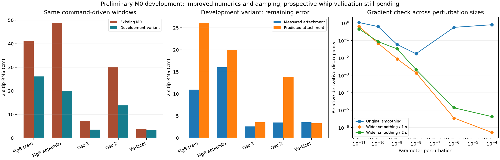

# M0 development: stable gradients and a simple damping correction

Completed across 9–10 September 2026, Windows 11 / RTX 4080, float64.
The user authorized investigating the remaining dynamic mismatch and emphasized
the sim-to-real-to-sim objective: new real whip data will be collected later.

## Outcome

The previous gradient discrepancy is consistent with an overly sharp transition
in bending damping near straight cable segments, rather than an error isolated
to the custom CUDA solver. Widening the existing regularization from 2e-7 to
2e-5 gives reliable derivatives on the checked one- and two-second rollouts.
This explicitly changes the regularized damping model; it is not claimed to be
an algebraically identical acceleration of the old model.

A small effective velocity-damping coefficient also improves the preliminary
predictions without a cable neural residual. A separate **unselected M0 development
candidate** has been saved. The original M0, its forecasts and planner selection
remain unchanged. No PPO, MPPI, new neural training or physical flight was run.

## Gradient diagnosis

The two training windows `figure8_001-00641` and `figure8_001-02441` reproduce the
previous problem. These checks retain the original M0 physical coefficients and
frozen residual weights, with weighted one-second causal initialization. They
perturb one residual output bias, without optimizer steps.

- Original optimized and dense-solver predictions differ by at most 2.25e-10 m;
  their full residual gradient vectors differ by about 1.13e-5 relatively.
- With original smoothing, reducing the finite-difference perturbation to 1e-8
  brings the one-second derivative discrepancy down to about 1.7%, but smaller
  steps worsen it again. There is a narrow useful range between strong local
  sensitivity and floating-point error.
- With smoothing 2e-5, the one-second derivative agrees to about 5.2e-7 relative
  error at perturbation 1e-4, and 3.5e-6 at 1e-6. Full gradient norm drops from
  about 131 to 0.627 on these windows.
- Ordinary PyTorch backpropagation with checkpointing and dense solves matches
  the smoothed captured implementation: maximum position difference 5.12e-13 m,
  relative full gradient-vector difference 7.08e-11.
- At two seconds, relative derivative discrepancies are 4.25e-6 and 1.36e-5 for
  those two perturbation sizes. Extremely small perturbations still suffer
  floating-point error; they are not used as acceptance thresholds.
- The smoothing change alone moves one-second tip trajectories by 0.49 mm and
  4.82 mm RMS on these two windows. It is a small but nonzero model change here.

This resolves the reproducible long-window check for the tested configuration.
It does not guarantee conditioning on every future whip trajectory. Future
fitting must retain a representative rollout derivative check for its own model
and data. The new regression test fails the finite-difference tolerance with
the old problematic setting and passes with the new smoothing.

## Remaining mismatch: a finite damping diagnostic

Bending damping suppresses deformation, whereas an external velocity-damping
term also removes energy from cable motion through space. The prior physical
baseline has zero external drag, and its learned cable correction is small.
We therefore tested one scalar nonnegative damping term, keeping EI/Cb, masses,
geometry and attachment unchanged. This is an effective discrepancy model,
not a calibrated aerodynamic coefficient or proof that air drag alone caused
the original error.

Under smoothing 2e-5, the finite candidate list was 0, 0.1, 0.2, 0.4, 0.8, 1.2,
1.6 and 2.0 per second. Selection used the twelve previously fixed training
windows, equal weight per take, and equal robust objectives at one and two
seconds. The selected value was 0.4 per second. This was one finite grid, not
a convergence claim or a restarted parameter campaign. Separate-take data
was scored only after freezing this scalar choice.

Cable-only tip RMS in centimetres, measured attachment, same weighted initial state:

| Smoother physical model | Training 1 s | Separate take 1 s | Training 2 s | Separate take 2 s |
| --- | ---: | ---: | ---: | ---: |
| No external velocity damping | 4.71 | 5.49 | 11.54 | 9.91 |
| 0.4/s external velocity damping | 3.28 | 3.27 | 6.10 | 3.36 |

These are the pilot's twelve training and three separate-take windows. They
are not whole-take or strike-performance statistics. The same separate take
has already been inspected in earlier development; it is not a fresh blind test.

## Coupled check and the limits of the pilot average

We also replayed the recorded PVA commands for the previously selected
representative two-second window from each take, supplying predicted attachment
motion. Both variants use the same weighted cable initialization and unchanged
drone model. Drone predictions match exactly between them.

| Representative window | Existing M0 tip RMS | Development candidate tip RMS | Candidate with measured attachment |
| --- | ---: | ---: | ---: |
| figure8_001-02441 | 41.12 cm | 26.13 cm | 10.99 cm |
| figure8_002-02041 | 48.88 cm | 19.94 cm | 16.01 cm |
| osci_001-02441 | 7.33 cm | 3.58 cm | 2.61 cm |
| osci_002-01241 | 30.12 cm | 13.83 cm | 3.54 cm |
| vertical_figure8_001-01441 | 3.79 cm | 3.34 cm | 3.56 cm |

The representative excluded-take figure-eight window differs from the three
strictly complete pilot windows. An interior-marker gap excludes it from the
strict all-marker pilot, but its attachment and tip remain observed over all
300 scored samples. This diagnostic preserves missing masks and evaluates the
observed tip; it does not impute missing markers or add the window to fitting.
The larger 16.01 cm conditional error exposes a remaining difficult case that
the 3.36 cm pilot average must not conceal.

The candidate improves all five command-driven representative checks, but both
cable-model mismatch and drone-motion prediction still matter. Future whip data
will be necessary to assess task-relevant behavior. None of these results is
prospective physical strike validation.

## Frozen candidate and the adaptation sequence

[Candidate model](../runs/audits/preliminary1-gradient-resolution/candidate/model.json)
contains smoothing 2e-5, external damping 0.4/s and the original M0 EI/Cb.
The cable residual is disabled. Its drone model and drone residual are exact
copies from preliminary M0; provenance records that inheritance. The staged
candidate is marked unselected, not flight-ready, and not a completed full
replacement fit. It has not been registered as the active planner model.

This is **M0 development using preliminary1 only**, not M1. The intended next
evidence sequence remains:

1. Freeze the chosen preliminary model, source, settings and an MPPI command
   trajectory with its exact original prediction before the real take.
2. Collect the new real whip takes when the user is ready. Keep failed takes,
   raw logs, tracking masks and actual command bytes.
3. Score each measured take against its original saved forecast before fitting
   to it. Never replace that forecast with a replay from an updated model.
4. Build M1 from reviewed new real data, then plan again and perform a later
   prospective check. A same-command M0/M1 comparison distinguishes better
   prediction from improvements caused by changing the plan.

Preliminary M0 need not establish final strike accuracy before gathering useful
adaptation data. Its numerical execution and provenance do need to be reliable,
and current errors must remain visible. This diagnostic supplies a simpler
candidate for that loop rather than another large residual-training campaign.

If a future residual is added to this scalar-damping baseline, design it
explicitly. The existing dissipative-NN loader rejects simultaneous separate
fixed drag; do not bypass that guard or double-count damping. Do not silently
revert the numerical regularization when creating the next fitting job.

## Verification and saved evidence

Six calibration checks passed (five CUDA graph/solver checks and the new measured
one-second gradient regression). Nine smooth-damping physics tests passed,
including the new smoothing value's dissipativity, translation invariance,
rotation equivariance and local derivatives. Tests ran on Windows / RTX 4080.
All 325 protected hashes checked unchanged.

`runs/audits/preliminary1-gradient-resolution/` preserves original, dense,
smoothed, eager-reference and two-second gradient results; baseline arrays and
full gradient vectors; the scalar-search protocol and every score; coupled and
measured-attachment comparisons; candidate files; source scripts; and the plot.
The initial strict-boundary diagnostic refused a window with an interior-marker
gap; `boundary_strict_eligibility.json` preserves that reason. The subsequent
tip-only diagnostic retains the missingness and is not used for fitting.
