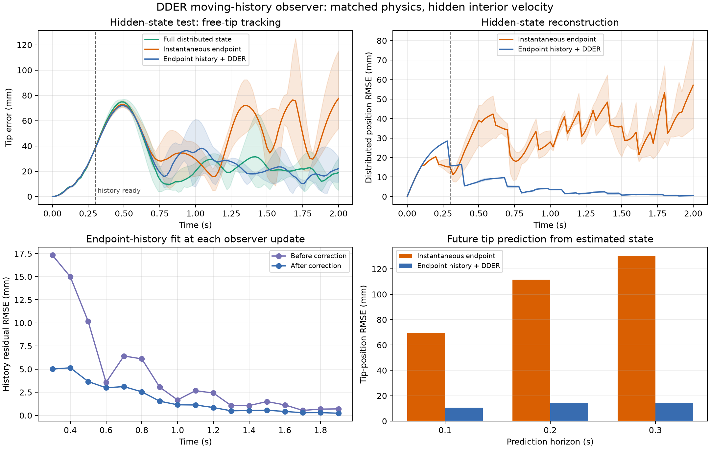

# DDER Moving-History Hidden-State Observer for Figure-8 Tracking

## Executive result

This study asks whether a recent history of only the prescribed cable-root motion and free-tip **position** can recover enough hidden distributed cable state for the existing DDER-MPPI controller. The cable physics are deliberately perfect and fixed: the plant, observer, and controller use the same `EI` and `Cb`, and parameter adaptation is disabled.

The answer for the tested hidden-interior-velocity disturbance is **yes**. Averaged over three paired MPPI seeds:

| Observation supplied to unchanged MPPI | Hidden-state tip tracking RMSE | Distributed position RMSE | 0.2 s tip-prediction RMSE |
|---|---:|---:|---:|
| Full distributed state | 33.51 mm | 0.00 mm | 0.00 mm |
| Instantaneous endpoint | 49.70 mm | 33.38 mm | 111.60 mm |
| Endpoint history + DDER observer | **34.44 mm** | **9.25 mm** | **14.59 mm** |

Relative to instantaneous endpoint reconstruction, the history observer closes approximately **94.3% of the tracking gap** to full-state control. It reduces estimated-state tip-prediction RMSE by 84.7%, 86.9%, and 88.9% at 0.1, 0.2, and 0.3 s respectively. It does this without receiving the plant's interior state, tip velocity, disturbance, future root motion, future tip motion, or Figure-8 reference.

The frozen prototype used for this scientific result was not fast enough to run the correction at 10 Hz: an active two-iteration update took 248.5 ms on average. The subsequently accelerated, method-equivalent implementation takes **24.94 ms mean / 26.70 ms p95** for the same observer workload. See `HISTORY_OBSERVER_ACCELERATION_REPORT.md`; the scientific values in this report remain the frozen pre-optimization baseline.



## 1. Frozen task and physics

The experiment uses the current flat geometric Figure-8 task. It does **not** prescribe traversal time or loop frequency. MPPI follows the nearest forward path branch and receives a small progress reward; consequently conventional phase lag against a time-indexed reference is not defined and is not reported.

The frozen study configuration is:

- Figure-8 amplitudes: 0.7 m in X and 0.5 m in Y;
- flat path at a constant target height;
- 11-node one-attached/free-tip DDER cable;
- 50 Hz physics and acceleration commands (`dt = 0.02 s`);
- 1.0 s MPPI prediction horizon;
- 11 three-dimensional acceleration knots;
- 2,048 MPPI samples and two iterations;
- 10 Hz replanning (`0.10 s` between replans);
- acceleration limit: 6 m/s²;
- drone-speed limit: 3 m/s;
- three paired MPPI seeds: 17, 23, and 41;
- 2.0 s execution per case.

The current homogeneous cable parameters are:

- `EI = 1.0154787051679222e-4 N m²`;
- `Cb = 1.5e-5 N m² s`.

The numerical values are not identified in this experiment. Plant, observer, and controller receive identical values, so any difference among observation modes is due to state information rather than physical-model mismatch.

### 1.1 MPPI controller cost

For a predicted rollout, let `d_k` be the Euclidean distance from the free tip
to its locally projected point on the geometric Figure-8, `Delta ell` the
monotone forward path progress in metres, `a_k` the drone acceleration command,
and `v_tip,k` the predicted tip velocity. The unchanged control cost is:

```text
J_MPPI = 5000 mean_k(d_k^2)
         - 5 Delta ell
         + 0.5 mean_k(||(v_tip,k - v_tip,k-1)/dt||^2) / a_max^2
         + 0.0002 mean_k(||a_k||^2)
         + 0.05 [mean_k(||a_k-a_k-1||^2) + ||a_0-a_previous||^2]
         + 80 [max_speed/v_max - 1]_+^2
         + 100 [(ground_clearance-min_scene_height)/ground_clearance]_+^2.
```

Here `a_max = 6 m/s²`, `v_max = 3 m/s`, and ground clearance is 0.02 m. The
first predicted frame is omitted from the tracking mean because it cannot be
changed by the rollout controls. Figure-8 projection is locally branch
continuous and is refined by five Newton-style projection steps around a
travel-distance-derived unwrapped progress branch.

There is deliberately **no drone-displacement penalty**, no prescribed path
speed, no loop frequency, no endpoint-history term, no cable-state truth
penalty, no cable-energy reward, and no prescribed swing/whip shape in this
controller cost.

## 2. Information boundary

The new `EndpointHistoryObservation` type contains exactly:

- timestamp;
- current root position;
- current root velocity;
- current free-tip position.

It has no field for interior node position, interior velocity, free-tip velocity, disturbance, future data, or target/reference data. Arrays are copied and made read-only on construction. Unit tests inspect the observation dataclass fields explicitly so an interior truth channel cannot be added accidentally without failing the contract test.

The three controller modes are:

1. **Full state:** MPPI receives the actual current distributed DDER state. This is the reference.
2. **Instantaneous endpoint:** MPPI retains its predicted interior and applies a
   root-fixed smoothstep correction so that the distal node equals the current
   observed tip position and tip velocity. Thus this baseline actually receives
   more instantaneous distal information than the history observer, which uses
   tip **position only**.
3. **Endpoint history + DDER:** MPPI receives the observer's estimated complete DDER state.

The third mode never substitutes plant truth into the observer. Plant truth is retained only in the study evaluator.

## 3. Observer architecture

### 3.1 Recursive prior

The observer continuously propagates its own previous estimate through the same DDER model using the root position that actually occurred. It does not reconstruct a cable from scratch at every update and never integrates damped DDER backward in time.

At 50 Hz it stores the shortest causal suffix spanning 0.30 s. This gives 16 timestamps, or 15 physical integration intervals, once the buffer is full. Correction occurs at the 10 Hz MPPI replanning events.

### 3.2 Smooth correction coordinates

The DDER remains an 11-node model. Only the correction around the recursive prior is reduced-dimensional.

For normalized material coordinate `s`, the four scalar spatial modes are:

```text
phi_0(s) = s
phi_1(s) = sin(pi s)
phi_2(s) = sin(2 pi s)
phi_3(s) = sin(3 pi s)
```

They are applied independently to X, Y, and Z for both position and velocity. The correction therefore has:

```text
4 modes × 3 axes × 2 state types = 24 dimensionless variables.
```

The root row is set exactly to zero. Physical scales are:

- position correction scale: 0.025 m;
- velocity correction scale: 0.25 m/s.

### 3.3 Physical projection

Every candidate window-start state is returned to the same DDER constraint manifold before replay:

1. overwrite root position with the measured root position;
2. apply the existing length/inextensibility projection;
3. overwrite root velocity with the measured root velocity;
4. apply the existing velocity projection.

No separate cable constraint method was introduced.

### 3.4 Moving-history shooting objective

For each candidate correction `q`, DDER propagates the corrected historical state forward through every recorded root position in the 0.30 s window. Its free-tip positions are compared with the measured free-tip positions:

```text
J_obs(q) = mean_k ||p_tip_pred(k; q) - p_tip_meas(k)||²
           + lambda_q ||q||².
```

The prior weight is `lambda_q = 1e-4`. The observer never sees the Figure-8 reference.

### 3.5 Finite-difference GN/LM correction

The observer uses central finite differences, not autograd through DDER:

- finite-difference step: 0.04 in normalized correction coordinates;
- 49 candidates (`1 + 2 × 24`) propagated as one batch per Jacobian evaluation;
- LM damping: `1e-4`;
- maximum two GN/LM iterations;
- step-norm limit: 2.0;
- per-component limit: 2.5;
- batched line-search factors: 1.0, 0.5, 0.25, 0.125;
- singular-value rank tolerance: `1e-4` relative to the largest singular value.

If the line search does not improve the endpoint-history objective by at least `1e-10`, the prior is retained. This behavior is important in the clean matched case, where no correction is justified.

## 4. Controlled experiments

### 4.1 Clean propagation/integration test

Plant and observer start from the same hanging distributed state. There is no disturbance. This is only an implementation-consistency test; it is not evidence that endpoint history identifies a hidden state.

### 4.2 Hidden-state recovery test

The plant receives a lateral distributed velocity perturbation of 0.45 m/s scaled by `sin(pi s)` over the cable. It is zero at the attached root and free tip. At the initial instant:

- root position and velocity are unchanged;
- tip position and velocity are unchanged;
- only the cable interior contains hidden momentum.

The full-state controller observes this immediately. The endpoint and history controllers start from the original unperturbed prior. The history observer must wait for the disturbance's effect to appear in the tip-position history.

### 4.3 Propagation-only diagnostic

For the history runs, the same incorrect prior is also propagated offline with measured root motion but without endpoint-history correction. This distinguishes physics propagation from actual measurement correction.

## 5. Tracking results

Values below are means across the three paired seeds.

| Condition | Mode | RMSE | Mean error | P95 error | Maximum error | Max drone speed | Max acceleration | MPPI/update |
|---|---|---:|---:|---:|---:|---:|---:|---:|
| Clean | Full | 13.59 mm | 10.49 mm | 26.73 mm | 29.86 mm | 0.751 m/s | 6.0 m/s² | 167.2 ms |
| Clean | Endpoint | 38.20 mm | 25.57 mm | 81.56 mm | 107.81 mm | 0.844 m/s | 6.0 m/s² | 157.7 ms |
| Clean | History | **13.44 mm** | **10.45 mm** | **26.36 mm** | **29.45 mm** | 0.757 m/s | 6.0 m/s² | 158.4 ms |
| Hidden interior velocity | Full | **33.51 mm** | **26.86 mm** | 71.09 mm | 75.12 mm | 0.734 m/s | 6.0 m/s² | 159.0 ms |
| Hidden interior velocity | Endpoint | 49.70 mm | 42.92 mm | 79.34 mm | 104.11 mm | 0.804 m/s | 6.0 m/s² | 160.1 ms |
| Hidden interior velocity | History | **34.44 mm** | **28.52 mm** | **68.76 mm** | **71.91 mm** | 0.770 m/s | 6.0 m/s² | 158.5 ms |

In the clean case the history result is effectively identical to full-state control. Under the hidden disturbance, the full-to-endpoint gap is 16.19 mm and the history observer leaves only 0.93 mm of that gap. The gap-closure calculation is:

```text
(49.70 - 34.44) / (49.70 - 33.51) = 94.3%.
```

The slightly lower clean-history mean than clean-full is not interpreted as superiority; it is below meaningful resolution for this three-seed stochastic pilot.

## 6. State reconstruction and future prediction

| Condition | Mode | Distributed position RMSE | Distributed velocity RMSE | Tip prediction 0.1 s | 0.2 s | 0.3 s |
|---|---|---:|---:|---:|---:|---:|
| Clean | Full | 0 | 0 | 0 | 0 | 0 |
| Clean | Endpoint | 30.41 mm | 0.3162 m/s | 63.51 mm | 97.45 mm | 108.65 mm |
| Clean | History | <0.001 mm | <0.00001 m/s | <0.001 mm | <0.001 mm | <0.001 mm |
| Hidden interior velocity | Full | 0 | 0 | 0 | 0 | 0 |
| Hidden interior velocity | Endpoint | 33.38 mm | 0.3702 m/s | 69.57 mm | 111.60 mm | 130.56 mm |
| Hidden interior velocity | History | **9.25 mm** | **0.0585 m/s** | **10.63 mm** | **14.59 mm** | **14.43 mm** |

Future-prediction evaluation starts from the estimated state and uses the actual future root motion only as an offline evaluator boundary. Full-state prediction is numerically exact here because physics, state, and future root boundary are exact and matched.

The observer's hidden-test state error is not zero, but it is clearly control-relevant: its 0.3 s tip prediction is 14.43 mm rather than 130.56 mm, and its MPPI tracking is close to full state. This supports judging the state by predictive sufficiency, not only by raw latent-state equality.

## 7. Evidence that endpoint history, not propagation alone, performs recovery

Under the hidden disturbance, propagation from the incorrect prior without measurement correction gives:

- distributed position RMSE: 20.87 mm;
- distributed velocity RMSE: 0.0959 m/s;
- tip-history RMSE: 36.91 mm.

The history-corrected observer gives:

- distributed position RMSE: 9.25 mm;
- distributed velocity RMSE: 0.0585 m/s;
- mean fitted endpoint-history residual after correction: 1.76 mm.

Thus the endpoint-history correction reduces propagation-only position error by 55.7% and velocity error by 39.0%. The result is not explained by simply carrying the known physical model forward.

Across the 17 ready updates per run:

- hidden case: 17/17 corrections accepted;
- clean case: 0/17 corrections accepted;
- hidden mean history residual: 4.42 mm before and 1.76 mm after correction;
- clean residual: approximately `2.3e-4 mm`, with no drift-inducing update.

## 8. Jacobian and basis diagnostics

The correction Jacobian has 24 columns. Median numerical rank is:

- clean: 18.0;
- hidden disturbance: 18.7.

Median condition number is approximately:

- clean: `3.45e5`;
- hidden disturbance: `2.80e5`.

The history does not fully observe every correction direction. This is expected with one three-dimensional output trajectory and is why the recursive prior, LM damping, and arrival regularization are necessary. The observer still extracts a useful local correction from the observable subspace.

The selected disturbance is representable by the basis: its initial velocity mismatch is exactly the `sin(pi s)` mode up to a measured relative projection residual of `4.1e-8`. Initial position mismatch is numerically zero. Therefore this particular recovery result is not limited by basis expressiveness. Over the hidden runs, the residual post-estimation state error has median basis projection residuals of approximately 3% for position and 8% for velocity. In the clean runs the absolute error is near numerical zero, so relative basis residual ratios are not meaningful.

## 9. Runtime

The linear algebra is not the bottleneck. Active correction timing averaged across seeds is:

| Condition | Ready correction total | P95 | FD DDER replay | Line-search/final replay | Dense GN solve |
|---|---:|---:|---:|---:|---:|
| Clean, no accepted step | 152.4 ms | 167.1 ms | 52.9 ms | 52.2 ms | 0.070 ms |
| Hidden, two accepted iterations | **248.5 ms** | **266.8 ms** | 86.6 ms | 88.5 ms | 0.137 ms |

The reported all-replan mean for the hidden run is 211.2 ms because the first three replans only collect history and take zero optimization time. MPPI itself remains approximately 158.5 ms/update in this study. A mature hidden-case update would therefore require roughly 407 ms if observer and MPPI are sequential.

Although 49 candidates are far fewer than MPPI's 2,048 candidates, this implementation runs multiple short replay batches and obtains poor GPU utilization at those much smaller batch sizes. DDER replay and dispatch dominate; the 24-by-24 solve is negligible. Correctness was intentionally prioritized over CUDA optimization in this stage.

The implementation measured in this frozen study did **not** meet a 10 Hz online observer requirement. That exact implementation bottleneck has since been addressed by full-history CUDA capture, device-resident state histories, cached constants, and removal of redundant physical replays. The current observer workload is 9.96x faster without changing the model, residual, or information boundary. End-to-end observer-plus-MPPI latency still requires separate validation.

## 10. Software integration and tests

Implemented components:

- `drone_mpc/history_observer.py`: sensor-boundary dataclasses, recursive prior, smooth correction basis, physical projection, batched shooting, GN/LM, diagnostics;
- `drone_mpc/figure8_tracking.py`: third observation mode, observer-to-MPPI integration, estimated-state and observer logging;
- `drone_mpc/figure8_tracking_gui.py`: observer mode and a dedicated Observer settings tab;
- `research_tools/figure8_history_observer_study.py`: deterministic paired study and machine-readable outputs;
- `research_tools/plot_figure8_history_observer_results.py`: frozen result figure;
- `tests/test_history_observer.py`: information-boundary, basis, recursive propagation, and hidden-state correction tests;
- `tests/test_figure8_tracking.py`: full/endpoint/history integration smoke test and live mode switching.

The observer implementation never imports or accepts the Figure-8 reference. The state estimator's only measurement residual is actual free-tip position history.

Machine-readable results are in `reports/figure8_history_observer_data/summary.json` and the associated per-run NPZ files.

## 11. Limitations

This is a focused proof-of-mechanism, not a final observability claim:

- only one deliberately representable hidden disturbance family was tested;
- only three MPPI seeds were used;
- runs cover 2.0 s, approximately 0.2 geometric path cycles;
- sensing is exact and has no latency, noise, or dropout;
- `EI` and `Cb` are exact and fixed;
- only one 0.30 s window and one four-mode basis were evaluated;
- the observer is not yet computationally real-time.

Longer runs, mixtures of spatial modes, mid-run impulses, and sensing imperfections belong to later studies. They should not be mixed into this first causal hidden-state result.

## 12. Conclusion

For the tested case, recent sparse endpoint history interpreted through DDER recovers enough hidden distributed state to restore nearly all of the full-state Figure-8 tracking performance. It strongly improves distributed-state estimation and future endpoint prediction, rejects unnecessary corrections in the clean matched case, and outperforms both instantaneous endpoint reconstruction and uncorrected model propagation.

The scientific answer is therefore **positive**: endpoint history contains useful control-relevant information about hidden cable dynamics when interpreted through the known distributed physics.

The engineering answer is more cautious: the transparent two-iteration finite-difference prototype is too slow for 10 Hz correction. It should be retained as the validated reference observer, then accelerated or scheduled at a lower correction rate before real-time deployment. `EI/Cb` adaptation should remain disabled until that state-observation path is computationally and experimentally validated.
