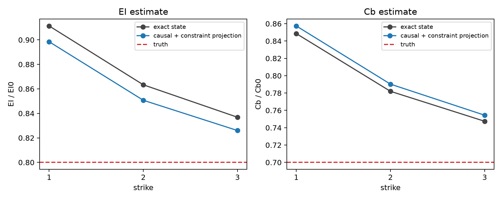
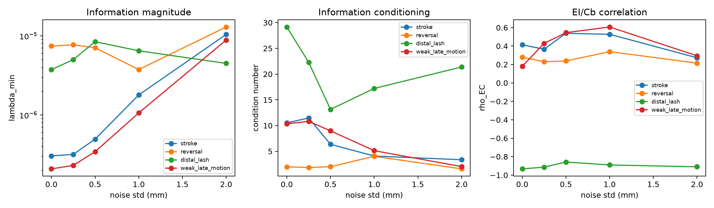
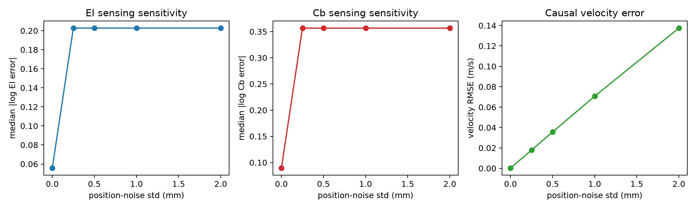
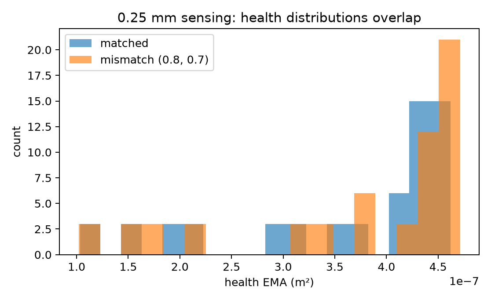
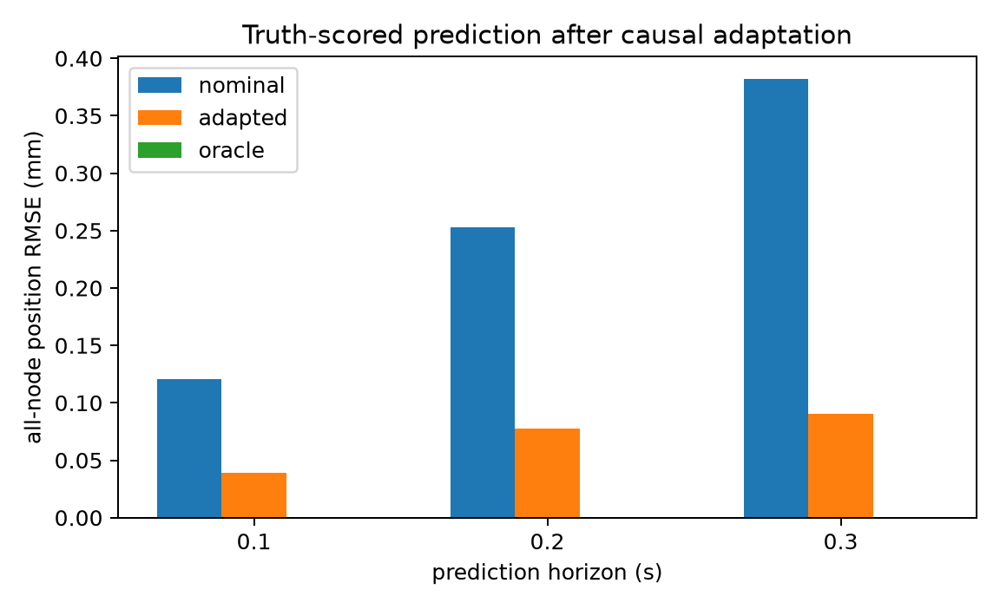
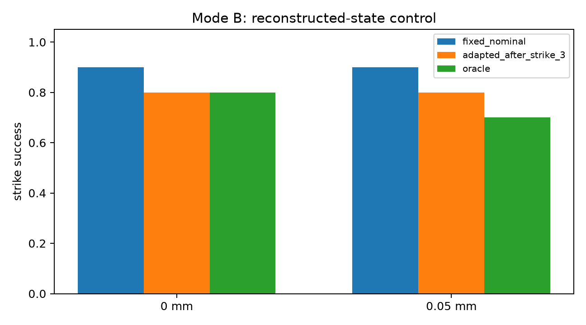
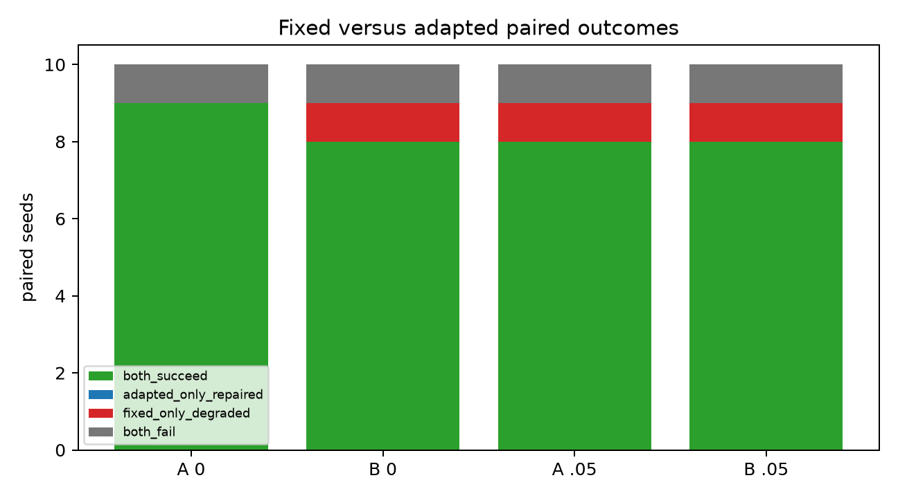
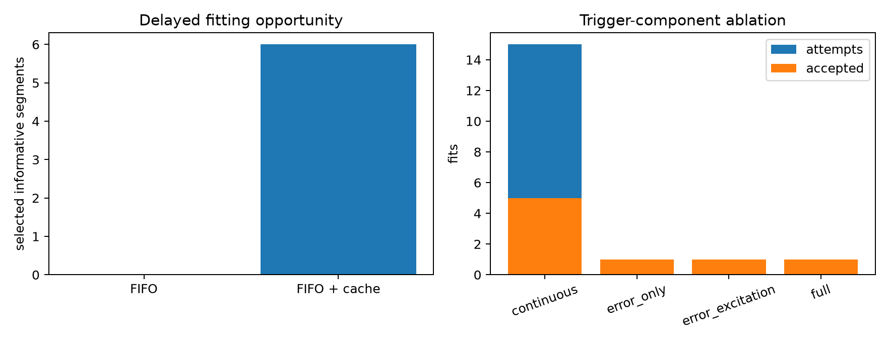

# Sensing-Aware DDER Adaptation: OptiTrack-Compatible Synthetic Observation Study

**Date:** 2026-08-26  
**Status:** completed synthetic sensing study; not real OptiTrack validation  
**Reference:** `DISTRIBUTED_DDER_ADAPTATION_REPORT.md` remains the authoritative exact-state baseline.

## Executive conclusion

The existing two-parameter DDER adaptation method remains correct under exact distributed state, and it also works with **causally reconstructed velocity in noiseless position data** after one important state-estimation correction: the raw position derivative must be projected onto the known DDER inextensibility constraint. With that projection, a representative `(EI*/EI0, Cb*/Cb0) = (0.8, 0.7)` cable converged to `(0.826, 0.754)` after three accepted fits, while the matched cable produced no trigger, no update, and no drift.

The present estimator is **not yet ready for physical OptiTrack adaptation**. A globally calibrated matched-model health threshold detects the representative mismatch at 0 and 0.05 mm synthetic position noise, but no longer detects it at 0.10 mm or above. At every requested stress-test level from 0.25 to 2.0 mm, the conservative threshold prevents false matched-model updates but also prevents all mismatch fits. This is a state-estimation/health-separation limitation, not evidence that the DDER physics or two-parameter fitter failed.

The full sensed-state controller also becomes sensitive enough that an oracle-parameter controller does not consistently outperform the nominal controller. This demonstrates that state-estimation error has become more important than parameter-model error in the current pipeline.

**Decision: C — do not attempt physical adaptation yet; improve and validate the causal cable-state estimator first.** Preserve the joint `EI,Cb` fitter and between-strike architecture. The next physical experiment should record timestamped OptiTrack root and `c1...c10` positions during repeated free-cable motions, characterize real noise/dropout/latency, and benchmark causal velocity estimates against an offline derivative reference before closing the adaptation loop.

## 1. Scope and frozen controller

This study changes only the observation boundary and state reconstruction. It does not change DDER physics, MPPI, contact semantics, fitting, validation, or atomic runtime publication.

The current authoritative profile is `data/drone_mpc/settings_profiles/11node_tru_phys.json`. The controller definition actually used by the code is:

| Item | Frozen value |
|---|---:|
| Initial drone position | `(0, 0, 1.5)` m |
| Target position | `(1.0, 0, 1.4)` m |
| Target radius | `0.05` m |
| Desired impact direction | `+x` |
| Minimum directed tip speed | **`3.5 m/s`** |
| Impact cone half-angle | `35 deg` |
| Contact rule | first physical tip entry; non-tip before tip is failure |
| Maximum acceleration | `20 m/s^2` |
| Maximum drone speed | `3 m/s` |
| MPPI horizon / rate | `0.7 s / 50 Hz` |
| DDER nodes | `11` |
| MPPI candidates / iterations / knots | `2048 / 2 / 11` |
| Replanning request | `10 Hz` |

This resolves the earlier 3.5-versus-5.0 m/s ambiguity: the present controller uses **3.5 m/s**, and all experiments in this report retain it.

The warmed accelerated MPPI baseline remained consistent with the earlier report: median `83.34 ms`, p95 `84.47 ms`, and maximum `84.47 ms` over ten warmed updates. Same-GPU fitting raised median latency to `86.81 ms` and p95 to `89.00 ms`; fitting itself took a median `160.52 ms`. The between-strike architecture therefore remains appropriate.

## 2. Baseline regression

Before adding sensing, the exact-state baseline was rerun.

| Truth ratio `(EI, Cb)` | Final estimate | Attempts / accepted | Result |
|---|---:|---:|---|
| `(1.0, 1.0)` | `(1.000, 1.000)` | `0 / 0` | no trigger, drift, or false update |
| `(0.8, 0.7)` | `(0.8368, 0.7474)` | `3 / 3` | mismatch detected; prediction improved |

The sensing changes therefore start from the validated behavior described in the previous report.

## 3. Implemented observation architecture

The new sensor-independent path is:

```text
DDER plant truth (private)
        |
        v
CableObservationSource
        |
        +-- SimulatedOptiTrackSource
        +-- StreamingSimulatedOptiTrackSource
        +-- future MotiveOptiTrackSource
        |
        v
CableObservation
  sample timestamp, arrival timestamp, sequence number,
  root position, c1...c10 positions, validity mask
        |
        v
CausalCableStateEstimator
        |
        v
EstimatedCableState
        +----------------------------+
        |                            |
        v                            v
DDER-MPPI controller       distributed physical adapter
```

`CableObservation` contains no velocity and no simulator state. Node 0 is the attached root; nodes 1...10 correspond to `c1...c10`; node 10 is the free material tip. Exact state remains accessible only to the plant and evaluator.

The MPPI execution code accepts an optional controller-state provider. With no provider it follows the exact original path. With a provider, every realized 50 Hz plant frame is delivered to the position-only source and the controller initializes each solve from the most recent causally available estimate. This avoids an early implementation artifact in which the estimator saw only 10 Hz replanning endpoints.

Arrival timestamps are enforced. An observation whose `arrival_timestamp` is after controller time cannot be used. Unit tests verify that future samples do not mutate past estimates.

## 4. Causal state estimator

### 4.1 Initially requested estimator

The first implementation used, independently for every Cartesian coordinate of the root and ten markers, a one-sided degree-2 polynomial over seven valid historical samples:

```math
p(\tau) = a_0 + a_1\tau + a_2\tau^2,
\qquad \hat p(t)=a_0,
\qquad \hat v(t)=a_1.
```

Only timestamps at or before the newest measurement were used. Startup used deterministic finite-difference/previous-estimate fallbacks.

### 4.2 Why raw differentiation failed

Even with exact positions and no noise, the raw derivative caused a matched cable to adapt to approximately `(0.5, 1.11)` and drove the mismatched cable to the lower `EI` bound. The all-node raw velocity error was about `17.9 mm/s` for the seven-sample quadratic estimator.

This was not a future-data leak. The independent coordinate fits produced small axial relative velocities that are incompatible with the inextensible DDER state manifold. The parameter fitter then interpreted that kinematic inconsistency as physical `EI,Cb` mismatch.

### 4.3 Selected transparent correction

The corrected configuration is intentionally simple:

- three past samples;
- first-order local timestamped fit;
- latest measured position retained instead of a polynomial position estimate;
- resulting velocity projected onto the known DDER chain velocity constraint;
- attached-root velocity retained as the boundary condition.

The projection uses only current measured positions, estimated velocities, vertex masses, chain rest constraints, and the root boundary velocity. It does **not** use `EI`, `Cb`, truth velocity, future data, or hidden simulator state. It therefore removes a known kinematic inconsistency without feeding the sought physical parameters into the estimator.

At zero noise this reduced all-node velocity RMSE to approximately `0.266 mm/s` for the representative mismatched motion, with zero position error. Mean estimator compute time was approximately `0.775 ms` per 100 Hz observation; p95 was approximately `0.962 ms`.

### 4.4 Validity and missing data

Every estimate carries separate masks for genuinely measured, usable, and imputed nodes. Short missing intervals use causal extrapolation for controller continuity, but imputed values are excluded from fitting and validation residuals. Residual costs are normalized over valid measurements. Segments below the configured real-measurement coverage are rejected.

## 5. Zero-noise velocity-reconstruction ablation

### 5.1 Parameter identification

| Truth | State supplied to adapter | Final `(EI/EI0, Cb/Cb0)` | Accepted fits | Joint log error |
|---|---|---:|---:|---:|
| `(1.0,1.0)` | exact position + exact velocity | `(1.000,1.000)` | 0 | 0 |
| `(1.0,1.0)` | exact position + raw causal velocity | `(0.500,1.113)` | 3 | large false drift |
| `(1.0,1.0)` | exact position + constrained causal velocity | `(1.000,1.000)` | 0 | 0 |
| `(0.8,0.7)` | exact position + exact velocity | `(0.8368,0.7474)` | 3 | about `0.080` |
| `(0.8,0.7)` | exact position + raw causal velocity | `(0.500,0.8454)` | 2 | large bias |
| `(0.8,0.7)` | exact position + constrained causal velocity | `(0.8260,0.7544)` | 3 | `0.0814` |

Thus causal differentiation alone severely degrades adaptation, but the constrained causal estimate recovers the exact-state identification quality in clean data.



### 5.2 Phase observability

For the `(0.8,0.7)` cable using constrained causal velocities:

| Phase | `lambda_min` | Condition number | `rho_EC` | Interpretation |
|---|---:|---:|---:|---|
| Early stroke | `3.03e-7` | `10.52` | `+0.414` | usable, weaker |
| Reversal | **`7.46e-6`** | **`1.98`** | `+0.279` | best-conditioned joint phase |
| Distal lash | `3.75e-6` | `29.15` | **`-0.933`** | strong but highly correlated |
| Weak late motion | `2.08e-7` | `10.33` | `+0.181` | passes current numerical gate only because derivative artifacts inflate activity |

Reversal remains the best phase and distal lash remains strongly `EI/Cb` correlated. The weak-late-motion result no longer reproduces the exact-state rejection: its eigenvalue is artificially raised above the unchanged `1e-7` gate. This is an estimator artifact and argues against declaring the original information gate calibrated for sensed data.



## 6. Synthetic position-noise stress test

The requested levels were `0`, `0.25`, `0.5`, `1.0`, and `2.0 mm`. These are diagnostic Gaussian perturbations, **not measured OptiTrack specifications**. Thresholds were calibrated independently at each sensing severity using five matched-model calibration seeds (`1001...1005`), then frozen across all mismatch cases. Evaluation used a distinct sensor seed.

### 6.1 State-estimation error

Median all-marker velocity RMSE across the five representative truth cases was:

| Position noise | Velocity RMSE |
|---:|---:|
| `0 mm` | `0.267 mm/s` |
| `0.25 mm` | `17.87 mm/s` |
| `0.5 mm` | `35.65 mm/s` |
| `1.0 mm` | `70.69 mm/s` |
| `2.0 mm` | `137.50 mm/s` |

The roughly linear scaling is expected from causal differentiation.

### 6.2 Health-trigger separation

At 0.25 mm and above, every matched case remained stable with zero false update, but every tested mismatch also remained at `(1,1)` because no fitting event was triggered. The matched sensing floor dominates the short-horizon prediction-error separation.

A dedicated boundary diagnostic at `0.05`, `0.10`, `0.15`, and `0.20 mm` found:

| Noise | Matched `E_high` | Matched false fits | `(0.8,0.7)` attempts / accepted | Final estimate |
|---:|---:|---:|---:|---:|
| `0.05 mm` | `3.258e-8 m^2` | 0 | `1 / 1` | `(0.906,0.860)` |
| `0.10 mm` | `1.284e-7 m^2` | 0 | `0 / 0` | `(1.000,1.000)` |
| `0.15 mm` | `2.875e-7 m^2` | 0 | `0 / 0` | `(1.000,1.000)` |
| `0.20 mm` | `5.086e-7 m^2` | 0 | `0 / 0` | `(1.000,1.000)` |

The first clear degradation occurs by `0.05 mm`; detection is lost between `0.05` and `0.10 mm` for this mismatch and trigger design.





### 6.3 EI versus Cb

At zero noise, both remain jointly identifiable. At the requested noisy levels, the health gate suppresses fitting before the information matrix can provide a clean parameter-specific comparison. Median absolute log error over the representative cases at 0.25 mm and above is `0.203` for `EI` and `0.357` for `Cb`, but the truth perturbations are not equal in log magnitude, so this is not sufficient evidence for a quantitative claim that `Cb` degrades faster. `Cb` is mechanically more dependent on velocity reconstruction, but the present experiment only establishes that **joint identification as a whole is not robust at these noise levels**.

## 7. Forward prediction

For the zero-noise causal `(0.8,0.7)` adaptation, truth-scored all-node position RMSE was:

| Horizon | Nominal | Adapted | Oracle | Nominal/adapted improvement |
|---:|---:|---:|---:|---:|
| `0.1 s` | `0.121 mm` | `0.039 mm` | `<0.001 mm` | `3.10x` |
| `0.2 s` | `0.253 mm` | `0.0777 mm` | `<0.001 mm` | `3.26x` |
| `0.3 s` | `0.382 mm` | `0.0908 mm` | `<0.001 mm` | `4.21x` |

The clean exact-state report previously found roughly `4.4--7.3x`; the causal state path retains approximately `3.1--4.2x` for these horizons. At `0.10 mm` and above no adaptation occurs, so none of that improvement is retained.



## 8. Mode A versus Mode B control

Mode A gives the adapter reconstructed state but leaves MPPI on exact state. Mode B gives both the adapter and MPPI the reconstructed state. Truth is used only for scoring.

Ten paired MPPI seeds were evaluated for `(0.8,0.7)` at 0 and 0.05 mm.

| Noise | Mode | Fixed | Adapted after strike 3 | Oracle parameters |
|---:|---|---:|---:|---:|
| `0` | A: exact controller state | `9/10` | `9/10` | `9/10` |
| `0` | B: reconstructed controller state | `9/10` | `8/10` | `8/10` |
| `0.05 mm` | A | `9/10` | `8/10` | `9/10` |
| `0.05 mm` | B | `9/10` | `8/10` | `7/10` |

Wilson 95% intervals are wide at ten seeds: `9/10 -> [0.596,0.982]`, `8/10 -> [0.490,0.943]`, and `7/10 -> [0.397,0.892]`.

The paired fixed-versus-adapted outcomes were:

| Condition | Both succeed | Adapted repairs | Adapted degrades | Both fail | Exact paired p-value |
|---|---:|---:|---:|---:|---:|
| Mode A, 0 | 9 | 0 | 0 | 1 | `1.0` |
| Mode B, 0 | 8 | 0 | 1 | 1 | `1.0` |
| Mode A, 0.05 mm | 8 | 0 | 1 | 1 | `1.0` |
| Mode B, 0.05 mm | 8 | 0 | 1 | 1 | `1.0` |

The adapted model usually reduced median target error—for example Mode B zero-noise changed `12.89` to `7.88 mm`—but did not repair a paired failure in this representative condition and introduced one paired loss in three of four comparisons. The oracle model also degrades under Mode B. Therefore these changes cannot be attributed only to parameter estimation; reconstructed-state sensitivity and stochastic MPPI selection now dominate the reliability comparison.





No full nine-condition, 20-seed matrix was run. The requested order explicitly requires the sensing method to be frozen first. Running that matrix after mismatch detection fails at 0.10 mm would spend substantial compute on a method already shown not ready for final evaluation.

## 9. Trigger and cache ablations

At the selected 0.05 mm diagnostic level:

| Truth | Policy | Attempts | Accepted | Final estimate |
|---|---|---:|---:|---:|
| matched | continuous | 15 | 0 | `(1.000,1.000)` |
| matched | error-only / excitation / full | 0 each | 0 | `(1.000,1.000)` |
| `(0.8,0.7)` | continuous | 15 | 5 | `(0.824,0.740)` |
| `(0.8,0.7)` | error-only | 1 | 1 | `(0.906,0.860)` |
| `(0.8,0.7)` | error + excitation | 1 | 1 | `(0.906,0.860)` |
| `(0.8,0.7)` | full information gate | 1 | 1 | `(0.906,0.860)` |

Event triggering saves most fitting work and avoids matched-model fitting attempts. In this trajectory, however, excitation and information gates provide no incremental system-level benefit over error-only triggering because the single triggered window passes both. They remain reasonable safeguards, but this study does not establish extra value from them.

The delayed-fit cache ablation produced three FIFO-only candidates and no valid fitting/validation split. FIFO plus cache retained ten candidates and selected four fitting plus two validation segments with `lambda_min=3.73e-5`, condition `3.34`, and `rho=-0.463`. The candidate nevertheless failed held-out improvement and was rejected. The cache demonstrably preserves a later **opportunity**, but it does not yet demonstrate parameter or prediction improvement.



## 10. Dropout and latency diagnostics

At 0.05 mm, validity-aware fitting was exercised with one synthetic realization:

| Missingness | Measured fraction | Velocity RMSE | Final estimate | Accepted/attempted |
|---|---:|---:|---:|---:|
| none | `1.000` | about `3.6 mm/s` | `(0.906,0.860)` | `1/1` |
| independent 1% | `0.991` | about `4.0 mm/s` | `(0.843,0.756)` | `3/3` |
| independent 5% | `0.950` | about `6.4 mm/s` | `(1.088,0.800)` | `2/3` |
| one 3-frame all-marker burst | `0.986` | about `8.2 mm/s` | `(1.131,0.777)` | `1/3` |

The improvement at 1% is a realization effect, not evidence that dropout helps. The result confirms that masks and imputed-residual exclusion work, while larger/burst missingness degrades this simple estimator.

A three-seed Mode B latency diagnostic yielded `2/3`, `3/3`, `2/3`, and `1/3` successes for `0`, `10`, `20`, and `30 ms`. The non-monotonic small-sample results do not justify a latency model, but 30 ms clearly deserves attention in a future frozen-state-estimator study. No compensation was added.

## 11. Software verification and truth-leakage controls

The implementation includes tests for:

- position-only observation contract with no truth velocity/state fields;
- causal quadratic recovery on irregular timestamps;
- immutability of past estimates after future arrivals;
- arrival-time causality;
- dropout imputation versus genuine-measurement masks;
- exclusion of imputed marker residuals from parameter fitting;
- unchanged adaptation and controller tests.

The final focused suite passes 58 tests. Exact truth enters only the simulator and evaluator. The optional inextensibility projection uses the known kinematic chain, not the unknown parameters.

## 12. Answers to the required scientific questions

1. **Does causal position-derived velocity degrade identification without noise?** Raw causal differentiation does, severely. A simple DDER-consistent velocity projection recovers clean identification quality.
2. **Is EI identifiable?** Yes in exact/noiseless and 0.05 mm synthetic data for the tested motion; not reliably triggered at 0.10 mm or above with the current health monitor.
3. **Is Cb identifiable?** The same qualified answer: yes in clean/very-low-noise data, not established at realistic unknown sensing severity.
4. **Is Cb more sensitive than EI?** Mechanically it depends more directly on velocity, but this experiment does not cleanly isolate a greater degradation rate because fitting is suppressed before parameter-specific noisy estimates are obtained.
5. **Does reversal remain best conditioned?** Yes at zero noise after causal reconstruction (`condition=1.98`).
6. **Does distal lash remain correlated?** Yes (`rho_EC=-0.933`).
7. **When does synthetic noise noticeably degrade estimation?** Partial degradation is present at `0.05 mm`; mismatch detection is lost by `0.10 mm` in the boundary test. All requested levels beginning at `0.25 mm` fail to trigger.
8. **Can one global threshold distinguish matched and mismatched physics?** Only in the exact/very-low-noise regime tested. It cannot at `0.10 mm` and above.
9. **Matched false-trigger rate?** Zero in the evaluated calibration and matched trajectories, obtained at the cost of missed mismatch triggers.
10. **Mismatch detection latency?** `0.7 s` at 0.05 mm; no detection within the record at 0.10 mm and above.
11. **Does the information gate add measurable benefit?** Not beyond error-only triggering in the tested sensed trajectory. It does characterize phase quality and rejects no additional actual trigger here.
12. **Does the cache add measurable benefit?** It preserves informative segments and creates a fitting opportunity, but the candidate is rejected; no final-accuracy benefit is demonstrated.
13. **How much prediction improvement remains?** About `3.1--4.2x` at 0.1--0.3 s in zero-noise causal data, versus the earlier `4.4--7.3x`. None remains where no fit triggers.
14. **Does adaptation repair sensed mismatch failures?** Not in the representative ten-seed study; there were zero paired repairs and up to one paired degradation per condition.
15. **How close is adapted Mode B to oracle?** At zero noise both are `8/10`; at 0.05 mm adapted is `8/10` and oracle `7/10`. These small differences are not statistically meaningful and expose state-estimation sensitivity.
16. **Is state-estimation error now more important?** Yes. Oracle parameters do not recover exact-state reliability under reconstructed-state control.
17. **Is joint EI/Cb adaptation justified for the first physical experiment?** The fitter should remain joint, but enabling physical parameter updates is premature until the state estimator is validated on real marker data.
18. **Very next physical experiment?** Record root plus ordered `c1...c10` positions and timestamps at the intended Motive rate during repeated free-cable stroke/reversal/lash motion. Measure actual noise, dropout, latency, and timestamp irregularity. Compare online causal velocity with an offline noncausal derivative reference, then rerun the same estimator-only replay without controlling a drone.

## 13. Final recommendation

**C. Do not attempt physical adaptation yet; improve the causal velocity/state estimator first.**

Do not change DDER, MPPI, the joint `EI,Cb` fitter, or between-strike publication. The clean joint adaptation result remains valid. The next engineering work should target observation-noise-aware causal state reconstruction and a health statistic that separates physical mismatch from estimator uncertainty without reintroducing false drift. It should be developed first on recorded OptiTrack-compatible marker data and then frozen before running the full nine-condition simulation matrix.

## 14. Artifacts and reproducibility

Machine-readable results are in `reports/sensing_aware_adaptation_data/`:

- `baseline_matched.json`
- `baseline_joint_mismatch.json`
- `baseline_mppi_timing.json`
- `zero_noise_causal_velocity.json`
- `representative_noise_sweep_projected.json`
- `fine_noise_detection_boundary.json`
- `mode_b_full_sensed_control.json`
- `sensing_diagnostics.json`
- `representative_paired_control_10seeds.json`
- `statistical_summary.json`
- `plots/`

The main runner is `research_tools/sensing_aware_adaptation_study.py`; plot/statistics generation is in `research_tools/render_sensing_adaptation_report.py`. This is **Level 2: synthetic OptiTrack-compatible causal observation simulation**. It is not Level 3 actual OptiTrack validation and not a Level 4 physical closed-loop aerial experiment.
