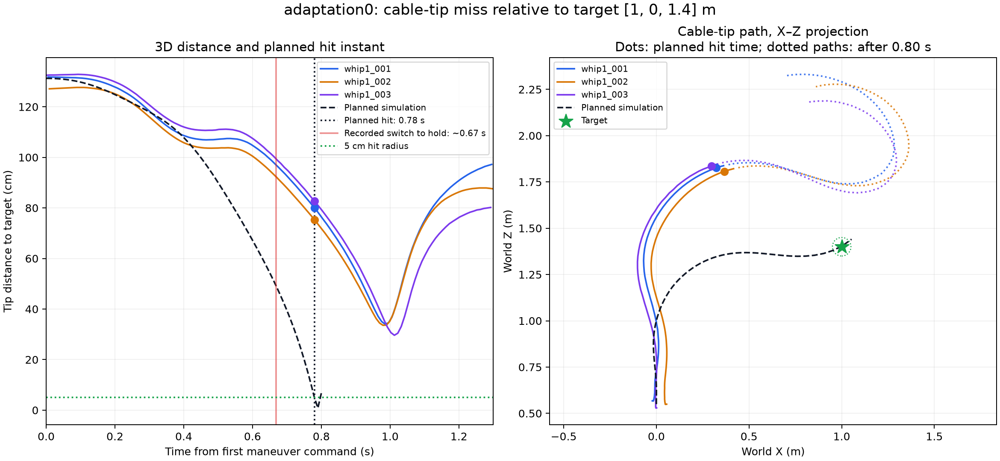

# Whip1 cable-tip hit error

Target: [1.0, 0.0, 1.4] m in the saved world frame. Cable-tip marker: cable1:c10.

The saved source simulation first satisfies its 5 cm, speed and direction hit gates at 0.78 s. Its nearest target-center pass is 0.7887 s, 0.38 cm from the center. The planned cutoff is 0.80 s.

| Trial | Error at planned hit (cm) | X error (cm) | Y error (cm) | Z error (cm) | Closest in 0–0.80 s (cm) | Closest in 0–1.30 s (cm) | Time of latter (s) |
|---|---:|---:|---:|---:|---:|---:|---:|
| whip1_001 | 80.0 | -67.7 | +2.8 | +42.6 | 76.5 | 34.0 | 0.985 |
| whip1_002 | 75.3 | -63.4 | +2.0 | +40.7 | 71.9 | 33.5 | 0.983 |
| whip1_003 | 82.7 | -70.1 | +4.1 | +43.7 | 79.4 | 29.6 | 1.012 |

Errors are measured tip minus target. Negative X means short of the target along the desired +X strike direction; positive Z means above it.

## Method and interpretation

- Read all three original OptiTrack CSVs and their paired controller CSVs. Verified raw SHA-256 hashes and exact agreement between named cable coordinates and the prepared NPZ arrays.
- Ignored unlabeled markers. Prelaunch drone-to-marker distances increase monotonically from c1 to c10 in every trial, consistent with c10 being the free tip.
- The copied reference hash matches the saved simulation export. The first 20 logged p/v/a commands match its first 20 rows. The reference target is used directly, with no spatial fit to make the tip agree.
- Time zero is the first command reception estimate (controller time minus command age). Existing constant offsets were determined by matching measured drone positions, not by optimizing tip error. All distances use three coordinates, including Y.
- The hit-instant value uses linear interpolation between adjacent 100 Hz tracking frames. Closest distances minimize distance along adjacent frame segments. No interpolation over missing frames is permitted.
- The 0–0.80 s window is the intended maneuver. The 0–1.30 s window adds a fixed 0.50 s to inspect a delayed pass; it includes the position-hold response and is not a completed open-loop strike.
- Logs switch from the reference to hold after approximately 0.67 s, before the planned 0.78 s hit. These errors describe the trajectory actually recorded, including that change.
- Clock synchronization and physical target location were not independently verified. At-time errors are approximate. The +/-50 ms sensitivity below is illustrative, not a statistical interval. Geometric miss distances are less dependent on clock alignment when the nearest pass lies inside the search window.
- No missing c10 frames occur within 50 ms of the planned hit in any trial. Original raw data, configs, policies and review labels were left unchanged.

## Timing sensitivity

| Trial | Hit-instant error range for illustrative +/-50 ms shift (cm) |
|---|---:|
| whip1_001 | 70.8–88.1 |
| whip1_002 | 66.4–83.3 |
| whip1_003 | 73.9–90.7 |

Full numerical values and source hashes are in results.json. The analysis script is analyze.py. This is a Windows offline measurement audit; no physics fitting, retraining or flight execution was performed.
