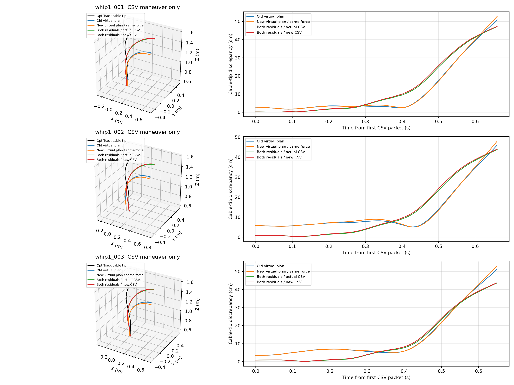
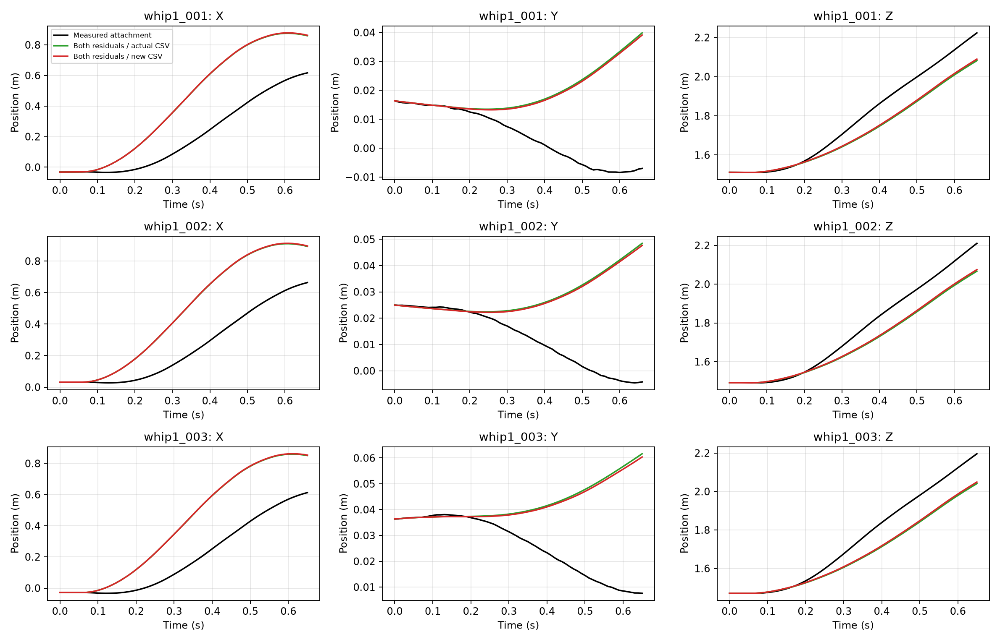

# Frozen historical force replay

Current all-data candidate: historical commands are in-sample validation. New CSV is a counterfactual, not the flown input.

Virtual: unchanged archived plan state. Execution: causal measured cable and attachment state; no subsequent measurement feedback.

Use original observed packet timing. Exclude every state at or after first post-maneuver hold.

Archived physics reproduction maximum position difference: 0 m.
New versus old virtual command position RMSE over first 20 packets: 0.07 cm.

| Take | Last CSV state (s) | Old virtual tip (cm) | New virtual tip (cm) | Both NN, actual CSV tip (cm) | Both NN, new CSV tip (cm) |
|---|---:|---:|---:|---:|---:|
| whip1_001 | 0.66 | 18.74 | 19.04 | 20.41 | 20.69 |
| whip1_002 | 0.66 | 17.16 | 17.53 | 19.10 | 19.40 |
| whip1_003 | 0.65 | 19.88 | 20.17 | 18.48 | 18.73 |

Errors are time-aligned trajectory discrepancies, not hitting errors. Intended hit time 0.78 s is outside the executed CSV segment. No recovery/hold is scored.

Both residuals remain enabled in the complete response. Cable NN participates in virtual force dynamics and in the separate predicted execution, not twice in one cable step. Drone response consumes PVA, not force directly.

Clock alignment and tracked-point conventions retain the existing dataset assumptions. No new trajectory was flown. Raw data, active configuration and selected PPO are unchanged.

Seven existing command-history and full-state execution tests passed on Windows/RTX4080. Archived trajectory replay had zero position difference; all executed reference packets matched exactly.
